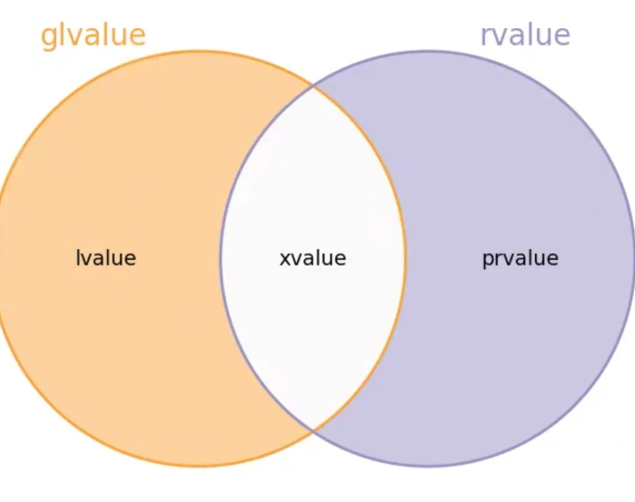

# İleri C++ Ders Notları 1.Hafta

## İçindekiler

- [İleri C++ Ders Notları 1.Hafta](#i̇leri-c-ders-notları-1hafta)
  - [İçindekiler](#i̇çindekiler)
  - [1.Ders](#1ders)
  - [İfade Kategorileri ( Expression )](#i̇fade-kategorileri--expression-)
  - [Referanslar](#referanslar)
    - [İfadelerin hangi kategoriye ait olduğunun anlaşılması](#i̇fadelerin-hangi-kategoriye-ait-olduğunun-anlaşılması)
    - [**decltype** operatörü hatırlatma](#decltype-operatörü-hatırlatma)
    - [Function Overloadinge ilişkin kurallar ve hangi referansa hangi referans türleri bağlanabiliyor?](#function-overloadinge-ilişkin-kurallar-ve-hangi-referansa-hangi-referans-türleri-bağlanabiliyor)
  - [std::move](#stdmove)
  - [2.Ders](#2ders)
    - [Forwarding Referans](#forwarding-referans)
    - [Moved from state Nesneler](#moved-from-state-nesneler)
    - [Move implementasyonu](#move-implementasyonu)
  - [Copy-elision](#copy-elision)
    - [Special member functions](#special-member-functions)
    - [noexcept keywordü](#noexcept-keywordü)
  - [Copy Elision Detayları](#copy-elision-detayları)

---

## 1.Ders

---

```c++
#include <iostream>
int main()
{
    std::cout << "merhaba dunya" << std::endl;
}
```

Bu basit kod içerisinde bile:

- Sınıflar
- Operator overloader
- Templateler var. (class, function )
- Kalıtım var. (Multiple inharitance, inharitance, virtual inharitance)
- Function overloading
- ADL (argument dependendt lookup)
- Referans semantiği
- std::engl bir fonksiyonu şablonu (ostream manipulator)
- Chaining var

Araçların birbiri ile ilişkisi çok fazla var.

C/C++ ayrışmasının nedeni:

- C++'ta olan ve C'de olmayan bazı araçlar için o kuralların değiştirilmesi gerekti. Örneğin *value category*.
- C' dilinde olan C99 ile eklenen fakat C++ ile olmayan araçlar, designated initializers, compound literals, restrict pointer, flexible array member ...

## İfade Kategorileri ( Expression )

C/C++'ta en temel birim. Dilin sentaksına ilişkin bir çok kural bununla alakalı.

Bir ifadenin 2 temel niteliği var


*ifadenin türü*:

- O ifadenin kullanıldığı bağlamda, sentaks hatası olup olmamasında belirli.
- İfadenin türü, derleyicinin orada nasıl bir kod üreteceğini belirliyor.
- Function overloading'te hangi fonksiyonun seçileceği konusunda belirleyici oluyor.
- İfadenin türü **referans** olamaz

`int x = 5 ; int & r = x;` dediğimizde burada `r` ifadesinin türü *int*.

***value category***: Bir ifadenin value category'si her konuda daha çok belirleyici oluyor.

**L-value expression:**: İlk çıkış itabariyle, *left-value* atama operatörünün sol operandı olmasından geliyor. Kavramsal olarak left value'nun dışına çıkan ifadeler de var ( örneğin const ).

- **modifable**  L-value: Sol operandı olabilen.
- **unmodifable**  L-value: Sol operandı olamayan.

Daha sonra bunu **Locatable** olarak değiştirildi.

C'de kategori 2 ye ayrılıyor, **L-value** ya da **R-value**.

Fakat C++ dilinde C++11'e kadar neredeyse C ile aynıydı. Modern C++ ile gelen *taşınma semantiği* ve *perfect forwarding* geldi ve burada value categorylerinde büyük bir değişim oldu.

---

`int x = 6;`  Bu bir ifade değil!

Value category sadece ve sadece expressiona özel, Değişkinin bir **value category'**si olmaz!!!!!

---

Modern C++ ile dilin value category kavramını değiştirip, 5 tane olucak şekilde güncellendi. Bunlardan 3'üne **Primary Value Category** (Pr-value, L-value, X-value). Bir ifade mutlaka bu kategoriden birine ilişkin olmak zorunda (Örtülü dönüşümler sonucundaki value category kast edilmiyor, static olarak bakıldığı zaman.).

- Pr-value: Pure R value
- L-value: Locators value
- X-value: Expiring value

Kelime anlamı ile doğrudan bir ilişki yok.

**mixed/combined value category**:

- GL Value: O ifade L-value ya da X value ise.
- R Value: C++ içerisinde combined bir kategori. Pr value ya da X Value ise.


> A Pr-value is an expression whose evalutation:
> **computes the value of an operand of a built-in operator** or
> initializes an object (*result object* C++17 ile eklendi.)

Bir ifadenin değer kategorisi 2 temel özelliğini belirleyip derleyicilerin ona göre kod üretmesini sağlıyor.

*identity*'ye sahip olup olmamasını belirtiyor ve *movebility* o nesnenin kaynakları tekrar kullanılabilir mi?


Bir identity'si olan ifadelere GL-value. Bellekte bir adrese sahip mi? O adrese erişilebiliyor mu? Bizim bir değişkenimiz var ve o değişkeni bir ifade kullanarak o adrese erişebiliyoruz.

Taşıma yapılabiliyorsa RValue ifadeler.

- **L-value**: Kimliği olan ve taşınamayan ifadeler.
- **PR-Value**: Kimliği olmayan fakat taşınabilen ifadeler.
- **X-Value**: Kimliği olan ve taşınabilenler.



Buradaki kategoriler bizi 1. olarak referanslar konusunda ilgilendiriliyor, 2.olarak type-deduction konusunda , 3.olarak function overload resolution'da.

## Referanslar

C++ dilinde 3 çeşit referans var:

- L value reference. tek `T &` ile tanımlanıyor.
- R value reference. çift `T &&` ile tanımlanıyor.
- Forwarding/universal reference () - asıl varlık nedeni *perfect forwarding*i implemente etmek, başka amaçlarla da kullanılabiliyor.

Burada referansın hangi kategoride olduğu, o referansa hangi value kategorisinde const ya da non-const hangi ifadelerin bağlanabileceğini saptıyor.

### İfadelerin hangi kategoriye ait olduğunun anlaşılması

Dilin kuralları bunu detaylı bir şekilde anlatıyor. Value-category ile `decltype` yakından ilişkili.

---

### **decltype** operatörü hatırlatma

`decltype` 2 farklı görevi var:

- 1. operand olarak bir isim kullanılması farklı, buna member selection `(.) ve (->)` operatorleri ile elde edilen isimler dahil. O isim hangi türden declare edildiyse ben o türden bir değişken olurum.

```c++
#include<iostream>
struct Myclass  {int a;};
int main()
{
    int x = 10;
    itn & r = x;
    const int &cr = x;
    int * ptr = &x;---
    decltype(x); //int
    decltype(r) a = x; //int & 
    decltype(cr) a = 10 ; //const int r;
    
    Myclass m{};
    decltype(m.a) c;// int c;
    int && b = 5;
    decltype(b); //int &&
}
```

- 2. operand'ı isim formunda olmayan herhangi bir ifade olucak. Burada bir tür elde edilecek ama elde edilen tür ifadenin value category'si tarafından belirlenecek.

3 tane ihtimal var, eğer ifade expr ===> T diyelim bu durumda,

- PrValue ise - T
- LValue ise - T&
- XValue ise - T&&

```c++
int && foo();
struct Neco{int x {};};

decltype(10); //int türü
int x{3};
int *p{&x};
decltype(x+5); //int
decltype(*p); // int &
decltype((x)); //int &
decltype(foo()); //int &&
decltype(Neco{}.x); //int && 
```

Bu kural ilişkisi örneğin `decltype(c) ile decltype((c))` birbirinden farklı.
> Not! Sağ taraf referansını kullanırken onun bağlandığı nesneyi değiştirmek istiyoruz onun için *const* olmasını çok istemiyoruz.

---

*decltype* specifier'ını kullanarak value kategorisini öğrenebiliriz.

```c++
#include <iostream>

//Variable template syntax, 
template<typename T>
constexpr const char* p = "PRValue"; //T'nin türü const T* türünden bir değişken tanımladık 
template<typename T>
constexpr const char *p<T&> = "LValue";//Primary templat'in sol taraf referanslar için partial specilization
template<typename T>
constexpr const char *p<T&&> = "XValue"; //Primary templat'in sağ taraf referanslar için partial specilization

#define pvcat(e) std::cout << "value category of '" << #e <<"' is " << p<decltype(e)> <<"\n"; //#e macro argümanını çift turnak içine alıyor
//functional macros

int foo();
int& foo1();
int && foo2();
void foo3();
int foo4(int);
struct Nec{int x{}; static int y;};
int main()
{
    std::cout<< p<int&&> << "\n";//()
    std::cout<< p<int&> << "\n";//()
    std::cout<< p<int> << "\n";//()

    std::cout<< p<decltype(10)> << "\n";//()
    int x = 10;
    std::cout<< p<decltype((x))> << "\n";//()

    pvcat(x+5); // prvalue
    pvcat(x++); // prvalue
    pvcat(x--); // prvalue
    
    pvcat(++x); // lvalue
    pvcat(--x); // lvalue

    pvcat(foo()); //pr-value
    pvcat(foo1()); //l-value
    pvcat(foo2()); //x-value

    pvcat(foo3()); //pr-value

    pvcat(45); //pr-value
    pvcat('A'); //pr-value

    pvcat("ahmet"); //l-value

    pvcat(foo); //l-value

    pvcat(std::move(x)); //x-value
    pvcat(static_cast<int&&>(x)); // xvalue

    pvcat(std::move(foo4)); //fonksiyonlar hangi referans türüne dönüştürülsün her zaman L-value ifadesi olur.

    pvcat(nullptr); //pr-value 

    pvcat(Nec{}); //pr-value
    pvcat([]{return 1;});//pr-value  //lambda ifadeleri derleyiciler tarafından oluşturulan closure türünden geçici nesneler.

    Nec mynec;
    pvcat(mynec);// l-value expression

    auto &r  =mynec;
    pvcat(r); // lvalue
    auto &&r1  =Nec{};
    pvcat(r1); // l-value referans

    pvcat(mynec.x); // l-value
    pvcat(Nec{}.x); // x-value
    pvcat(std::move(mynec).x); // x-value
    pvcat(std::move(mynec).y); // l-value

    int y{},z{};
    //en karışıklarından biri turnary operator bunun içinde 
    pvcat(x > 10 ? y : z); // l-value 
    pvcat(x > 10 ? y : 10 ); // pr-value
}
```

> <https://onlinegdb.com/4m5dLTADz>

Function template ile yapılması:

```c++
#include <iostream>
#include <type_traits>
template<typename T>
void func()
{
    if constexpr (std::is_rvalue_reference<T>::value)//std::is_rvalue_reference_v<T>
    {
        std::cout<<"X value";
    }
    else if constexpr(std::is_lvalue_reference<T>::value)
    {
        std::cout<<"L value";
    }
    else if constexpr(!std::is_reference<T>::value)
    {
        std::cout<<"PR value";
    }
}

#define exp(e) decltype((e))

int main()
{
    int x{43};

    func<exp(12)>();
    func<exp(x)>();
}
```

### Function Overloadinge ilişkin kurallar ve hangi referansa hangi referans türleri bağlanabiliyor?

- const olmayan L-value referansa sadece L-value bağlayabiliriz
- Eğer referans const L-value referans ise, const olmayan, const olan bir sınıf nesnesini bağlayabiliriz. Sağ taraf bir sınıf nesnesini bağlayabiliriz. Yani const sol taraf referansına her şeyi bağlayabiliyoruz

Sağ taraf referansına const olsun veya olmasın sadece sağ taraf referansı bağlayabiliyoruz.

- const olmayan sağ taraf referansa sadece const olmayan sağ taraf referans değerleri bağlanabiliyor.
- const olan sağ taraf referansına const/const olmayan sağ taraf referans değerleri bağlanabiliyor.

```c++
#include <type_traits>
struct Nec{};
int main()
{
    Nec x;
    const Nec cx;
    Nec &r = x;    
    const Nec &cr = Nec{};
    const Nec &cr = cx;
    const Nec &cr = x;
    const Nec &cr = std::move(cx);    
}
```

|               | T&             | const T& |       T&&      |    const T&&   |
|--------|---------|:--------:|:--------------:|:--------------:|
| Lvalue        |        1       |     2    | Sentaks hatası | Sentaks Hatası |
| const l-value | Sentaks Hatası |     1    | Sentaks Hatası | Sentaks Hatası |
| R value       | Sentaks Hatası |     3    |        1       |        2       |
| const Rvalue  | Sentaks Hatası |     2    | Sentaks Hatası |        1       |

1-2-3 öncelik olarak verilmiştir

```c++
#include <iostream>
struct S{};
void foo(S&){    std::cout << "S&"<< '\n';}
void foo(const S&){    std::cout << "const S&"<< '\n';}
void foo(S &&){    std::cout << "S &&"<< '\n';}
void foo(const S &&){    std::cout << "const S &&"<< '\n';}

int main()
{
    S x;
    const S cx;
    foo(x);
    foo(cx);
    foo(std::move(cx));
}
```

Buradaki farklar move/copy constructor arasındaki farklarda düşünülebilir. Orada da benzer bir overloading mekanizmasını kullanıyoruz.

```c++
Myclass(const Myclass&);
Myclass( Myclass &&);
```

**move** does not move!!!!! Dolayısıyla bir sağ taraf referansına bir nesneyi bağlamak ile taşıma yapılmıyor.

## std::move

Value category dönüşüm fonksiyonu, 2 tane move fonksiyonu var.

- Fakat utility header file içinde tanımlanan move ise bir dönüşüm fonksiyonu, verilen bir parametre eğer L-value ise R-value çıkar. R-value giren R-value çıkar. Move'un yaptığını `static_cast<T&&>` ile yapabilirdik.
- Algorithm başlık dosyasındaki olay, copy assignment yerine move assignment ile yapılsın istediğimiz zaman.

```c++
#include<iostream>
#include<algorithm>

template<typename InIter, typename OutIter>
OutIter Copy(InIter beg, InIter end, OutIter destbeg)
{
    while (beg != end)
    {
        *destbeg++ = *beg++;
    }
    return destbeg;
}

template<typename InIter, typename OutIter>
OutIter Move(InIter beg, InIter end, OutIter destbeg)
//Kaynak olan değeri sağ taraf değerine dönüştürüyor ve böylece bu atama copy'assignment yerine move assignment ile yapılıyor.
//Kaynak range'teki öğeler moved from state'de kalıyor.
{
    while (beg != end)
    {
        *destbeg++ = std::move(*beg++);
    }
    return destbeg;
}

template<typename T>
constexpr  Move(T &&)noexcept 
{

}
```

Move'un yaptığı olayı `static_cast<T&&>(exp)` ile de dönüştürülebilirdi, bunun yerine `std::move(exp)` kullanılıyor. Fakat bunun bir maliyeti var ve burada `utility` başlık dosyasını include etmek gerekiyor.

---

## 2.Ders

---

### Forwarding Referans

Move kullanmak için *forwarding reference* kullanıyoruz

Eğer fonksiyonun parametresi `T &&` şeklinde yazıldıysa burada tür çıkarım kuralları daha farklı ve bu referansa bütün ifadeler bağlanabiliyor. Bunun en önemli özelliği

- R-value expr çağrı yapılırsa eğer T referans türü değilse R-value olduğnu anlıyoruz. Türün kendisi olucak ve fonksiyon parametresi sağ taraf referans oluyor.
- L-value exp çağrı yapılırsa sol değer referansı oluyor ve burada reference collapsing ile => sol taraf referansına bağlanıyor. Eğer T sol taraf referans türüyse L-value olduğunu anlıyoruz

r universal referans

```cpp
template <typename T>
void func(T&& r); 
```

r universal referans değil

```cpp
template <typename T>
void func( const T&& r); 
```

r universal referans değil. Burada template argümanı belirlendiğinde fonksiyonun parametresi belirlenmiş olucak.

```cpp
template<typename T>
class Myclass 
{
public: 
    void foo(T&&);
    template<typename U>//universal referans
    void foo(U&&);
    template<typename ..Args> //perfect forwarding mekanizması için
    void emplace_back(Args && ..args);
};
```

```cpp
int main()
{
    auto && x = 10; //forwarding referans
    for(auto && x : container) //forwarding referans
    {
    }
}
```

> Reference collapsing'in çıktığı bağlamlar:
>
> 1. Template parametrelerinde
> 2. Tür eşizim bildirimleri
>  
```cpp
class Myclass{};
using LREF = Myclass &;
using RREF = Myclass &&;
int main()
{
    Myclass m;
    LREF &r = m; 
}
```

---

**Reference Collapsing Kuralları**:

|T& | &   | T&  |
|T& | &&  | T&  |
|T&& | &  | T&  |
|T&& | && | T&& |

---

>
> 3.decltype bildirimleri ile

```cpp
int main()
{
    int x {234};
    int *ptr = &x;
    decltype(*ptr)& r = x; //elde edilen tür l-value referans türü elde edildi ve int& türü & türü ile int& bağlandı.
}
```

Peki std::move ne yapıyor? Bazı yerlerde biz l-value expression olan bir sınıf nesnesini taşımaya uygun hale getirmek istiyoruz. r-value olması demek, taşınabilir olması demek.

```cpp
std::string foo();

int main()
{
    std::string str{"ferit aksoy"};
    auto &r = str;
    std::string &&r2 = foo(); //life extention kuralı.
    static_cast<std::string&&>(r); 
    //bunu bir fonksiyon haline getirmişler
}
```

Bunu yapmamız için 2 temel nedeni var:

Fonksiyonun davranışının gelen argümanın l-value veya r-value olup olmamasına göre değişiyor. STL'deki neredeyse tüm containerların insert fonksiyonlarının hepsinin bu tür fonksiyonlarının bir l-value alan ve r-value alan fonksiyonu var.

```cpp
void func(std::string &&) //taşıma potansiyeli var fakat taşıma garantisi yok
{
    auto str = std::move(s); 
}
void func(const std::string &)//kopyalama amaçlı.
{

}
```

Taşıma amaçlı bir fonksiyona çağırı yapıldığında nesnein moved from state'de olmasının garantisi yok.

> Her zaman taşınma semantiği, kopyalama semantiğinden daha iyidir algısı var fakat bu her zaman için geçerli değil
> Taşıma her zaman avantaj sağlamayabilir.

### Moved from state Nesneler

```cpp
int main()
{
    using namespace std;
    veconstructor<string > str{100'000,'A'};
    svec.push_back(move(str));
    str
}
```

Dil bize moved-from state durumundaki nesneler için bize belli bir garanti veriliyor:

- Değeri ne olduğu belli değil fakat geçerli bir değerde, adeta bir fonksiyonun parametre değişkeni gibi
- Yani burada str'yi tekrar kullanabiliriz.
- Nesnenin invariantları tutucak. Bu nesneyi belirli garantiler altında kullanabiliyoruz.
- Bu nesneye yeni bir değer atanarak kullanılabilir.

Moved from state'teki nesneyi kullanmaya yönelik bir sürü idiomatik yapı var, ama zorunlu bir durum olmadığı sürece bu nesneyi değeri ile kullanmayın anlamında. Depişmezleri hold ediyor

```cpp
int main()
{
    std::ifstream ifs{"deneme.txt"}
    if(!ifs)
    {
        std::cerr << "acilamadi\n";
        return 1;
    }
    std::veconstructor<std::string> svec;
    std::string sline;
    while(getline(ifs,sline))
    {
        svec.push_back(sline); //svec.push_back(std::move(sline))
    }
}
```

Döngünün her turunda satırlar heap'te tutuluyor ve burada push_back fonksiyonunu çağırdığımızda copy construconstructor çağırılıyor. Bunun yerine std::move kullanılarak çağırırsak sline moved-from state'e geçiyor fakat daha sonra getline ile sline içerisine yeni bir nesne atamış oluyoruz. Burada pratikte standart kütüphanenin sınıfları için genellikle moved from state nesne için default initialize edilmiş duruma getiriyor. SADECE STANDART KÜTÜPHANELER İÇİN GEÇERLİ.

--

### Move implementasyonu

```cpp
#include <type_traits>
template <typename T>
std::remove_reference_t<T> && Move(T&&t) noexcept//forwarding referans
{
    return static_cast<std::remove_reference_t<T>&&>(t);
}
```

> Meta function: fiilen bir fonksiyon değil, bir sınıf compile time'a yönelik bir kullanım, bir türe veya değere yönelik bir hesaplama yapıyor olabilir. ,
> type transformation meta fonksiyon: bir tür alıp istenilen başka bir tür veriyor
> remove_reference: referans türünün referans olma özelliğini ortadan kaldırılıyor.

```cpp
//remove reference kodu
template<typename T>
struct RemoveReference
{
    using type = T; 
};
//partial specilization yapacağız
template<typename T>
struct RemoveReference<T&>
{
    using type = T; 
};
struct RemoveReference<T&&>
{
    using type = T; 
};
//alias template kullanıyor
template<typename T>
using RemoveReference_t = RemoveReference<T>::type;

int main()
{
    RemoveReference<int&>::type; //int 
}
```

## Copy-elision

### Special member functions

Sınıfın bazı özel non-static üye fonksiyonlarını nitelendiriyor bu üye fonksiyonlar, sınıf nesnelerinin hayata getirilmesi, kopyalanması, taşınması ve hayatlarının bitirilmesi ile ilgili. Bunların özel olmasının temel nedeni, bunlar derleyici tarafından belirli koşullar oluştuğunda derleyici tarafından yazılabiliyor ve programcı bunu derleyiciye bir bildirim ile yapabiliyor.

Özel üye fonksiyonlar:

- Default constructor
- Destructor
- Copy constructor
- Copy assignment
- Move constructor
- Move assignment

Eğer bunlar derleyici tarafından yazılabiliyorsa, ideali derleyiciye bırakmak ve buna *Rule of Zero* deniyor. Modern C++ öncesinde Move constructor ve assignment yoktu.

Derleyicinin özel üye fonksiyonunu yazmasına artık **default** etmek deniyor. Bu programcı tarafından explicit olarak olacağı gibi, implicit olarakta **default** edilebiliyor.

Dilin özel üye fonksiyonların kodunun derleyici tarafından nasıl yazıldığını belirtiyor. Derleyicinin hangi durumda üye fonksiyonu **defualt** edilip, edilmediği dilin kurallarınca belirli.

Bir özel üye fonksiyonu:

- **Not declared**: Fonksiyonun **olmaması** anlamına geliyor.

> Explicit olarak **delete** edilmesi değil!

```cpp
struct Myclass 
{
    Myclass(int);
};
```

Dilin kurallarına göre artık default constructor *not declared* durumunda.

```cpp
struct Myclass
{
    Myclass();
    Myclass(const Myclass & );
};
```

Move constructor ve assignment'ı not declared durumda.

- **User declared**: Bildirimin programcı tarafından yapılması demek ve bu 3 farklı şekilde olabilir:
- 1. Fonksiyon tanımlanmak üzere bildirilmiş olabilir. **defined**
- 2. Fonksiyonu bildirir ve derleyici tarafından *default* edilmesi istenebilir. **defaulted**
- 3. Fonksiyon bildirilmiş olabilir fakat delete edilmiş olabilir. **deleted**

> Delete edimiş fonksiyon vardır fakat, çağırılmasında hata oluşur. Yani bu fonksiyonlar function overloading resolution sürecine dahil edilir, eğer seçilirse sentaks hatası olur.

```cpp
void func(int) = delete;
void func(double);
void func(float);
void func(long);
int main()
{
    func('A'); //sentaks hatası olur çünkü delete edilmiş fonksiyona bir çağrı yapılmış olur.
    func(23u); // sentaks hatası olur çünkü burada bir ambiguity oluşur. Overload settindeki tüm fonksiyonlar viable fakat hiç biri seçilemez.
}
```

> Move memberların delete edilmesini gerektiren bir senaryo yok. Çünkü eğer move member delete edilirse kopyalamaya fallback olmayacak.

```cpp
class Myclass 
{
public: 
    Myclass() = default; // kodun derleyici tarafından yazılması

private:
    int mx{};
    std::string str{}; //default member initializer.
};
```

Bazı sınıfların default constructor'ının olmayabilir fakat bu o sınıfın kullanımını çok büyük ölüçüde azaltıyor. Standart kütüphanede de bu kullanım var.

```cpp
class Myclass
{
public
    Myclass(const Myclass & )noexcept = default;

};
```

Uniqptr'ın pimpl idiom'ı ile kullanımında destructor'ın default edilmesi gerekiyor.

```cpp
class Myclass
{
public:
    ~Myclass();
};
Myclass::~Myclass() = default;
```

- **Implicitly declared**: Bir special member fonksiyonunun derleyicinin durumdan vazife çıkarak programcı açıkça bildirmemesine rağmen, dilin kuralları gereği bu üye fonksiyonlardan bir veya birden fazlasını bildirmesi.
- - **defaulted**:
- - **deleted**: Modern C++ ile dile eklendi. Derleyici implicitly declared olması durumda bu özel üye fonksiyonun kodunu yazıyor. Derleyici bu fonksiyonun kodunnu yazarken eğer bir hata ile karşılaşılırsa bu fonksiyon **delete** ediliyor

```cpp
class Myclass
{
public:
private:
    const int mx;
};
int main()
{
    //Myclass m; sentaks hatası oluşur çünkü delete edilmiş bir fonksiyona çağrı yapıldığı için senttaks hatası oluşur
}
```

Const nesneler default initialize edilemiyor ve bu durumda delete edilmiş bir fonksiyona çağrı yapılıyor. Dilin kurallarına göre derleyicinin yazdığı default constructor üyeleri default initialize eder.

```cpp
class Nec{};
class Erg{};

class Myclass
{
private:
    Nec mx;
    Erg my;
};
int main()
{
    constexpr auto b = std::is_nothrow_default_constructible_v<Myclass>;
    //noexcept() ile de yapabiliriz.
    std::cout << b; // b is true
}
```

Derleyici default constructor'ı yazar içindeki memberlarda `noexcpet` garantisini veriyorsa, derleyicinin yazıdğı constructor'da bu garantiyi veriyor. Burada yardımcı öğeler kullanarak `noexcept` ile ifade edebiliriz.

### noexcept keywordü

```cpp
void func(int x)noexcept; //func fonksiyonu exception throw etmiyor garantisi veriyor.
//void func(int x)noexcept(true); şeklinde de yazılabilirdi.
void func(int x)noexcept(sizeof(int) < 8); 

template<typename T>
void foo(T x)noexcept(std::is_no_throw_copy_constructible_v<T>); //T türü copy constructible ise noexcept(true) olucak
```

noexcpet operatörü ile specifier'ı birbirinden farklı:

- aşağıdaki örnekte ilk noexcept biri specifier, ikincisi operatör.

```cpp
template<typename T>
void func(T x)noexcept(noexcept(x + x)); 

int main()
{
    using namespace std;
    constexpr auto b = noexcept(cout << 1); // bu ifade ekrana 1 yazmaz yani bu ifade operanda bakıyor. ve exception throw etmiyor ise true
    // aksi halde false döner.
}
```


Eğer sınıfa bir destructor bildirilirse copy constructor ve copy assignment'ın default edilmesi gerekiyor. Ama bunun yapılmaması ve yanlış oluyor. Burada dikkat edilmesi gerekiyor. Move constructor ve assignment bildirilmemiş oluyor.

- Tabloda kırmızı ile bildirilen kısımlar sorun yaratabilecek bir durum.

```cpp
class Myclass
{  }; //default constructor, destructor, copy constructor, copy assignment, move constructor, move assignment
```

Kritik noktalar:

- Bir sınıfın destructor'ı her senaryoda var.
- Eski büyük 3'lüde herhangi biri bildirilirse move memberların derleyici tarafından bildirilmemiş oluyor.
- Move memberlardan biri bildiriliyorsa, derleyici copy memberları **delete** ediyor.

```cpp
class Myclass
{
private:
    int mx{};
    std::string mname{"noname yet"};
//inclasss/ default member initializer
};
```

Burada bir initialization yapılmıyor. Bu eğer bu üyeleri constructor init list ile initialize edilmez ise bunlar ile init edilsin deniyor. Eğer sınıfın default initialize member ediliyorsa onları kullanıyor

```cpp
class Myclass
{
public:
    void print()const
    {
        std::cout << mx << " ";
        std::cout << mname << "\n";
    }
private:
    int mx{};
    //eğer mx; olsaydı kod içerisinde indetermined value olurdu. Bu kodda udb olur.
    std::string mname{"noname yet"};
//inclasss/ default member initializer
};
int main()
{
    Myclass m;
    //Myclass m{}; //value initialize edilmiş olur. Burada da zero initialize edilmiş oluyor. 
    m.print();
}
```

## Copy Elision Detayları

C++17 standartı ile PR-value expression artık bir nesneyi initialize etmek için kullanılacak bir ifade. Uygun bağlamda bir nesneyi initialize etmek için kullanılıyor. Bazı durumlarda belirli bir nesne olarak görülmüyor, bir nesneyi init. edecek bir formül olarak görülüyor.

```cpp
class Myclass
{};
void bar(Myclass);

Myclass foo(){
    return Myclass{};//C++17 P
}

int main()
{
    Myclass m = Myclass{};
}
```

C++17 öncesinde yukarıdaki `Myclass{}` PR-value ifadeleri birer nesne kategorindeydi ve bu sınıfın bir çağırılabilir copy-constructor'ının olması gerekiyordu.
