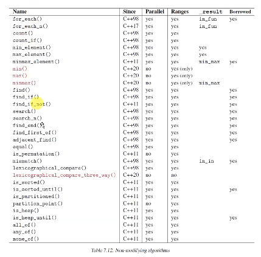

# 13.Hafta

> 22_16_09_2023

## İçindekiler

## Ranges Kütüphanesi

### Generic fonksiyonlar 




```c++
void print(std::string_view sv, auto beg, auto end)
{
    std::cout << msg;
    for(auto pos = beg; pos != end; ++pos)
        std::cout << ' ' << *pos;
    std::cout << '\n';
}

int main()
{
    std::vector inCall{1,2 ,3, 4, 5, 6, 7, 8, 9, 10};
    std::vector outCall{1,2 ,3, 4, 5, 6, 7, 8, 9, 10};
    auto result= std::ranges::transform(inCall, outCall.begin(), [](int x){return x * x;});

    print("inCall : ", inCall.begin(), inCall.end());
    print("outCall : ", outCall.begin(), outCall.end());
}
```

### Views

format kütüphanesi ile de kullanabiliyoruz, bu özellik C++23 ile geld. Her view bir range fakat her range bir view değil. Belirli concept özellikleri sağlayan rangeler view olabilir. Begin ve end bilgilerinin aynı türden olmayabilir. Bir çok range'i iki kere dolaşmak gerekmiyor. Var olan fonksiyonlar, begin ve end'in aynı türden olduğu varsayılarak tasarlanmış


- view'ların kopyalanması ve taşınması çoğunlukla constant time.
- 

```cpp
int main()
{
    using namespace std;
    vector<int> ivec{1, 2, 3, 4, 5, 6, 7, 8, 9, 10};

    auto vw = vec | views::filter([](int x){return x% 2 == 0;});

    cout << format("{}", vw);  
}
```

- yazma algoritmaları her zaman yazdığı konumdan bir sonraki konuma döndürüyor.

```cpp
int main()
{
    vector<string> svec;
    rfill(svec, 10, rname);
    ranges::copy(svec, ostream_iterator<string>{cout, " "});
    vector<size_t> destvec(100);
    transform(svec.begin(), svec.end(), destvec.begin(), [](const string &s){return s.size();});
    cout << "distance = "<< distance(destvec.begin) 
}
```

41.23