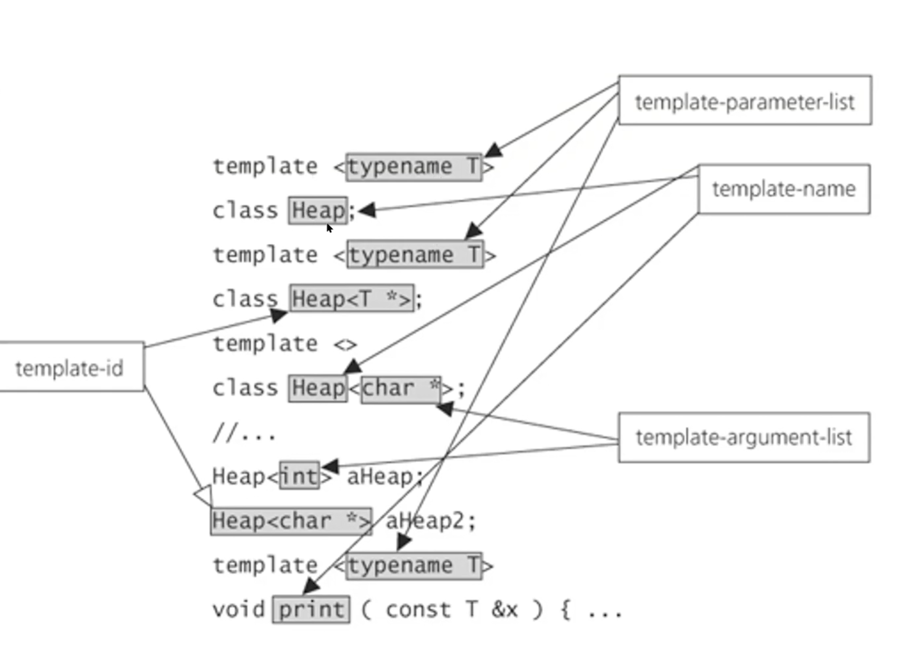
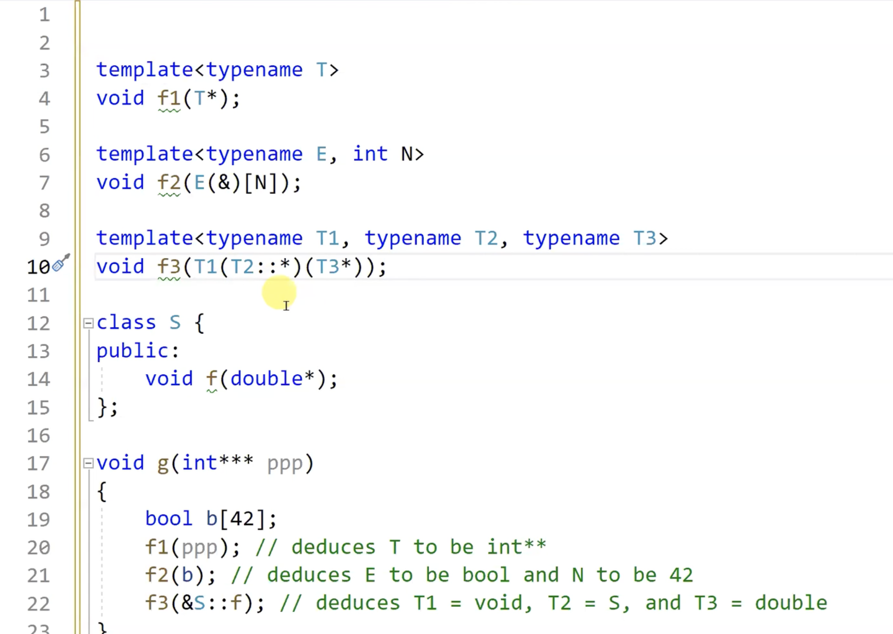
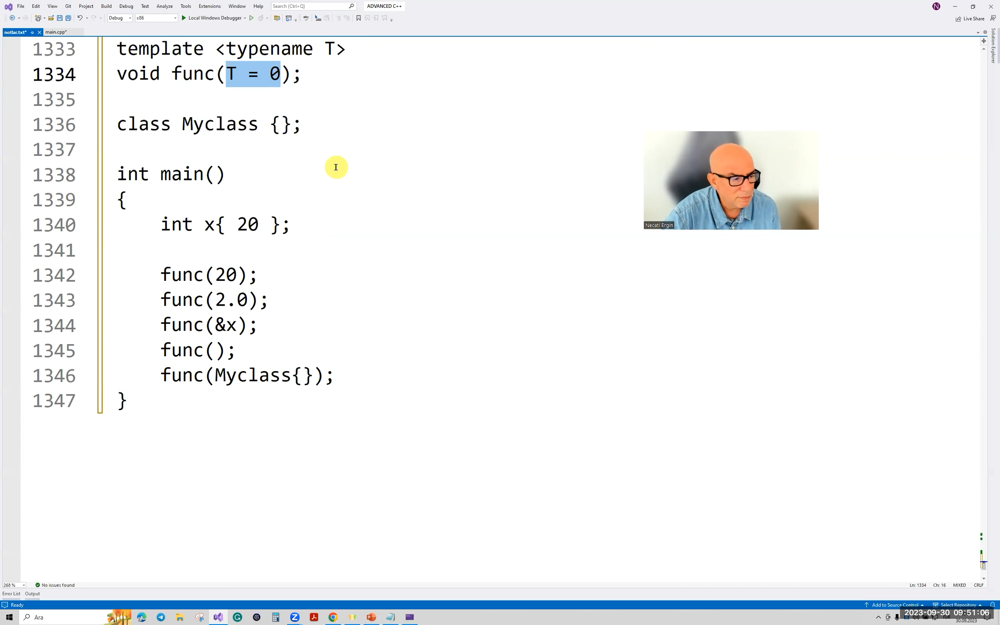
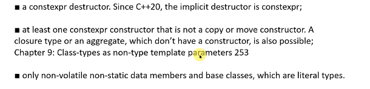
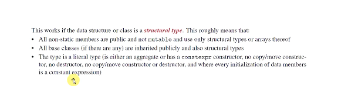

# 15.hafta

## İçindekiler

- [15.hafta](#15hafta)
  - [İçindekiler](#i̇çindekiler)
- [26\_30\_09\_2023](#26_30_09_2023)
    - [En çok yapılan deduction hataları](#en-çok-yapılan-deduction-hataları)

# 26_30_09_2023

## Template Temel Hızlı Tekrar



Template argument deduction: template argümanlarını bilme aşamasında, argümanların türünün bilinmesine deniyor

### En çok yapılan deduction hataları

```cpp
template <typename T>
void foo(T);

template <typename T>
void foo(T&);

template <typename T>
void foo(T&&);
```

- 1.için referanslık ve constluk düşüyor.
- 2.için constluk düşmüyor.

Çıkarım T'için yapılıyor, parametre için değil.

Diziler için sol taraf referansı olduğunda çıkarım int[] olarak yapılıyor. Array decay olmuyor.

bazı durumlarda çıkarımın yapılması kodun çağırılıp çağırılmasına bağlı değil

```cpp
template <typename T>
void foo(T,T);

int main()
{
    void (*fp)(int,int) = &foo;
}
```

- Çıkarım için incomplete type türünden bir sınıf tamamlayın ve bu şekilde çıkarımın nasıl yapıldığını görebileceğiz

```cpp
template<typename T> 
class TypeTeller;
```

```cpp
template<typename T,typename U>

void foo(std::array<T,,sizeof(U)>,std::array<U,sizeof(T)>);

int mian()
{
    std::array<int,sizeof(double)> a;
    std::array<double,sizeof(int)> b;
    std::array<double, 5> c;
    foo(a,b);
    //foo(a,c); // Sentaks hatası oluşur çünkü, 1. parametre int oldu, sizeof(double) ve 5 aynı değil.
}
```

Çıkarım konusunda cpp ref örnek



Fonksiyonun parametresi fucntion pointer türünden template olabilir.

```cpp
template <typename T, typename U>
void func(T(*(U)));
``` 

- Pozitif lmabda idiomu

```cpp
#include <vector>
template‹typename T>
void func(T&& x, const std::vector‹T>& ivec);
int main()
{
    using namespace std;
    vector‹int › ivec(10);
    func(ivec[0], ivec);
}
```

- template parametresi default argüman alabilir. Varsayılan argümandan hareketle çıkarım yapılamaz. Myclass için sentaks hatası olmaz.



### Non-Type Template Parametreler

Tam sayı türlerinden olabilir. 
Objec türlerden olabilir.
Referans türü olabilir.
Fonksiyon pointer'ı ve member fonksiyon türü olabilir.
Gerçek sayı türleri de olabilir.

```cpp
template <int x>
class Nec{};
template <int*>
class Den{};
```

```cpp
class Myclass
{ public: double foo(double); };
int g{};
int foo(int);
template<auto x>
class A{};
template <int (*pf)(int)>
class C{};
template<double(Myclass::*)(double)>
class D{};
template<int &>
class E{};

int main()
{
    int ival{};
    A<5>ax;
    B<&g> bx;
    C<foo> cx;
    D<Myclass::foo> dx;
    E<g>ex;
}
```

- non-type argümanlar olarak nesne/değişken kullanılmak isteniyorsa bu değişken statik ömürlü olmalı. 

```cpp
template <int, bool> 
clas Nec{};

int main()
{ 
    Nec<sizof(int), sizeof(int) == 4> n2;
    Nec<5, (sizeof(int) > 2)> n3;
    Nec<5, sizeof(int) > 2> n4;
}
```

- lexigocraphical comparison yapılır. 

```cpp
template <typename T, int N, int M>
constexpr bool less(const T(&a)[N], const T(&b)[M])
{
    for(int i = 0; i< N && i< M;++i)
    {
        if(a[i] < b[i])
            return true;
        if(b[i] < a[i])
            return false;
    }
    return N< M;
}

int main()
{
    int a[] = {3,7,9};
    constexpr int b[] = {3,7,9,2,6};
    constexpr int c[] = {3,7,9,2,6};
    constexpr auto f = less(b,c);
    std::cout << std::boolalpha << (a<b) << "\n";
}
```

```c++
template <auto Val, typename T  = decltype(Val)>
T foo();

int main()
{
    auto val = foo<12>();
    auto val2 = foo<12.0>();
}
```


- Parametre paketi de kullanılabilir.

```cpp
template <int ...Vals>
class Nec{};

enum class Pos{Off, On, Hold,Standby};
template <Pos ...Vals>
class Den{};

int mian()
{
    using namespace std;
    Nec<> n0;
    Nec<1> n1;
    Nec<2> n2;
    static_assert(is_same_v<decltype(n0), decltype(n1)>);
    using enum Pos;
    Den<Off> d1;
    Den<Off, On> d2;
    Den<Off, On, Hold> d3;
}
```

- decltype(auto) kullanılabilir. Bu kullanımda non-type parametre oluyor.

```cpp
template <decltype(auto) Val>
class Myclass{
    public:
    Myclass()
    {
     ++Val;
    }
};

int g{};

int main()
{
    // Myclass<g> m; Sentaks hatası bu bir sabit ifadesi değil çünkü
    Myclass<(g)> m;
    std::cout << g << "\n"; //1
}
```

#### C++20 İle Gelen Özellikler

- Non-type parametreler gerçek sayı türlerinden olabilir.
- auto type parametre paketi kullanıldığında farklı farklı türlerden olabilir.

- Asıl büyük değişiklik:





```cpp
class Myclass
{
};

template <Myclass x>
class Nec{};

Myclass g;

int main()
{
    Nec<g> n;
}
```

- string literalini kullanma 

```cpp
#include <algorithm>
template <int N> 
struct MyLiteral
{
    constexpr MyLiteral(const char(&ar)[N]) // bu constructor CTAD'dan da faydalanabilir.
    {
        std::copy(ar, ar + N, s);
    }
    char s[N];
};

template <MyLiteral str>
struct Myclass{};

int main()
{
    Myclass<"ali"> m;
}
```

- Aslında burada myliteral türüne örtülü bir dönüşüm oldu. 

- lambda ifadeleri de doğrudan structural type.

```cpp
template <auto x>
struct Nec{

        Nec()
        {
            std::cout << typeid(decltype(x)).name() << "\n"; 
        }
};

int main()
{
    Nec<[]{return 10;}> n;
}
```

- Bu şekilde istediğimiz bir callable, compile time-argümanı olarak verip run-time'da çalıştırabilirli.z


