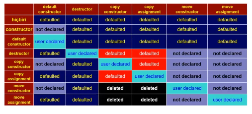
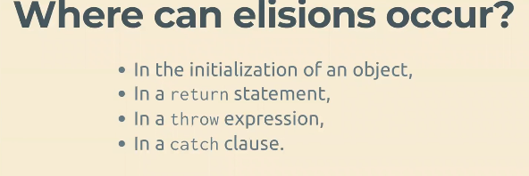
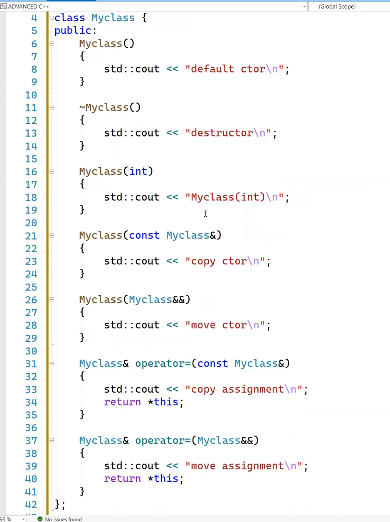
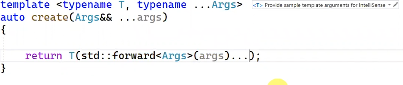
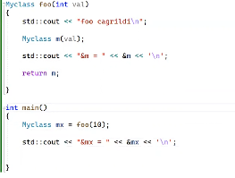
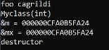
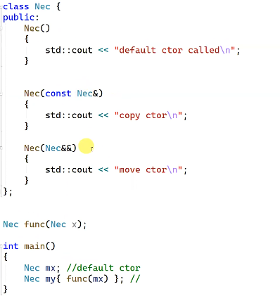
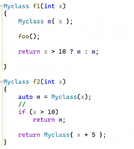
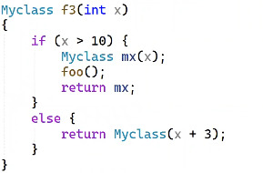
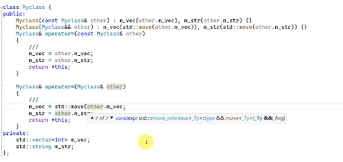

# 2.Hafta

```c++
int main()
{
    int *p{}; //değişkenin türü int *
    p; //ifadenin türü int *
    int && r = 10; //değişkenin türü int ref ref
    r;//ifadenin türü ise int. 
}
```

## Copy Elision

Kopyalamanın yapılmaması demek, verimlilik açısından çok önemli, çünkü kopyalama çok pahalı bir işlem, eğer programın logic açıdan bir değişiklik yaratmadan kopyalamayı yapmama şansımız var ise kopyalamadan kaçınarak maliyet kazanıyoruz.



Kopyalama yerine taşınma yapılmasından değil, ne copy ne de move yapılması **kast edilmiyor**. Bazı sınıflar için çünkü bu durumun maliyeti aynı olabilir.

Eğer bir nesne hayata getirilmiyorsa, bir copy-elision'dan bahsetmemiz mümkün. Tüm senaryolarda bir nesneye taşıma veya kopyalama yapmak yerine var olan bir nesne olarak onun hayatını devam ettiriyoruz.

```c++

x = y; //burada bir copy-elision'dan bahsedemeyiz.

veconstructor <string> x,y;

x = y; //burada copy assignment çalışırken

x= std::move(y); //burada ise move assignment çalışır.
//fakat burada copy-elision'dan bahsedemeyiz.
```

Bir nesneği hayata getirirken

- copy-constructor
- move-constructor kullanabiliriz.
- Onu initialize eden değere bağlı olarak, default veya parametreli constructor ile hayata gelebilir.

Nerelerde karşımıza çıkıyor.



> Throw ifadeleri exception objelereine ilk değer veriliyor.

```c++
MyException ex;

throw ex; //derleyiciye exception object'e ex ifadesi ile ilkk değer veriyoruz ve burada copy-elision söz konusu olabilir.
```

C++17 ile bazı durumlar *mandatory* hale getirildi fakat, bu senaryolarda zaten bir kopyalama yok. C++17 ile artık PR-val expression tanımı değişti ve artık PR-val bir nesneye ilk değer vermeye yönelik bir reçete ve burada ne zamanki bir nesne oluşturuluyor, temproray metarlization ile bir nesne oluşuyor. Bu gerçekleşmediği sürece bir nesnenin hayata gelmesi mümkün değil.

Mandatory copy-elision sınıfın copy ve move construconstructorlarının olmasına gerek yok, eğer bu zorunlu bir şey olmasaydı ve copy ve move construconstructorları olmasaydı derleyiciler burada copy-elision yapamıyordu.

Mandatory'nin optimizasyon olması ile

- Çağrılarbilir move ve copy olmadan derlenebiliyor
- Debug modunda çalışması ve üretilen kod farklı olabilirdi. Logic aynı olsa bile.

---

> Örneklerde kullanılacak myclass sinifi:



---

### Mandatory Copy Elision

C++17 itibari ile PR-value expression tanımı değişti bu bir nesneye ilk değer vermeye yönelik bir reçete, temprorary materilization ile bir nesne oluşuyor. Pr-value to X value ile bir materilization gerçekleşiyor.

`Myclass m = Myclass {Myclass {Myclass {}}};`

Burada derleyici bir optimizasyon yapmasa: *default->copy->copy* construconstructor oluşturabilirdi. Artık burada result object'ini bulana kadar nesne oluşturulmuyor. Bir sentaks hatası yok ve sadece 1 kez default constructor çağırılıyor. Bu bir optimizasyon değil, bir zorunluluk.

```c++
void foo(Myclass){}
int main()
{
    foo(Myclass{}); // Unmaterailized Object Passing
}
```

Bu senaryoda da kopyalama yok ve sadece 1 kez default constructor çağırılıcak. Eğer burada copy/move constructor delete edilmiş olsa bile kopyalama olmayacak.

- Mandator copy elision tek copy elision çeşidi değil.

#### Unmaterailized Object Passing

İsimlendirilmemiş bir nesne kullanmak daha verimli kod oluşturmaya katkı yapma ihtimali var. Örneğin,

```c++
int main()
{
    Myclass m;
    foo(m);
    foo(std::move(m));
}
```

Olarak yazsaydık, kopyalama yapılacaktır. Artık bu kodda copy constructor çağırılıyor. Eğer nesne sadece fonksiyona bir argüman olarak geçmekse isimlendirilmeden kullanılan nesne verim ve maliyete yarar sağlayabilir.

> İstisnai durumlar olabilir. Örneğin kodun okunması ve test edilmesi çok zor ise.

#### UNRVO (İsimlendirilmemiş bir nesnenin geri dönüş objesi olarak kullanılması)

```c++
Myclass foo(int x){    return Myclass{x};}
int main(){    auto m = foo(123);}
```

Burada copy-elision olması zorunlu. Bu çok önemli bir garanti, kopyalama ve taşınamayan nesneler olsa dahi burada fabrika fonksiyonlarını yazabiliyoruz.



İfadenin değeri **kullanılmasa**(discard edilse) dahi temprorary metarilization gerçekleşicek.

Temproray materailization örnekleri.

`const myclass & r = myclass{};`
`myclass && r = myclass{};`
`auto val = myclass{}.foo();` Eğer ortada bir nesne yoksa onun fonksiyonunu çağıramayız.

- Return value optimization ve mandatory.

### NRVO ()

- Mandatory değil ve derleyici optimizasyon yapıyor. Optimizasyonun yapılması için special member functionların olması gerekiyor.

Derleyicinin optimizasyon yapması dokümante edilmiş olsa dahi, move ve copy constructor'un olması gerekli.

Derleyicilerin yetenekleri burada birbirinden farklı. *clang* derleyicisinin yapabildiği senaryolarda gcc bile yapamıyorlar.

Bu örnek için tüm derleyiciler için copy elision optimizasyonu yapılıyor. Bu kodun çalışması için copy/move constructor'unun olması lazım.

```c++
Myclass foo(){    
    Myclass m;    
    //other code.
    //m.foo();
    //m.bar();
    //m.baz(); gibi fonksiyonların olmasıda bu optimizasyonun yapılmasına engel olmayabilir.
    return m;
}

int main()
{
    Myclass mx = foo();
}
```

> otomatik ömürlü nesneler move eligible olduğu zaman move constructor devreye giriyor olabilir.





> Ekstrem bir neden yoksa move constructor no-except taşımalı.

- Eğer burada copy-constructor bir yan etkiye sahip ise,**as-if**'in çiğnendiği bir yer, eğer burada copy-constructor/move-constructor çağırıldığında optimizasyon yapılmayacağı üzerine kurararsak o **yan etki gerçekleşmeyecek!!!**
  
> **as-if rule** Derleyici programın çıkışına etki etmediği sürece istediği optimizasyonu yapabilir. Copy-elision optimizasyonu burada bu etkiyi yok edicek.
  
```c++
Myclass foo()
{
    Myclass x{};
    ///
    return x;
}
```

Eskiden bu optimizasyonu yapabilmek için **out-parameter** kullanılıyordu onun yerine artık doğrudan return parametre kullanılıyor. Çok sınırlı olarak out-value bu iş için kullanılsa dahi. Sıradışı senaryolar hariç burada copy-elision olucak ya da move-semantics devreye giriyor.

`void foo(Myclass&)` yerine `Myclass foo()`. Artık semantik açıdanda pratik olarak kullanabiliyoruz.

### Copy-Elision Yapılamadığı senaryolar

Bunların bir kısmı derleyiciye bağlı olabilir, fakat bazı durumlar için bu derleyiciden bağımsız olarak mümkün olmuyor. Parametre değişkeninin return parametresi olması.



- Nec isimli bir sınıf ve func isimli bir fonksiyonumuz var. Burada Nec parametresinin değeri belli ve bu durumda name return value optimization gerçekleşmiyor.

```c++
Nec func(Nec x){    //use x;
    return x;}
```

Bir diğer durum döndürülen nesnenin bir koşula bağlı olması lazım.



f1 fonksiyonu, 2. ve 3. operandları ayrı iki nesne olduğu için burada doğrudan copy-constructor çağırılıyor.

f2 fonksiyonunda bir yerel değişken tanımlanmış ve x'in değeri 10'dan büyükse return objesinde temprorary var, derleyici burada copy-elision gerçekleştirilebiliyor.



f3 fonksiyonunda ki optimizasyon derleyiciye bağlı.

- Return ifadesinde move kullanma fakat bunun istisnası olan bir yer f1,fonksiyonu.

Eğer kalıtım bir söz konusu ise, oradada RVU yapma şansı kalmıyor.

```c++
class force_rvo
{
public:
    force_rvo(int)
    {
        std::cout << "force_rvo(int)\n";
    }
    force_rvo(const force_rvo &);
    force_rvo(force_rvo &&);
};

force_rvo foo(){}
```

Burada eğer linked hatası alınırsa return value optiimization yapılmadığını gösteriyor.

> Copy-elision bizim için en iyi seçenek, eğer bu mümkün değilse ve taşıma ya da kopyalamadan biri yapılacaksa maliyet olarak move semantics seçiebilir olan.

## Move Semantics

Bir nesnesinin hayatı biteceği yerde onun kaynağını çalarak başka bir nesneye atama yapmak.

- Move constructor ve assignment bazı durumlarda derleyici tarafından yazılıyor ve eğer bunlar bizim beklediğimiz gibi yazılıyorsa bırakın olsun, Eğer sınıfın veri elemanı bir handle değilse, derleyicinin yazdığı move ve copy constructor işimizi görür.



> Ideali Rule-of-zero

Eğer böyle bir gereklililk varsa handle olması dışında, derleyicinin oluşturduğu kodun moved-from state'teki nesnelerin belli garantileri vermek istiyorsak ve derleyici bizim istediğimiz durumu oluşturmasını istiyorsak kodu programcının yazması.

Bir fonksiyonun geri dönüş değerini `const` yapmak, derleyicinin move-constructor'u çağırmasını engelliyor

```c++
const Myclass foo(int)
{
    Myclass m(x);
    return m;
}

int main()
{
    Myclass mx;
    mx = foo(23); //copy assignment çağırılıyor.
}
```

std::move(), çağırma çünkü bu derleyicinin optimizasyon yapmasını engelleniyor ve copy-elision engelleniyor

```c++

Myclass foo()
{
    return std::move(x);
}
```

Fonksiyonun geri dönüş değerini bunu gerektirecek bir durum olmadığı sürece yapma.

Koda müdahale etmemiz gereken bir yer, kopyalama işlemi yapılacakken bilerek ve istiyerek bu nesenin kaynağını başka bir nesneye aktarmak istiyorsak.

```c++
int main()
{
    Myclass m{24};
    Myclass x = std::move(m); //veya static-cast ile
}
```

### Construconstructor kullanarak move ve copy

```c++
using svec = std::veconstructor<std::string>
class Nec
{
public:
    //Nec( svec vec):mvec(std::move(vec)){}
    Nec(const svec & vec):mvec(vec){}   //kopyalama yapıcak
    Nec(Myclass && m); // taşıma yapıcak
private:
    svec mvec;
};
```

Eğer parametre sayısı fazlalaşırsa, bu bir problem olabilir.

### Taşıma semantiği ve move construconstructor'ın No except ile ilişkisi

#### noexcept tekrarı

Modern C++ ile dile eklendi.

> Exception specification sentaksı modern c++ ile dilden kaldırıldı.

```c++
foo(); //exception throw edebilir noexcept(false)
foo()noexcept;//exception throw etmez noexcept(true)
foo()noexcept(logic);//eğer logic true ise exception throw edebilir.
```

Generic kodlar içerisinde çok kritik önem taşıyor olabilir.

```c++
void foo()noexcept(sizeof(int) == 4);
template<typename> T
void func(T)noexcept(std::is_nothrow_constructible_v<T>);
void func(T x )noexcept(noexcept( x + x));
```

Artık fonksiyonun imzasının bir parçası fakat **function overloading'te** kullanılamıyor.

---

Sınıfın move constructor/assignment ve swap/memory deallocation fonksiyonlarının noexcept garantisi vermesi gerekiyor. Bir sınıfın destruconstructorı default olarak noexcept.

Derleyici özel üye fonksiylarının noexcept olup olmadığını koda bakarak anlıyor.


Hepsi true dönüyor.

Eğer sınıfa bir string alaman konursa, copy ve copy assignment false oluyor, eğer string sınıfının kopyalama işlemleri bu garantiyi verseydi myclass sınıfıda aynı garantiyi vericekti.

Emin olmadığımız durumda `static_assert` ile bunu test edebiliriz.

C++20 ile default ederkende yapabiliyoruz. `Myclass()noexcept = default;` şeklinde.

---

**Exception Garantileri**:

Bir fonksiyonun exception gönderme garanti seviyeleri:

- Basic garanti: herhangi bir şekilde fonksiyon exception throw ederse nesne invalid bir state'de olmayacak ve bir kaynak sızdırmayacak. Program state'i halen geçerli durumda kalmalı.

---
