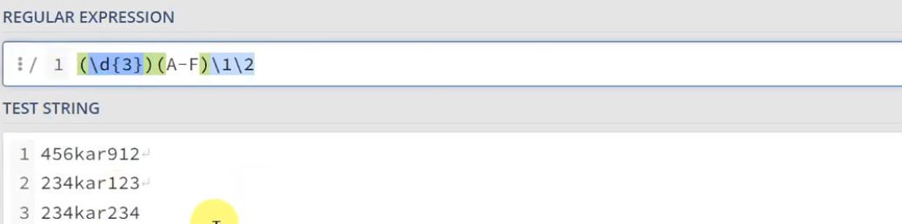
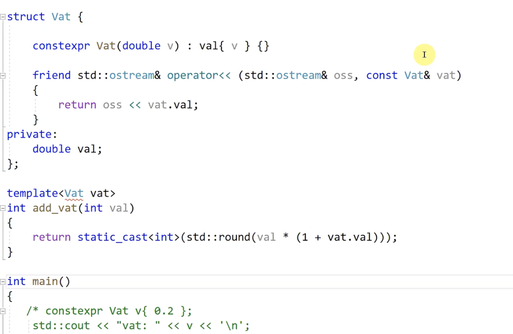
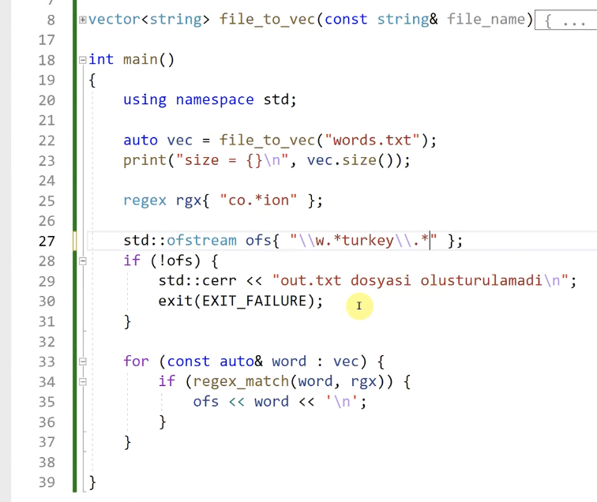
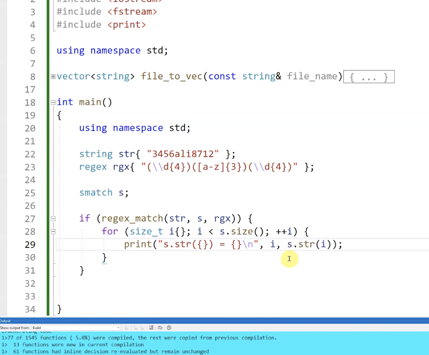
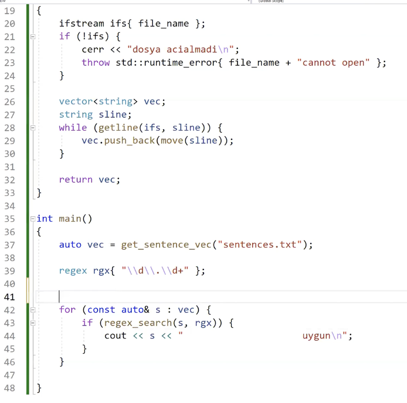

# 34.Ders Notu

# İçerik

# Regex

Regex: regular expression, bir kural setini belirliyor ve bu kural setini kullanalarak text içinde faydalı işlemler yapıyor. Örneğin eposta adresi kodu bir yazının içinde kodu sınayabiliyor.

Bir yazı içerisinde o yazı setini sağlayan kuralları sınaya biliyor.

Arama işlemlerini *regex engine* ile yapabiliyoruz. Tokenizing araçlarını kullanılıyor.

[regex101.com](https://regex101.com) 

**literal characters**: Özel bir karakter grubundal bir şey kullanılmıyorsa bu anlama geliyor *literal* anlamda.

**Basit string operasyonlarında regex kullanma**

**meta character** herhangi bir karakteri nitelemk için (newline dışında) bu karakterleri *escape etmemiz gerekiyor.*
`[aer]` şeklinde yazdığımızda bunun anlamı 'a' 'e' ve 'r' karakterinden 1'i olabilir.

Rakam karakterleri için `[0-9]` şeklinde yazıyoruz.

`[^` karakteri: bu karakterin anlamı bu karakterlerin dışındaki karakterlerdir. 

**Quantifiers**: Nicelik gösteren grammar aracı olarak kullanılıyor. Bir tokenin arkasına geldiğinde o tokenden kaç tane olduğunu betimliyor.

'?' karakteri: 0 ya da 1 tane olabilir. 

`*` karakteri: 0 ya da daha fazla olabilir.

`+` karakteri: 1 ya da daha fazla olabilir.

`{}` karakteri: belirli bir sayıda olabilir. `{2}` şeklinde yazdığımızda 2 tane olabilir. `{2,}` şeklinde yazdığımızda 2 ya da daha fazla olabilir. `{2,4}` şeklinde yazdığımızda 2 ya da 4 tane olabilir.

`\s` whitespace karakteri. 

`\d` digit karakteri. 

`\w` word karakteri. 

`\b` word boundary karakteri.

### Parantez Atomu

hem notasyonda öncelik kazandırıyor hem de capture grup denen özelliğe sahip.


**back referans**: regex stringi içerisinde bulunan bir grubun tekrar kullanılmasını sağlayabiliyor






Ayın günlerini aramak için:


kullanılabilir.

**Positive lookahead** ? işaretinden sonra bir şey var mı diye bakıyor.
**Negative lookahead** ?= işaretinden sonra bir şey yok mu diye bakıyor.

bir quanttifier'ın sonuna ? işareti koyduğumuzda o quantifier'ın greedy olmamasını sağlıyoruz. Koşulu sağlayan ilk değeri bulduğunda durucak.

# CPP ve Regex

`#include <regex>` kütüphanesi ile regex kullanılabilir.

- regex engine'ı hazırlıyor ve bu engine ile arama işlemleri yapılıyor.
- Mutlaka ve mutlaka bir regex sınıfı türünden bir nesne tanımlanmalı
`regex rgx{"cdel"};` şeklinde tanımlanabilir.
- Dikkat etmmemiz gereken şey '\' karakteri kullanmamız durumunda escape karakteri olduğu için iki kez yazmamız gerekiyor.
- `regex rgx{"c\\del"};` şeklinde yazılmalı.
- Eğer oluşturulan regex'te bir hata var is exception throw ediyor

`regex_match` ile arama yapıyoruz ve en basit kullanım şekli 2 parametre ile kullanmak örneğin:

```cpp
#include <regex>
#include <iostream>

int main()
{
    std::string s = "ali";
    std::regex rgx{"ali"};
    std::cout << std::regex_match(s,rgx) << "\n";
}
```


Bu fonksiyon verilen dosya isminin içerisindeki stringleri vector'e atıyor. 



- `regex_search` fonksiyonu ile arama yapılıyor. Buna bir parametre daha ekleniyor. Regex_match'te amaç uydu/uymadı diye kullanabilirizi. 
- Eğer biz match ile ilgiili diğer özellikleri istiyorsak o bilgileri kullanmamızı sağlayacak bir nesneye ihtiyacımız var. eğer makul bir neden yoksa out-parametre kullanmamalıyız.

> Out parametre: iletmek istediğimiz parametrelerin değerlerini değiştirmek için kullanılan parametrelerdir. Nesneyi referans semantiği ile gönderiyoruz. Aksi yönde bir sorun yoksa geri dönüş değerini kullanın.

Regex için geçmemiz gereken nesnenin türü `std::smatch` (eğer arama std::string üstünde yapılıyorsa )ya da `cmatch`( aramayı cstring içerisinde yapılıyorsa)  olmalı. 

Birer `container` ve elemanları submatch, dolayısıyla bu nesne içerisinde bir öğeye eriştiğimiz de bunun türü *submatch* oluyor.

```cpp
int main()
{
    using namespace std;
    smatch sm;
    print("{}\n", sm.empty()); //şu anda boş.
}
```

- Capture grupları: parantez atomları ile oluşturulan gruplar. Bu gruplar içerisindeki elemanlar submatch türünden oluyor.
- Container'daki ilk öğe tam eşleşen öğe oluyor.
- İlk grup 1. elemanı, 2. grup 2. elemanı gibi ilerliyor.

```cpp
int main()
{
    using namespace std;
    string str{"12321321sdfs3141241"};
    regex rgx{R"(\d+)"};
    smatch sm;
    if(regex_match(str, sm,rgx))
    {
        cout << "match\n";
        print("sm.size() = {}\n", sm.size());
        print("sm.length(0) = {}\n", sm.length(0));
        print("sm.position(0) = {}\n", sm.position(0));

    }
    else
    {
        cout << "no match\n";
    }
}
```



regex_search ile arama yaparken prefix match olan kısımdan önce match olmayan kısımları veriyor, suffix match olan kısımdan sonra match olmayan kısımları veriyor.

