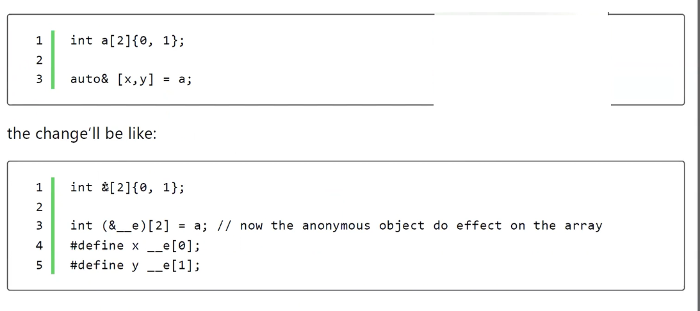
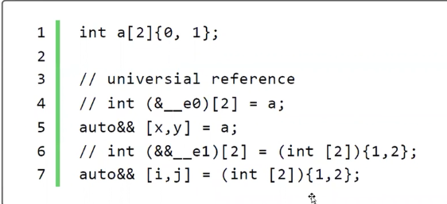

# 6.Hafta

> 10_29_07_2023

## CTAD: Class Template Argument Deduction

- Aslında C++17 dile eklenen sınıf şablonları için bir tür çıkarımının yapılması. Artık C++17 ile sınıf şablonları içinde bir tür çıkarımı sağlanıyor.
- - Çıkarımın yapılmasını sağlamak veya derleyici yönlendirmek için `deduction guide` dile eklendi. User-type sınıflar içinde bu çıkarımı yapabiliyoruz.
- Kodların yazımını ve okunmasını kolaylaştırıyor.
- Kod kalabalığını azaltmak için daha önceden fabrika fonksiyonu kullanılıyordu.

```cpp
int main()
{
    using namespace std;
    auto p = make_pair(12, 5); // pair<int, int> çıkarımı fonksiyon için yapılabiliyor.
}
```

- Artık make_pair'i kullanmak yerine CTAD'dan faydalanılabilir.
- Derleyici consturctorlara bakarak tür çıkarımı yapabiliyor. Hom type hem de non-type parametreleri için bu çıkarım yapılabiliri.
- Aggregat sınıflar için de bu çıkarım yapılabilir. Burada C++20 ile bazı farklılıklar oluştu.
- CTAD'ın constructor'ın explicit olup olmaması çıkarımı ekliyor
- Argümanların sınıf türünden olmasında da bir sakınca yok.

```cpp
template <typename T>
class MyClass
{
public:
    MyClass(const T& x) : mx{x}{
        std::cout <<  typeid(T).name() << "\n";
    }
    T mx;
};

template <typename T>
Myclass<T> make_myclass(const T& x)
{
    return Myclass<T>{x};
}
int main()
{
    Myclass<int> x{12}; // C++17'den önce bu şekilde yazılıyordu.
    auto mx = make_myclass{20}; /// CTAD olmadığından dolayı bu şekilde yazılıyor.
   Myclass m(12);  
}
```

- Çıkarımlar daha complex senaryolarla da yapılabilir.

```cpp
template <typename T, typename U>
class Myclass
{
public:
    Myclass(const T& x, const U& y) : mx{x}, my{y}{
        std::cout <<  typeid(T).name() << "\n";
        std::cout <<  typeid(U).name() << "\n";
    }
    T mx;
    U my;
};

int main()
{
    Myclass x{12, 5.24}; // C++17'den önce bu şekilde yazılıyordu.
    auto mx = Myclass{20, 5};
    Myclass m(12, "denem");
}
```

- Örneğin array sınıfını sarmalayan bir template sınıf çıkarımı.

```cpp
template <typename T, std::size_t N>
class Myclass
{
public:
    Myclass(T(&)[N])
    {
        std::cout << typeid(T).name() << "\n";
        std::cout << "constant N is" << N << "\n";
    }
};

int main()
{
    int a[10]();
    //Myclass<int,10> myclass(a);
    Myclass myclass2(a);
    double a[]{1.,3.,5.,7.,9.};
    Myclass 
}
```

- Function pointer ile de kullanılabilir. Geri dönüş değeri T türü olan ve parametresi dizeye referans olan bir function pointer

```cpp
template <typename T, typename U, std::size_t N>
class Myclass
{
public:
    Myclass(T(*)(U(&)[N]))
    {
        std::cout << typeid(T).name() << "\n";
        std::cout << typeid(U).name() << "\n";
        std::cout << "constant N is" << N << "\n";
    }
};

int foo(double(&)[20]){return 1;}

int main()
{    
    Myclass my(foo);
}
```

- Default argümandan da yararlanabiliyoruz. Birden fazla default argüman içinde bundan yararlanabiliyoruz.

```c++
template <typename T = double>
struct Myclass
{
    Myclass() :val(){}
    Myclass(T x = 0) : mx{x} {}
    T mx;
};

Myclass m1{19};
Myclass m2;  // Myclass<double> m2;
```

> `T{}` eğer sınıf türleri ise default ctor çağırılır, eğer aritmetik türlerden bir tür ise 0 ile başlatılır.

```c++
template <typename T = double, typename U = int, typename W = long>
class Myclass
{
public:
    Myclass(T x = T{}, U y = U{}, W z = W{}) : mx{x}, my{y}, mz{z} {}
    T mx;
    U my;
    W mz;
};

int main()
{
    Myclass m1{12, 5, 7}; // Myclass<int, int, int> m1{12, 5, 7};
    Myclass m2; // Myclass<double, int, long> m2;
}
```

- Çıkarım yapılırken ilk parametre için çıkarım yapılsın fakat ikinci parametreyi kullanayım gibi bir sentaks yok.

```c++
template <typename T, std::size_t N >
struct Array
{};

int main()
{
    std::array a{1,3,4,5,6,6};
    //std::array<> a{1,3,4,5,6,6};
}
```

- standart kütüphanenin örnekleri

```c++
int main()
{
    using namespace std;
    vector v{1,2,3,4,5,6,7,8,9,10}; // vector<int> v{1,2,3,4,5,6,7,8,9,10};
    list l{1,2,3,4,5,6,7,8,9,10}; // list<int> l{1,2,3,4,5,6,7,8,9,10};
    set s{1,2,3,4,5,6,7,8,9,10}; // set<int> s{1,2,3,4,5,6,7,8,9,10};
    set s2{1,2,3,4,5,6,7,8,9,10}, [](int a,int b){return b<a;}; //
}
```

```c++
template<typename F>
class Myclass
{
public:
    Myclass(F f) : mf{f} {
        std::cout << typeid(F).name() << "\n";
    }
    F mf;
};

int main()
{
    Myclass m{std::less<int>{}}; 
    // Myclass<lambda> m{[](int x, int y){return x + y;}};
}
```

- Joustis örneği

```c++
template <typename T>
class CountCalls
{
public:
    CountCalls(T f) : mf{f} {}
    T mf;
    int count{};
    template <typename... Args>
    auto operator()(Args&&... args)
    {
        ++count;
        return mf(std::forward<Args>(args)...);
    }
    int count() const { return count; }
private:
    T mf;
    int count{};
};

int main()
{
    using namespace std;
    vector<string>msvec;
    rfill(mvec,10000,rname);
    auto f = CountCalls{[](const string &s, const string y){return s.size() < y.size();}};    
    sort(mvec.begin(),mvec.end(),ref(f));
    //ref fonksiyonu 
    cout<< "f.count() = " << f.count() << "\n";
    // Myclass<lambda> m{[](int x, int y){return x + y;}};
}
```

- Buradaki ref neden kullanıldı? Algoritmalara bunu gönderirken kopyalama oluşmamasını istiyoruz. Ve bizim gönderdiğimiz nesnenin coun'tu arttırmazdı.

- Bazı templeatelerde fonksiyonun parrmetresi referans değil ve bu fonksiyonlara storage küçük bir nesne gönderdiğimizde kopyalanabiliyor fakat burada büyük nesneler için kopylama yapmak istemiyoruz.
- - Fonksiyon şablonundan oluşturulmuş fonksiyonun referans olmasını istiyoruz ve bunu reference wrapper ile sağlayabiliriz.

```c++
#include <algorithm>
class Pred
{
public:
    bool operator()(int)const
    {}
private:
    int ma[1024]; //her kopyalama da bu dizi de kopyalama olucaks
};


int main()
{
    find_if(); //3.parametresi referans değil.
    Pred mypred;
    vector<int> ivec(100'000);
    auto iter = find_if(ivec.begin(),ivec.end(),mypred); // kopyalama olucak
}
```

- Pred nesnesi fonksiyonun parametre değişkenine kopyalanacak.
- `for_each` algoritmasının geri dönüş değeri callable. 3.parametresi callable ve range'teki üyeleri callable'a gönderiyor.

```c++
class Functor
{
pulbic:
    Functor(int val) : mval{val} {}
    void operator()(int)const
    {
        if(x > mval)
            ++m_count;
    }
    int count() const { return m_count; }
private:
    int mval;
    int m_count{};
};

int main()
{
    using namespace std;
    vector<int> ivec(100'000);
    rfill(ivec,20'000, Irand(0,100'000));    
    auto f = for_each(ivec.begin(),ivec.end(),Functor{90'000});
    cout << "f.count() = " << f.count() << "\n";
}
```

- - Genel olarak yazma algoritmaları genellikle yazdığı konumdan sonraki konumu döndürüyor.

```c++
int main()
{
    using namespace std;
    vector<int> ivec(100'000);
    list<int> ilist(100'000);
    auto end_iter = for_each(ivec.begin(),ivec.end(),Functor{90'000});
    // ivec.begin() + 100000
    //liste yazılmış son konumu döndürüyor
}
```

- Bazı durumlarda küme parantezi ile normal parantez kullanmak arasında fark var

```c++
int main()
{
    using namespace std;
    vector<int> ivec(100'000);
    vector v2{v1};//vector<int>
    vector v3(v1,v1);//vector<vector<int>>
}
```

```c++
int main()
{
    using namespace std;
    list<pair<string,double>> mylist = {{"ali",12.5},{"veli",15.5},{"selami",20.5}};
    //vector v1(mylist.rbegin(),mylist.rend());
    vector v1{mylist.rbegin(),mylist.rend()}; // vector<iterator> açılımı oluyor
    for(const auto &[name, wage] : v1)
        std::cout << name << " " << wage << "\n";
}
```

- Std'de bazı kütüphanelerde CTAD kritik durum taşıyor.

```c++
template <typename T>
class Complex
{
public:
    constexpr Complex(T& re = T(), const T& im = T{});
private:    
    T real;
    T imag;
};


int main()
{
    using namespace std;
    complex c1{12.5, 5.5}; // complex<double> c1{12.5, 5.5}; Sınıf şablonunn
    complex c1{12.5};
    complex<double> c3{4.5};    
}
```

- Std::function bir callable'ı sarmalıyor.

```c++
int foo(int);
double bar(double,double);
struct Functor
{
    int operator()(int);    
};
int main()
{
    using namespace std;
    function f1{foo}; // function<int(int)> f1{foo};
    //function<int,int> şeklinde yazılması lazımdı.
    function f2{bar}; // function<double(double,double)> f2{bar};
    function f3{Functor{}}; // function<int(int)> f3{Functor{}};
    function f4{[](int x){return x;}}; // function<int(int)> f4{[](int x){return x;}};
}
```

- Bazı durumlarda çıkarım mekanizması yok.

```c++
//vector<pair>v1{{1,2},{3,4},{5,6}};   //burada bir çıkarım yapılmıyor.
vector v2{{1,2},{3,4},{5,6}}; // burada bir çıkarım yapılıyor.
```

- Specialization kullanılması CTAD kullanımını etkilemiyor.

```c++
template <typename T>
struct Myclass
{
    Myclass(T x) : mx{x} {}
    T mx;
};

template<>
struct Myclass<int>
{
    Myclass(int x) : mx{x} {}
    int mx;
};
int main()
{
    Myclass x{123};
}
```

### Deduction Guide

- Örneğin myclass için dizi çıkarımları int bir dizi için çıkarım `int[5]` şeklinde yapılıyor ve biz burada bu dizinin array decay ile pointer'a dönüşmesini istiyoruz.
- Bu çıkarımı sadece T'türünün çıkarımının yapılması için kullanıyoruz. Constructor'ın referanslık durumu değişmiyor.

```c++
template<typename T>
class TypeTeller;

template<typename T>
class Myclass
{
public:
    Myclass(const T& x) : mx{x} 
    {
        //TypeTeller<T> t; bu sentaks hatası veriyor ve türü görmek için kullanabiliriz.

    } // Diziye dizi ile ilk değer vermek sentaks hatası oluyor bunun için 
    //arrray decay uygulanmasını istiyoruz.
private:
    T mx;
};
template<typename T>
//<Sınıfınismi>(T) -> <Çıkarımın nasıl yapılmasını istiyorsak>
Myclass(T) -> Myclass<T>; // 

int main()
{
    Myclass m{"den"}; //char [4] türünden bir nesne
}
```

- Basit örnekler

```c++
typename <T>
class TypeTeller;

template<typename T>
class Myclass
{
public:
    Myclass(const T& x) : mx{x} 
    {
        TypeTeller<T> t; // bu sentaks hatası veriyor ve türü görmek için kullanabiliriz.
    }
};
template <typenmae T>
Myclass(T) -> Myclass<T&>;
Myclass(char)->Myclass<long>;
Myclass(short)->Myclass<long>;
Myclass(int)->Myclass<long>;
Myclass(unsigned int)->Myclass<long>;

int main()
{
    Myclass m{'a'}; //long
    Myclass m2{12}; //long
    Myclass m3{12u}; //long
}
```

```c++
template<typename T>
class Myclass
{
public:
    Myclass(const T& x) : mx{x} 
    {
    }
};

template <typename T>
Myclass(T) -> Myclass<T*>;
Myclass(const char *) -> Myclass<std::string>; // const char* türünün çıkarımını string olarak yapıyoruz.

int main()
{
    int x = 10;
    Myclass m{x}; // Myclass<int*>
}
```

- Pair ve tuple içiin

```c++
template<typename T, typename U>
class Pair
{
public:
    Pair(const T& x, const U& y) : mx{x}, my{y} {}
};
template<typename T, typename U>
Pair(T,U) -> Pair<T,U>; // bu sayede fonksiyon parametresi referans gödnerildiğinde dizi de çıkarım pointer olarak yapılıyor.
```

- Tuple için

```c++
template<typename... Ts>
class Tuple
{
public:
    constexpr Tuple(const Ts&... args) : mt{args...} {}
    template<typename... Us> constexpr Tuple(Us&&... args) : mt{std::forward<Us>(args)...} {}
};
template<typename... Ts>
Tuple(Ts...) -> Tuple<Ts...>;

int main()
{
    Tuple tx{42,"hello",nullptr};
}
```

```c++
template<typename T>
struct Sum
{
    T value;
    template<typename... Args>
    Sum(Args&&... args) : value{(args + ...)} {} //argümanların tooplam değeri ile değerleri init ediyoruz.
};
template<typename ...Types>
Sum(Types&& ...ts) -> Sum<std::common_type_t<Types...>>; // argümanların türlerinin ortak türünü buluyoruz.

int main()
{
    Sum s{1u,2.0,3,4.0f};
    Sum strsum{std::string{"ali"}, "veli"};
    std::cout << s.value << strsum.value << "\n";
}
```

- Vector'de range constructor'ı için aşağıdaki gibi bir çıkarım yapılıyor. vector'için `int*, int*` türünden bir parametre geçilirse çıkarımı `int` olarak yapılıyor.

```c++
namespace std
{
    template<typename InputIterator>
    vector(InputIterator,InputIterator) -> vector<typename iterator_traits<InputIterator>::value_type>;
}
```

- Aggregate türlerin çıkarımı için aşağıdaki gibi bir initialization yok.

```c++
template<typename T>
struct Myclass
{
    T mx;
};
template<typename T>
Myclass(T) -> Myclass<T>;
int main()
{
    //Myclass<int> x1 = 10; C++ 17 ile aşağıdaki de sentaks hatası bunun için deduction guide vermemiz gerekiyor
    // Myclass mynec(20);
    Myclass myclass = {20};
}
```

- Aşağıdaki gibi bir çıkarım yapılamıyor.

```c++
template<typename T>
clas Myclass
{
public:
    Myclass(const T& x) : mx{x} {}
private:
    T mx;
};

int main()
{
    Myclass myc(29);
    //Myclass *p = &myc; sentaks hatası
}
```

- `explicit` olarak deduction guide verilebiliyor.

```c++
template<typename T>
struct Myclass
{
    T mx;
};
explicit Myclass(const char *) -> Myclass<std::string>;
int main()
{
    Myclass myc("ali");
    Myclass m = Myclass {"ali"};
}
```

- Aşağıdaki örnekte explicit olarak veriilmiş, m için açılım Myclass'ın int* açılımı, sınıfın 2 constructorı var ve burada çağıralacak constructor U template parametresi olarak çıkarım yapılıyor.
- Fakat buarada U'nun tür çıkarımı int olarak yapılıyor.
-

```c++
template<typename T>
struct Myclass
{
    Myclass(T){std::cout << "ctor\n";}
    template<typename U>
    Myclass(U)
    {
        std::cout << "uctor\n";
        std::cout << typeid(U).name() << "\n";
        std::cout << typeid(*this).name() << "\n";
    }
};
template<typename T>
explicit Myclass(T) -> Myclass<T*>;

int main()
{
    Myclass m{12}; // Myclass<int*> deduction guide
    Myclass p2 = 52; // Myclass'ın int açılımı
    int i = 42; 
    Myclass p3{&i}; // Deduction guide devreye girecek ve Myclass<int**> olacak
    Myclass p4 = &i; // Myclass<int*> olacak
}
```

## Structure Binding

Bir dizi için, öğeleri tamemen public olan bir sınıf için ve tuple için kullanılabilir.

- Bu türden nesnelerin öğelerine daha yüksek verimle ayrıştırılmasını sağlamak.
- Aşağıdaki fonksiyonun first ve second'ını kullanmak istiyoruz.r

```c++
pair<int,double> foo()
{
    return {12, 5};
}
struct Myclass
{

    int ival{};
    double dval{};
    std::string sval{"deneme"};
};
int main()
{
    auto [x,y] = foo();
    std::cout << x << " " << y << "\n";
    int ar[3] = {1,2,3};
    auto [a1,a2,a3] = ar;
    Myclass m;
    auto [i,d,s] = m;
}
```

**Sentaksı**:

- `auto` keyword'ü mecburu, referans deklaratörü olabilir ya da olmayabilir.

```c++
auto [x,y] = var;
auto &[x,y]( var);
auto &&[x,y]{var};
```

- Aşağıdaki çıkarım her zaman eşittirin sağ tarafındaki nesne için yapılıyor. Bunun için istenmeyen öğeleri kullanılmayan öğeler için

```c++
struct Point
{
    int x,y,z;
};

int main()
{
    Point p1;
    auto [x,y,_] = p1;
    //auto [x,_,y] = p2; sentaks hatası aynı scopeta aynı isim bulunuyor.
}
```

```c++
struct Myclass
{
    double dval{};
    int a[5]{};
}
auto [d,x] = mynec;
//üretilen kod
/*
    Myclass __abc = mynec; kullanılan alias'lar
    d ==> __abc.dval eşisim gibi oluyor.
    yine aynı şekilde derleyicinin oluşturduğu nesnenin a dizisini kullanıyoruz
    x ==> __abc.a 
*/
int main()
{
    is_same_v<decltype(x),int *> ;//false    
    is_same_v<decltype(x),int[5]> ;//true
}
```

- Her zaman öğe sayısı kullanılan yerdeki öğe sayısı ile aynı olmalıdır.

### Diziler için

- Eğer referans ile bağlıyorsak bu değerleri değiştirdiğimizde dizinin elemanın değerini değişitirmiş oluyoruz.:

```c++
int main()
{
    int a[] = {10,20,30};
    auto &[e1,e2,e3] {a};
    ++e1;
    ++e2;
    ++e3;
    cout <<" e1: "<< e1 << " e2: " << e2 << " e3: " << e3 << "\n";
    cout << a[0] << " " << a[1] << " " << a[2] << "\n";
}
```



- Eğer `&&` deklaratörü kullanılsaydı:



- Dizi döndüren fonksiyon

```c++
auto get_array()->int(&)[3]
{
    static int a[3] = {1,2,3};
    return a;
}

int(&get_array_c())[3]
{
    static int a[3] = {1,2,3};
    return a;
}

using ar3_t = int[3];

ar3_t& get_array_ref()
{
    static int a[3] = {1,2,3};
    return a;
}


int main()
{
    using namespace std;
    auto [a,b,c] = get_array();
    auto [a1,b1,c1] = get_array_c();
    auto [a2,b2,c2] = get_array_ref();
}
```

### Sınıflar için

- Öğeleri public olan sınıflar için de kullanılabilir.

- Aşağıdaki kod için sentaks hatası üyelerin private olması.

```c++
clsas Myclass
{
    int a{10};
    int b{20};
    int c{30};
    friend void foo(); //ile sentaks hatasını çözebiliriz.
};

int main()
{
    auto [x,y,z] = Myclass{};
}
```

- Taşıma semantiğinden de faydalanabiliyioruz.

```c++
class Person
{
public:
    std::string mname{"deneme"};
    std::string msurname{"deneme surname"};
};

int main()
{
    Person p;
    auto [name,surname] = p;
    cout << p.name.length() << " " << p.msurname.length() << "\n";

    auto [nname,nsurname] = std::move(ğ);
    cout << p.name.length() << " " << p.msurname.length() << "\n"; // 0  0 taşıma semantiği 
}
```

### Tuple Interface'i ile

```c++
std::pair<std::string, std::string> foo();

int main()
{
    string s1;
    string s2;
    auto ps = foo();
    s1 = ps.first;
    s2 = ps.second;
}
```

- Burada s1,s2 default init edildi. Ve daha sonra copy-assignment fonksiyonu çağırııyordu. Burada bunu efektif yapmak için tie fonksiyonu kullanılıyor.

```c++
int main()
{
    using namespace std;
    tuple<int,double,string> tx{12,5.5,"ali"};
    //tuple da atamalar yapıldığında 
    tuple<int,double,string> ty;
    ty = tx; //ty'nin öğeleri değerlerini tx'ten alıyorlar.
    int i;
    double d;
    string s;
    tuple<int & ,double & ,string&> tz(i,d,s);
    //tz'nin öğeleri constructor'da gönderilen öğelere referans. Bu durumda bu tuple-nesnesine atama yapabiliyoruz.
    tz = tx;     
    //bunu isimlendirmeden aşağıdaki gibi de yazabiliriz.
    tuple<int & ,double & ,string&> = tx;

    //bunun yerine bize bunu veren bir fabrika fonksiyonu var.
    tie(i,d,name) = tx;
}
```

```c++
int main()
{
    using namespace std;
    vector<string> svec;
    rfill(svec,20,rname);
    print(svec);
    auto [min,max] = minmax_element(svec.begin(),svec.end());
}
```

---

> 11_30_07_2023

---

- Container'da tuple tutmak

```c++
using Person = std::tuple<int, std::string, s td::string>

int main()
{
    using namespace std;
    std::ofstream ofs{"out.txt"};
    if(!ofs)
    {
        std::cerr << "out.txt dosyasi olusturulamadi\n";
        exit(EXIT_FAILURE);
    }
    ofs.setf(ios::left, ios::adjustfield);
    //ofs << left; //bu şekilde de yapılabilir. Fakat bu sadece ilk yazma işlemi için
    vector<Person> pvec; //pvec(10'000); vectorün fill constructor'ı 10'000 tane öğe ile başlatılıyor value initialize ediliyor.
    pvec.reserve(10'000); 
    cout << pvec.capacity() << "\n"; //kapasite 10'000 olmak zorunda değil minimal 10'000 olabilir.
    for(int i = 0; i <10'000; ++i)
    {
        pvec.emplace_back(Irand(0,1000)(),rname() + ' '++ rfname(),rtown()); //Irand, rname, rfname, rtown fonksiyonları yardımcı kütüphaneden geliyor
    }
    cout << pvec.size() << "\n";
    
    sort(pvec.begin(),pvec.end()); //std::less kullanıldı.
    for(const auto& per:pvec)
    {
        cout << setw(12) << get<0>(per) << '\t' << setw(12) << get<1>(per) << '\t' << get<2>(per) << '\n';
    }

    for(const auto& [id,name,town]:pvec)
    {
        ofs << setw(12) << id << '\t' << setw(12) << name << '\t' << town << '\n';
    }
}
```

> tuple ve pair karşılaştırılması, pair için first'ler önce karşılaştırılıyor, eğer eşitse second'lar karşılaştırılıyor.
> tuple içinse bunun çoklusu.
