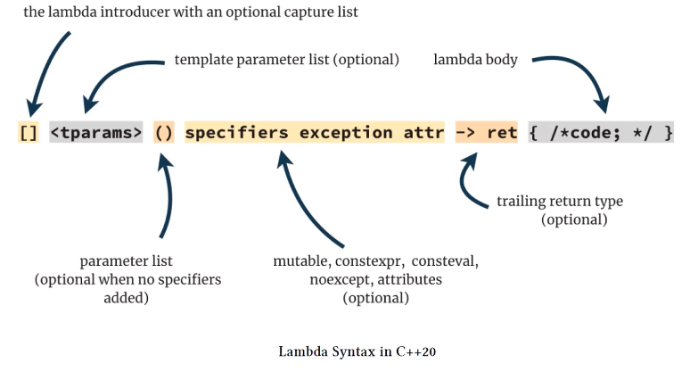
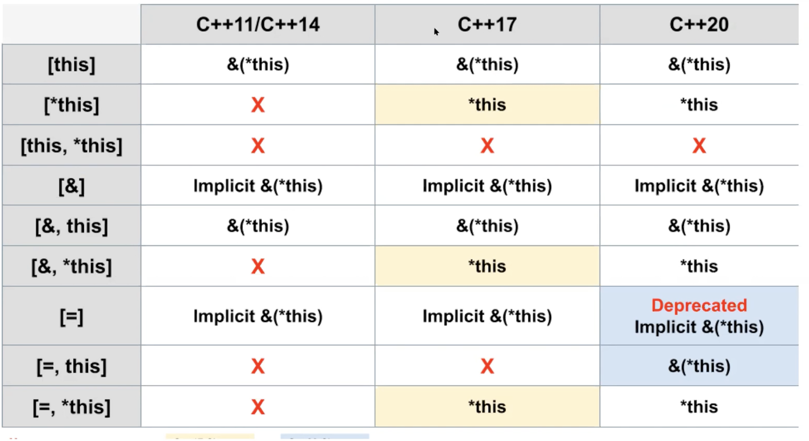

# 7.Hafta

---

> 05_08_2023

---

## İçindekiler

- [7.Hafta](#7hafta)
  - [İçindekiler](#i̇çindekiler)
  - [Space Ship Operatörü](#space-ship-operatörü)
  - [Lambda İfadeleri, C++20 ile Gelen Yenilikler ve Tipik Idiomlar](#lambda-i̇fadeleri-c20-ile-gelen-yenilikler-ve-tipik-idiomlar)
    - [Örnek sorular](#örnek-sorular)
    - [Hızlı Temel Tekrar](#hızlı-temel-tekrar)
      - [Sentaks Öğeleri](#sentaks-öğeleri)
      - [Capture Close](#capture-close)
      - [Sınıfın üye fonksiyonları içinde capture](#sınıfın-üye-fonksiyonları-içinde-capture)
      - [constexpr Keyword'ü](#constexpr-keywordü)
      - [std::function](#stdfunction)
      - [Generalized Lambda](#generalized-lambda)
      - [lambda init capture](#lambda-init-capture)
      - [Noexcept olup olmaması](#noexcept-olup-olmaması)
      - [Positive Lambda Idiom'u](#positive-lambda-idiomu)
    - [IFI (Immidiately Invoked Function Expression)](#ifi-immidiately-invoked-function-expression)

## Space Ship Operatörü

Bu operatörü çoğunlukla doğrudan kullanmıyoruz. Kullandığımız yer kendi türlerimiz için bu operatörü overload ettiğimiz yerler. Artık operatörler arasında bir ayrım yapılıyor ve bu ayrım:

1. `==` ve `<=>` operatörü
2. `!=`, `>`, `<=`, `>=`, `>` operatörleri

- Primary operatörler ***reversable*** (*derleyici uygun fonksiyon bulunmaması durumunda operandları yer değiştirebiliyor*).
- Secondary operatörler ise **rewritable** ( eğer x!=y  yok ise bunu !(x==y) olarak değiştirebilir.)

Bu da kendi sınıflarımız için `!=` değili yazmamıza gerek yok `==` yazmamız yeterli olacak. Aynısı diğer operatörleri yazmak yerine `<=>` operatörünü yazmamız yeterli olacak.

- Öğeler bildirim sırasına göre karşılaştırılır.

- `==` fonksiyonu için aşağıdaki örtülü dönüşümler yapılıyor.

```c++
class Myclass {
public:
    Myclass(int x = 0) : mx{x} {}
    bool operator==(const Myclass &other) const
    {
        return mx == other.mx;
    }
private:
    int mx;
};

int main()
{
    Myclass x{10}, y{20};
    auto b1 = x == y; // x.operator==(y)
    auto b2 = x != y; // !(x.operator==(y))
    auto b3 = x == 5;
    auto b4 = 5 == x; //C++20 öncesi bu legal değildi, derleyici 5 == x'için x.operator==(5) çağrısına dönüştürüyor.
}
```

- Sadece `<=>` default edilirse diğer 6 karşılaştırma işlemini de yapabiliyoruz

```c++
class Myclass {
public:
    Myclass(int x = 0) : mx{x} {}
    auto operator<=>(const Myclass &other) const = default;
    //auto operator==(const Myclass &other) const = default; bunu da default ediliyor
private:
    int mx;
};

int main()
{
    Myclass x{10}, y{20};
    bool b{};
    b = x == y; // x.operator==(y)
    b = x != y; // !(x.operator==(y))
    b = x != 5;
    b = 5 != x; 
    b = x == 5;
    b = x < y; // x<=> < 0 şeklinde de yazabilirdik fakat bu şekilde daha okunaklı
}
```

- Default edilmiş durumda derleyici yazdığı fonksiyonu, eğer öğelerin karşılaştırılması `noexcept` garantisi veriyorsa fonksiyonda `noexcept` garantisi veriyor.

```c++
template <typename T>
class Type{
public:
    [[nodiscard]] virtual std::strong_ordering
     operator<=>(const Type &)const requires(!std::same_as<T,bool>)= default;
};
```

- Geri dönüş değerinin `auto` olması generic kod kısmında işimize yarıyor. Burada geri dönüş değerini trail return type ile belirleyebiliriz.

```c++
template <typename T, typename U>
class Myclass {
private:
        T mx;
        U my;
public:
    auto operator<=>(const Myclass& other) const -> std::common_comparison_category_t<decltype(mx<=>mx),decltype(my<=>my)>
    {
        if(auto res = mx<=>other.mx; res != 0)
            return res;
        return my<=>other.my;
    }
};
```

- Vectorler için Lexicographical comparison yapılıyor.

```c++
int main()
{
    using namespace std;
    vector v1(100'000, 5);
    vector v2(5, 6);
    bool b = v1 < v2; // false

    //lexicographical comparison için 2 farklı container kullanabiliyoruz.
    list mylist{3,6,7,9,1};
    vector myvec{3,6,8,1};
    cout <<boolalpha <<lexicographical_compare(mylist.begin(), mylist.end(), myvec.begin(), myvec.end());//true
}
```

- C++20 ile öyle durumlar varki range'leri spaceship operatörü ile karşılaştırmamız gerekebilir, bunun için lexicoğraphical_compare_three_way algoritması eklendi ve bu fonksiyonun geri dönüş değeri `<=>` operatörünün geri dönüş değeri.

```c++
std::ostream& operator<<(std::ostream& os, const std::strong_ordering& so)
{
    return so == 0 ? os << "equal" : so < 0 ? os << "less" : os << "greater";
}

int main()
{
    list mylist{3,6,7,9,1};
    vector myvec{3,6,8,1};
    auto result = lexicographical_compare_three_way(mylist.begin(), mylist.end(), myvec.begin(), myvec.end());//true
    cout << result << "\n";
}
```

## Lambda İfadeleri, C++20 ile Gelen Yenilikler ve Tipik Idiomlar

- C++11 standartı ile dile eklendi.

Lambda ifadesi karşılığında bir local sınıf oluşturuyor ve ifade kategorisi PR-Value. Derleycinin oluşturduğu sınıf türüne `closure-type` deniyor. Nesneye ise `closure object` deniyor. Nested function'ın C++ karşılığı. Fonkisyon ihtiyacı olan nokta ile fonksiyonun arasındaki mesafeyi kapatıyor. Fonksiyona nerede ihtiyaç var ise orada tanımlıyoruz. Derleyicinin optimizasyon olasılıkları da optimize edilmiş oluyor.

### Örnek sorular

```c++
int g = 99;
auto fx = [=]{return g+1;}
auto fy = [g=g]{return g+1;}

int main()
{
    g = 500;
    cout << fx() << "\n"; //100
    cout << fy() << "\n"; //100
}
```

```c++
int main()
{
    auto x = {static int x{}; return ++x;}
    decltype(x) y;
    decltype(x) z;
    cout << y() << y() << z() << "\n";
    cout << y() << z() << z() << "\n";    
}
```

```c++
int main()
{
    const int x = 10;
    //auto f = [x]()mutable{++x;}; Sentaks hatası.  Capture close'da x ismi kullanılmış 
    //copy-capture ve burada sınıfın veri elemanı const, sınıfın üye fonksiyonu non-const olmasına rağmen
    //sınıfın üye elemanı const olduğu için sentaks hatası oluşuyor.

    //auto g = [x = x](){++x;};  Sentaks hatası.
    // Bunun legal olması için mutable olması gerekiyor, sınıfa bir veri elemanı koyacak ve buradaki x'ile initialize edilecek.
    //sınıfın üye fonksyionu const olduğu için burada sentaks hatası oluşuyor.
    auto h = [x = x]()mutable{++x;};
}
```

```c++
int main()
{
    int x = 4;
    auto y = [x = x + 1, &r = x]()
    {
        r+=2 ;
        return x*x;
    }();
    cout << x << " " << y << "\n"; // 6 25
}
```

```c++
int g = 5;
int main()
{
    auto f = [](int x = ++g){return x*x;};
    auto x = f();
    auto y = f();
    cout << x << " " << y << " " << g <<"\n"; // 36 49 7
}
```

```c++
double i{};
int main()
{

    auto f = [i =0 ]()-> decltype(i) {return 1;}();
    cout << is_same_v<decltype(f), int>;
}
```

### Hızlı Temel Tekrar



- Optional bir kısmı C++20 ile geldi.

```c++
int main()
{
    [](){}; //en basit lambda ifadesi
    [](){}(); //fonksiyon çağrı operatörünü böylede yazabiliyoruz.
    []{}(); //yukarıdaki ile aynı 

    [](int x){return x*6;}; //burada fonksiyon çağrısını yapmıyoruz. ; ile geçici nesnenin ömrü burada bitiyor.
    [](int x){return x*6;}(10);//bulunduğu yerde doğrudan çağırmak. Immidiately invoked function expression
    // bu fonksiyonu birden fazla kez çağırmak istersek closure-type'ı bir değişkene atamamız gerekiyor.
    auto f = [](int x){return x*6;}; //isimlendirilmiş bir function-object yapabiilriz.
    f(10);
    f(20);
    // İsim vererek kodu okuyana yardımcı olunuyor ve genelde const semantiğine uyulması gerekiyor.
}
```

- İsimlendirilmiş lambda ifadeleri const olarak tanımlandığında optimizasyon ihtimali artıyor.
- En sık kullanılan senaryo da lambda ifadesini bir fonksiyonu argüman olarak gönderiyoruruz.

```c++
template <typename F>
void func(F f);

int main()
{
    func([](int x){return x*6;});
}
```

- Bazı durumlarda lambda ifadesi'nin türünü bilmemiz gerekmiyor fakat bazı durumlarda bu bilgiye erişmemiz gerekebilir.

```c++
int main()
{
    auto f = [](int x){return x*6;};
    decltype(f) g = f; //f'nin türünü decltype ile elde edebiliyoruz. 
    cout << typeid(f).name(); //lambda ifadesinin türünü öğrenmek için typeid kullanabiliriz.
    g(10);
}
```

- Closure objectlerin türlerinin aynı olup olmaması bazı durumlarda kritik olabiliyor.

```c++
int main()
{
    auto f1 = [](int x){return x*6;};
    auto f2 = [](int x){return x*6;};
    is_same_v<decltype(f1), decltype(f2)>; //false
    auto f3 = f1; //f1'in türüne göre f3'ün türü belirleniyor.
    is_same_v<decltype(f1), decltype(f3)>; //true
}
```

- auto type-deduction'da dikkat edilmesi gereken closure-type çıkarımı ile bu türden çağırılan fonksiyonun geri dönüş değeri olabilir.

```c++
int main()
{
    auto f = [](int x){return x*6;};
    auto f = [](int x){return x*6;}();
   
}
```

#### Sentaks Öğeleri

`[](){}`

- lambda fonksiyonu *default* olarak `const`.
- Eğer return ifadesi yok ise geri dönüş değeri default olarak `void`. Geri dönüş değerini ise çıkarım yoluyla elde ediyoruz.
- `mutable` ile *non-const* üye fonksiyon olarak tanımlayabiliyoruz.

> semantik tarafında `mutable` kullanımı programcıya semantik olarak o üye veri elemanının problemin domaini ile alakası yok, sınıf nesnesini değiştirmeyen fonksiyonlar olarak işliyor.

- Fonksiyon içerisinde birden fazla return statement olması ve bu return statement'lerin geri dönüş değerlerinin türleri farklı olması sentaks hatası

```c++
int main()
{
    auto f = [](int x)
    {
        if(x < 10)
            return x*6;
        else
            return 7.0;
    };
}
```

- Bu durumda geri dönüş değerinin ya hepsinin aynı olması gerekiyor, ya da *trailing return* type kullanmak.
- Ara bloğun içine artık bir kısıtlama yok.

```c++
int main()
{
    auto f  =[](){
        static int x = 10;
        ++x;
        cout << x << "\n";
    }
    f();
    f();
    f();
}
```

- Aynı ifadeyi tekrar edip birden fazla lambda ifadesini tanımlarsak ve bu fonksiyonlar içerisindeki static yerel değişkenler birbirinden farklı.

**Parametre değişkenleri**:

- C++14 ile default argüman alabiliyor. `[](int x = 10 ){}`
- Yeniliklerden biri generalized lambdalar. C++14 sonrası için bu parametrenin member template şeklinde yazdırabiliyoruz.

```c++
/*
fonksiyon: 

class xyasdf
{
public:
    template<typename T>
    T operator()(T x) const
    {
        return x*6;
    }
};
*/


int main()
{
    auto f = [](auto x){return x*6;};
}
```

- Gönderilen birden fazla argümanın türü aynı olmak zorunda değil. C++20 ile gelen *familiar template syntax* dile eklendi.

#### Capture Close

- Derleyiciye lambda ifadesi ile bir sınıf kodu yazdırdığımızı biliyoruz. Parametre parantezi içinde `auto` kullandığımızda bunun template member fonskiyonu yaptığımızı biliyoruz. İlave bir sentaks kullanmak durumunda sınıfın bir veri elemanı olmuyor ve bu durumda bizim derleyiciye veri elemanı ekleyip bunu veri elemanı için constructor yazılmasını istiyoruz.
- Sınıfa eklenecek veri eleman referans olmayan herhangi bir türden olabilir. Burada bazı avantajları elde etmek için referans semantiğini kullanmak isteyebiliriz.
- Fonksiyon içerisinde statik ömürlü değişkenleri doğrudan kullanabiliriz. Bunları capture etmeye çalışırsak sentaks hatası oluşuyor.
- nesne'nin const olması ve sabit bir değer ile ilk değerini alması durumunda capture etmemize gerek yok.

```c++
int main()
{
    int val{35};
    auto f = [val](int a){return val*a;}; //copy capture
}
```

- `val` derleyicinin oluşturduğu sınıfın non-static veri elemanı.
- Birden fazla değeri virgüller ile ayrılmış liste ile capture edebiliriz.
- `=` tokenini kullanarak tüm görünen yerel değişkenleri capture edebiliyoruz.
- capture edildiğinde direkt array-decay oluşmuyor, diziyi direkt alıyoruz gibi düşünebiliriz.
- Init capture ifadesi kullandığımızda ise array-decay oluşuyor.

```c++
int main()
{
    int a[4]{};
    auto f = [a]{
        std::is_same_v<decltype(a), int*>; //false
        std::is_same_v<decltype(a), int[4]>; //false
    }
    auto f1 = [a = a](){
         std::is_same_v<decltype(a), int*>; //true
    }; 
}
```

- capture edilen nesnenin değerini değiştirebilmemiz için `mutable` olması gerekiyor.

```c++
int main()
{
    int x = 10;
    auto f = [x]()mutable{return ++x;};
    f();
    f();
    f();
}
```

- Nesnenin kendisini kullanmak istiyorsak ve o nesneyi değiştirmek isteyebiliriz, bu durumda yakalamayı referans semantiği ile yazmamız gerekyiyor.

```c++
int main()
{
    int x = 10;
    auto f = [&x](){return ++x;};
    f();
    f();
    f();
    cout << x << "\n";
}
```

- Bir kısmını referans bir kısmını copy capture edebiliiz

```c++
int main()
{
    int x{}, y{}, z{};
    auto f =[=, &z]{}; //x ve y capture, z referans semantiğii ile
    auto f = [&]{}; //hepsi referans semantiği ile
    auto f = [=]{}; //hepsi copy capture ile
}
```

- Özellikle gerekmiyorsa referans ile capture etmemeye çalış. Bazı durumlarda farkında olmadan *dangling reference* oluşturabiliriz.

```c++
auto foo()
{
    int x;
    return &x; //geri dönüş değeri int * olurdu ve otomatik ömürlü bir nesnenin adresini dönmüş olucaktı.
}

auto fo()
{
    std::vector vec{1,2,3,4,5};
    return vec;
}

auto foo(int i)
{
    auto f = [&](int x){ x*i};
}
int main()
{
    using namespace std;
    auto fn = foo(10);
    auto val = fn(290);
    cout << val << "\n";
    //bu kod undefined behavior oluşturuyor.
}
```

- Bir sonraki derse soru, aşağıdaki closure type için const sol taraf referans değeri kullanılabiliyor mu?

```c++
int main()
{
    using namespace std;
    vector<int> ivec(10000, i);
    auto f = [ivec]{    }; //burada kopyalama yapıyoruz ve maliyeti çok yüksek 

}
```

***Lambda init capture***:

- C++14'ten önce unique_ptr'ı taşımak istediğimizde taşınamıyruz bunun için artık lambda init capture kullanıyoruz.

```c++
int main()
{
    auto uptr = make_unique<string>(10'000,'a');
    //auto f = [uotr](){} Sentaks hatası çünkü unique_ptr kopyalanamaz
    auto f = [&uptr](){}; //bu durumda unique_ptr'ı yakalıyoruz
    f();
    cout << (uptr ? "dolu" : "bos");
    auto f1 = [uptr = move(uptr)]{}; //bu durumda unique_ptr'ı taşıyoruz
    cout << (uptr ? "dolu" : "bos");
}
```

#### Sınıfın üye fonksiyonları içinde capture

- Bunu yapmak için üye fonksiyon hangi nesne için çağırıldıysa onu capture etmemiz gerekiyor. Bunun için biri `this` pointer'ını capture etmek.
- Copy-all ile capture edilebilirdir fakat C++20 ile DEPRECATED hale geldi.
- Referans yoluyla capture edilmesi hale mümkün.

```c++
struct Myclass{
    int mx;
    void func()
    {
        auto f = [this]{return mx;};
        auto f1 = [this]{return this->mx;};
    }
};
```

- Dangling referans oluşmaması için ve fonksiyon içinde *this'in bir kopyasını kullanmak için

```c++
struct Myclass{
    int mx;
    void func()
    {
       auto f = [copy_this = *this]{auto val = copy_this->mx;};
    }
};
```



- C++17 ile `*this` kullanabiliyoruz.

```c++
struct Myclass{
    int mx;
    void func()
    {
       auto f = [*this](){auto val = mx;};
    }
};
```

#### constexpr Keyword'ü

- C++17 standartı ile lambda fonksiyonu eğer `constexpr` olma koşulunu sağlıyorsa `constexpr` oluyor.

```c++
int main()
{
    auto f = [](int x){return x*5  ;};
    constexpr auto val = f(10);
}
```

- **constexpr** keywordünü kullannarak eğer bu durumu bozan bir koşul olduğunda sentaks hatası oluşturuyor.

```c++
int main()
{
    auto fsquare = [](auto val){return val*val;};
    std::array<int, fsquare(5)>a1;
    cout << a1.size() << "\n";

    auto f1 = [](int x){static int cnt = 0; ++cnt; return x*cnt;};
    //std::array<int, fsquare(5)>a1; sentaks hatası 
    auto x = f1(10);
    //auto f2 = [](int x) constexpr{static int cnt = 0; ++cnt; return x*cnt;}; sentaks hatası
}
```

- fsssquare(5) ifadesi c++17 ile birlikte artık varsayılan şekilde constexpr.
- Dolayısıyla fonksiyona sabit ifadeleri ile yapılan çağrıdan elde edilen geri  dönüş değeri sabit ifadesi gereken yerlerde kullanılabilir.
- f1 tanımında static yerel değişklen kullanıldığı için artık bu lambda constexpr olamıyor.
- f2 nesnesinin ise tanımı geçersiz, eğer constexpr anahtar sözcüğü kullanılmasaydı tanımlı olucaktı.

---

> 13_06_08_2023

---

#### std::function

- Fazladan bir bellek alanı kullanıyor ve bazı durumlarda dinamik bir bellek alanıda allocate edebiliyor.

```c++
#include <functional>
int main()
{
    using namespace std;
    auto fn = [](double x){return x*x+.3;};
    cout << "sizeof(decltype(fn))= " << sizeof(decltype(fn)) << "\n"; // 1 byte 
    std::function f = fn; // C++17 ile dile eklenen CTAD.olmasaydı std::function<double(double)> yazmamaız gerekirdi
    cout << "sizeof(decltype(f))= " << sizeof(decltype(f)) << "\n"; // 1 byte 
    cout << fn(5.8763)<<  " " << f(5.8763) << "\n";

}
```

- Bir nesne ile denediğimizde allocation'u görebiliyoruz

```c++
void *operator new(std::size_t sz)
{
    std::cout << "new called with size " << sz << "\n";
    if(sz==0)
        ++sz;
    if(void *p = std::malloc(sz))
        return p;
    throw std::bad_alloc{};
}

class Myclass
{
    unsigned char buf[512]{};
}

int main()
{
    Myclass m;
    auto fn = [m](int x){return x*x;};
    cout << "sizeof(decltype(fn))= " << sizeof(decltype(fn)) << "\n"; // 512 byte
    std::function f = fn; // C++17 ile dile eklenen CTAD.olmasaydı std::function<double(double)> yazmamaız gerekirdi
    cout << "sizeof(decltype(f))= " << sizeof(decltype(f)) << "\n"; // 40 byte fakat burada 512 byte bellek alanı allocate ediliyor.
}
```

- Kullanılması gereken durumlar haricinde kullanma.

#### Generalized Lambda

```c++
int main()
{
    auto get_size = [](const auto &c)
    {
        return std::size(c); //c-arrayleri için bu şekilde yazmamız gerekiyor.
    };
    vector<int> ivec(30);
    list ml{1,2,3,4,5};
    cout << get_size(ivec) << " " << get_size(ml) << "\n";
    cout << get_size("ali") << "\n";
    int ar[20]{};
    cout << get_size(ar) << "\n";
}
```

- generic lambda ile normalde yanlış bir şekilde çıkarılacağı yerde, onun doğru şekilde çıkarılmasını sağlıyor.
- Bazı temalarda birden fazla kez farklı türler için aynı kodu yazmamız ürettirebiliyoruz.
- Yazım kolaylığı sağlıyor.

```c++
int main()
{
    using namespace std;
    vector<pair<string, string>>pvec;
    for(int i = 0; i< 1000; i++)
        pvec.emplace_back(pair{rname(), rownt()});
    //sort(pvec.begin(), pvec.end(), [](const pair<string,string>6x, const pair<string,string> &y{ return pair{x.second, x.first} < pair{y.second, y.first}; } ) );
    sort(pvec.begin(),pvec.end(), [](const auto &x, const auto &y){ return pair{x.second, x.first} < pair{y.second, y.first}; } );

    for(cons auto &[name, town]: pvec)
        cout << name << " " << town << "\n";
}
```

- Bir başka örnek

```c++
void f1(vector<shared_ptr<string>>&svec)
{
    sort(begin(svec), end(svec), [](const shared_ptr<string> &x, const shared_ptr<string> &y){return *x < *y;});
    for_each(begin(svec), end(svec), [](const shared_ptr<string> &sp){cout << *sp << "\n";});
    cout << "-------------------\n";
}

void f2(vector<shared_ptr<string>>&svec)
{
    sort(begin(svec), end(svec), [](const auto &x, const auto &y){return *x < *y;});
    for_each(begin(svec), end(svec), [](const auto &sp){cout << *sp << "\n";});
    cout << "-------------------\n";
}

int main()
{
    vector<shared_ptr<string>>svec;
    
    svec.emplace_back(new string {"deneme1"});
    svec.push_back(make_shared<string>("deneme2"));
    svec.emplace_back(make_shared<string>("deneme3"));
    f1(svec);
    f2(svec);
}
```

- Bir önemli tema da generic lambda'nın perfect forwarding yapabilmesi.

```c++
void foo(std::string &)
{
    cout << "lvalue\n";
}
void foo(std::string &&)
{
    cout << "rvalue\n";
}
void foo(const std::string &)
{
    cout << "const lvalue\n";
}

int main()
{
    auto f = [](auto &&x){ foo( std::forward<decltype(x)>(x));}; //universal referans parametre
    //C++20 ile familiar template syntax ile aynı şeyi yapabiliyoruz.
    std::string name{"deneme"}
    const std::string name1{"deneme1"}
    f(name);
    f(name1);
    f(std::string{"deneme2"});
    auto y = f(x);
    cout << y << "\n";
}
```

- Variadic template de olabilir

```c++
template <typename...Args>
void print(Args&&...args)
{
    std::initializer_list<int>{((std::cout << std::forward<Args>(args) << '\n'),0)...;};
}

int main()
{
    using namespace std;
    print(2,4.5,"denem",string{"fffff"});

    auto fn =[](auto && .....args)
    {
        print(std::forward<decltype(args)>(args)...);
    }
    fn(2,4.5,"denem",string{"fffff"});
    return 0;
}
```

#### lambda init capture

- move only bir türü lambda init capture  bir tür zourunluluk

```c++
int main()
{
    using namespace std;    
    auto uptr = make_unique<string>("deneme");
    auto f = [uptr = move(uptr)]{cout << *uptr << "\n";};
    if(uptr)
        cout << "up dolu"
    else
        cout << "up bos"
}
```

- Bazı durumlarda ilave olarak aşağıdaki gibi bir kod içerisinde s değerini s değişkeninden alıyor.

```c++
struct Baz
{
    auto foo() const
    {
        return [s=s]{std::cout << s<< std::endl;};
    }
    std::string s;
};

int main()
{
    const auto f1 = Baz["xyz"].foo();
    const auto f1 = Baz["abc"].foo();
    f1();
    f2();
}
```

- Lambda story kitabında tanıtılan bir temada

```c++
int main()
{
    using namespace std;
    vector<string>svec(1000);
    //
    string str{"deneme"};
    //...
    auto iter = find_if(svec.begin(),svec.end(), [&str](const string&s){
        return s == str + "den"s;
    }); //3.dereceye geçilen unary predict'ın true değer veren yeri döndürücek
    //bunun yerine
    auto iter = find_if(svec.begin(),svec.end(),  [&str](const string&s){
        return s == str + "den"s;
    }); 
}
```

#### Noexcept olup olmaması

Bazı generic kodlarda fonksiyonun exception throw edip etmemesinde göre kod seçimini yapıyor olabilir.

```c++
template<typename T>
void func(F&&f)
{
    if constexpr(std::is_nothrow_invokable_v<F, int>)
        cout << "no throw";
    else
        cout << "may throw";
}

int main()
{
    auto fn = [](int x){return x*5;};
    func(fn);
    auto fn1 = [](int x)noexcept{return x*5;};
    func(fn1);
}
```

- lambda fonksiyonunu aşağıdaki gibi çağırabiliyoruz.

```c++
int main()
{
    auto val = [](int x ){return x*5}(9);
    auto val1 = [](int x ){return x*5}.operator()(6);

    cout << "val = " << val<< "\n";
}
```

- Eğer lambda stateless ise bu operator fonksiyonun bir tür dönüştürme operatör fonksiyonu var ve bu

```c++
class xyz_13
{
public:
    int operator()(int x)const
    {
        return x*5;
    }
    using ftype = int(*)(int);
    operator ftype()const;
};
```

- Bu da bize pratikte stateless lambdalar fonksiyon adresi türüne implicit olarak dönüşebiliyor.

```c++
int main()
{
    auto fn = [](int x){return x*5;};
    int (*fp)(int) = fn.operator();
    cout << fp(2)<<"\n";
}
```

#### Positive Lambda Idiom'u

- İşaret operatörünün operand'ı pointer olabiliyor.

```c++
int foo(int);
int main()
{
    char c = 'a';
    +c; //bu ifade R-Value oluyor, integral promotion'a neden oluyor ve bu ifadenin türü int.
    int x = 10;
    int *ptr = &x;
    +ptr;//pointer'da olabiliyor.
    inf (*fp)(int) = foo;
    auto val = +fp;
}
```

- Bu da bize stateless lambda'nın function-pointer türüne dönüşüyor ve

```c++
int main()
{
    +[](int x){return x*5};
}
```

- Aşağıdaki örnek çalıştırıldığında ilk for-each'te yeni bir pair yatırılıyor. Burada for-each algoritmasında pairlerden bir kopyalama oluyor. Fakat ikinci for-each algoritması çağırılıdığında generialized lambda kullanıldığında koyalama yerine refereans ile aynı adresler ekrana yazdırılıyor

```c++
int main()
{
    std::map<std::string, int> numbers{{"one",1}, {"two",2}, {"three",3}};

    for(auto mit = numbers.cbegin(); mit != numbers.cend(); ++mit)
        cout << mit->first << " " << mit->second << "\n";
    std::for_each(numbers.cbegin(), numbers.cend(), [](const std::pair<std::string, int> &p ){cout << p.first << " = " << p.second << "\n";});
    // 
    std::for_each(numbers.cbegin(), numbers.cend(), [](const auto &p ){cout << p.first << " = " << p.second << "\n";});
}
```

### IFI (Immidiately Invoked Function Expression)

```c++
int main()
{
    [](int x){cout << x*5 << "\n";}(10);
}
```

- Bunun bir faydası initialization const nesneye ilk değer vermemiz zorunlu ve bu ilk değer bir hesaplamayla elde edililyor olabilir.
- Böylece const' i olan değere geri dönüş değeri ile verebildik.

```c++
const int i = [&] {
    int i = some_default_value;
    if(someConditionIsTrue)
    {
        Do some operations and calculate the value ıf i;
        i = some calculated value;
    }
    return i;
}();
```

- Bunu free function yapabilirdik, fakat burada lokal değerleri argüman olarak göndermemiz gerekiyordu.

```c++
int main()
{
    int a = 5;
    int b = 4;
    const int x = [&]{return a+b;}();
}
```

- 2.tipik kullanılıdığı yer constructor initialization list içerisinde kullanmak.

```c++
struct Foo{
    int baz;
    Foo(int bar) : baz([&]{
        //complex initialization of baz.
    }())   {}
};
```

- C++17 ile dile eklenen bir genel fonksiyon çağırıcısı var ve burada fonksiyon çağrı operatör fonksiyonu fark etmke zor olduğunda inovke fonksiyonuna lambda ifadesine callable olarak veriyoruz.

```c++
int main()
{
    int x = 10;
    int y = 20;
    const int a = std::invoke([&](){
        auto val = x + y;
        //....
        ++val;
        return val;
    });
}
```

- Bir başka kullanımı senaryosu ise static yerel değişkene değer veren bir lambda ifadesi olarak kullanılarak sadece constructor içerisindeki kod bir kere çalıştırılacak. Bu static değişkenler ise thread-safe.

```c++

class Myclass
{
public:
    Myclass(int x, int y)
    {
        static auto _ {[]{ 
            std::cout << "bu kod bir kere çalisir\n"; return 0;
        }()};
    }
};

int main()
{
    Myclass m ;
    Myclass m1 ;
    Myclass m2 ;
}
```

- Overload resolution'da kullanılabilir. Transform algoritmasına ( range'te ki öğeleri bir callable gönderiyor ve diğer range'in verilen iterator değerinden itaberen kopyalamak.). Burada overload resolution'ı yapılamıyor. Kodun legal olması için fonksyion adresini tür değiştirme operatörü kullanarrk dönüştürmek, c tarzda tür değiştirme operatörü ile yapabiliriz. 
- Fakat daha güzel bir çözüm lambda ifadesini kullanmak, böylece generic lambda ile kullanabililyoruz.

```c++
int f(int);
int f(double);
int f(long);
int main()
{
    std::vector<int> xvec(100, 5);
    std::vector<int> yvec(100);
    transform(xvec.begin(), xvec.end(), yvec.begin(), f);
    transform(xvec.begin(), xvec.end(), yvec.begin(), static_cat<int(*)(int)>(f));
    transform(xvec.begin(), xvec.end(), yvec.begin(), (int(*)(int))(f));
    transform(xvec.begin(), xvec.end(), yvec.begin(), [](int a){return f(a);});
    std::invoke([]{f(10);});
}
```
