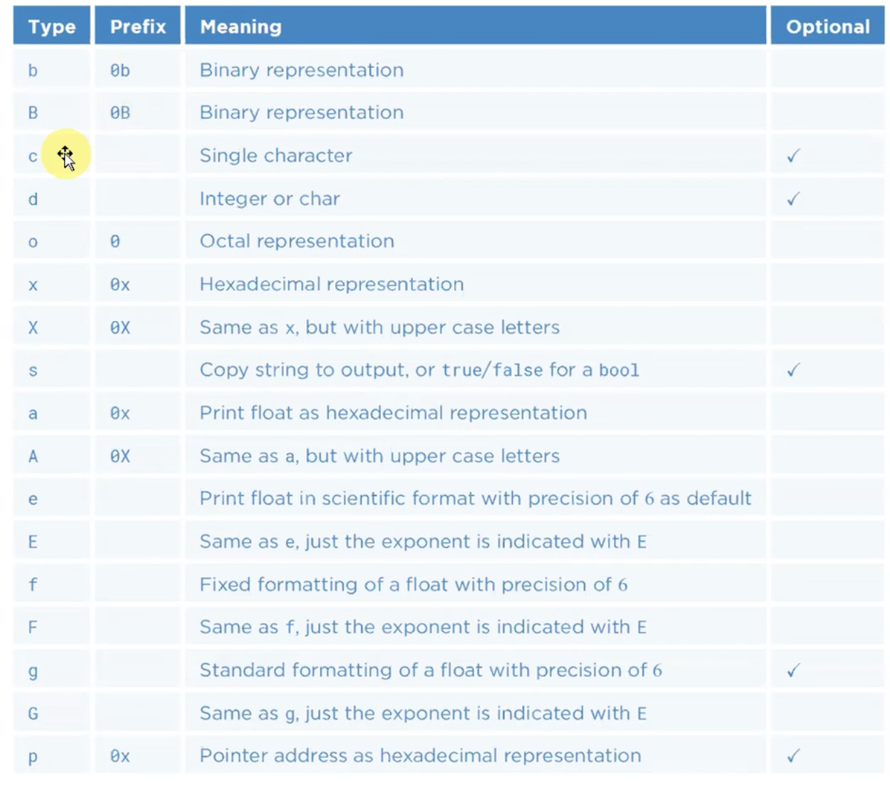
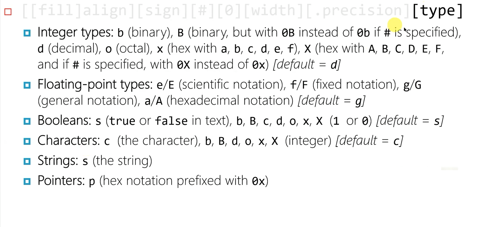

# 8.Hafta

## İçindekiler

- [8.Hafta](#8hafta)
  - [İçindekiler](#i̇çindekiler)
  - [C++20 std::format Kütüphaesi](#c20-stdformat-kütüphaesi)
    - [printf ve iostream kütüphanelerinin dezavantajları ve avantajları](#printf-ve-iostream-kütüphanelerinin-dezavantajları-ve-avantajları)
    - [std::format](#stdformat)
    - [Yazma alanı genişliği ve Width](#yazma-alanı-genişliği-ve-width)
    - [Sign](#sign)
    - [Padding 0](#padding-0)
    - [Type Kısmı](#type-kısmı)
    - [Precision](#precision)
    - [Format Fonksiyonları](#format-fonksiyonları)
    - [Custom Formatting](#custom-formatting)

---

> 8.Hafta 14_12_08_2023

---

> consteval anahtar sözcüğü işlendikten sonra da lambda konusnu işleyeceğiz.

## C++20 std::format Kütüphaesi

### printf ve iostream kütüphanelerinin dezavantajları ve avantajları

- Çıkış akımına bir yazıyı formatlı bir şekilde yazdırmak sorunlu bir durumdu. C'deki printf ve snprintf fonskiyonlarının yaptığı iş.
- C++20 öncesi 2 seçeneğimiz vardı:
- - Formatlamayı C'den gelen fonskyionlara yaptırmak.
- - ios kütüphanesinin formatlama özelliklerini kullanmak.
- Fakat bu iki seçenek de dezavatajları vardı.

C'den gleen printf fonksiyonlar:

`int printf(const char *pfm, ...)` şeklinde bir fonksiyon. `int sprintf(char *buf, const char *pfm, ...)` ve snprintf ilaveten dizinin boyutunu alıyor, `int fprintf(FILE *f, const char *pfm, ...)` şeklinde fonksiyonlar var. 3'ününde geri dönüş değeri yazdığı karakter sayısı.

- **dezavantajı**: Tüm variadic fonksiyonlar içerisinde type-safe olmaması, fonksiyon beklediği argüman türünü biliyor ve programcıdan da buna uyulmasını bekliyor.
- Variadic parametre için bir şekilde fonksiyon çağırısında gönderilen argümanların sayısını kontrol etmek zorundayız. C++ içerisinde böyle bir kısıt yok. C'deki fonksiyonlar da 3 teknik var.
- - ilk parametreye argüman sayısı gönderilmesi
- - Sentinel değeri kullanılabilir örneğin `-1` in başka bir argğüman olarak gönderilebilir
- - Fonksiyonun ilk parametresini yazı isteyen fonksiyon ve bu yazının içerisinde gönderilen argüman sayısını kullanmak.

- **Avantajlar**: Yeni derleyiciler ile kısmen hızlı.
- Argümanlar ile formatlamasında kullanılacak conversion specifier'ları ayrı ayrı görebiliyoruz. Locale ayarlarına göre formatlama yapabiliyoruz.

C++'ın iostream kütüphanesi:

- En büyük dezavantajı hantal olması
- Fakat tpye-safe operator overloading kullanıyor.
- Custom typelar için özelleştirilebiliyor. İstediğimiz format özellikleri ile kullanabiliyoruz. Birden fazla buffer nesnesi aynı bufffere'ı kullaılabiliyor.
- Fakat formatlama state kullanımını çok karmaşık olması ayrı bir negatif.

Bunların ortasını bulabilmek için 2 tarafında güzel özelliklerini alıp std::format kütüphanesi eklendi ve bu kütüphanenin mimari **Victor Zverovich**.

- std::format bize bir formatlanmış string döndürüyor ve opeator<< ile çıkış akımın yazdırabiliyoruz. Örneğin on/off bayrakları için:

```c++
int main()
{
    using namespace std;
    ios_base::fmtflags; //Her string nesnesi bunu tutuyor ve bitsel manipülasyon yapabiliyoruz.
    cout.setf(ios::boolalpha); //
    cout.unsetf(ios::boolalpha); //
    cout.flags(); //flags'lerin durumunu alıyoruz.

    cout.flags(cout.flags() | ios::boolalpha);
    cout.flags(cout.flags() & ~ios::boolalpha);
}
```

- Fromat state'ini resetleemiz gerekiyor olabilir bunun için artık formatlama işlemlerini bir nesne üzerinden yapabiliyoruz. Her formatlama özelliğiyi de on/off gibi değil birden fazla seçenek var.`os.setf(ios::left, ios::adjustfield);` -> standart çıkış bufferını yazıcak.

- Bir zor kısım ise operator overloading kısmı,

```c++
int main()
{
  using namespace std;
  int x = 10;
  double dval = 3.14;
  cout << ival << " " << dval << "\n"; // 10 3.14
  cout.setf(ios::hex, ios::basefield); 
  cout << ival;
  cout.setf(ios::uppercase);
  cout.setf(ios::scientific, ios::floatfield);  
  cout << dval;
}
```

- Bunun için daha karmaşık bir yapı ile yapıyoruz. Burada function pointer alan operator overload fonksiyonu çağırıdığımzda ostream-manipulatörleri ( örneğin endl fonksiyonu). Tanımlayarak daha kolay bir yapı oluşturulmaya çalışılmış

```c++
class
{
  public:
    int ival;
    double dval;
    ostream &operator<<(int);
    ostream &operator<<(double);
    ostream &operator<<(void *);
    ostream &operator<<(ostream &(*pf)(ostream &));
    {
      return pf(*this);
    }
};
std::ostream & Hex(std::ostream &os)
{
  os.setf(ios::hex, ios::basefield);
  return os;
}
cout << 47892 << Hex << 47802 ; //cout'un format statetini değiştirmiş oluyoruz.
//bu şekildel birden fazla manipülator var.
```

```c++
std::ostream & dl(std::stream&os)
{
  return os << "------------------------------------------------------\n";
}
int main()
{
  using namespace std;
  cout << 10 << dl << 20 << dl << 30 << dl;
}
```

- Parametreli manipülatörde yazabilirdik.

```c++
class sp{
public:
  sp(std::size_t n = 1) : mn{n} {}
  friend std::ostream & operator<<(std::ostream&os, const sp& x)
  {
    auto n = x.m_n;
    while(n--)
      os << ' ';
    return os;
  }
private:
  std::size_t mn;
};

int main()
{
  using namespace std;
  int x{12};
  double dval{3.14};
  string str{"Ali"};
  cout << x << sp(3) << dval << sp(5) << str << dl;
}
```

- Bütün bu yapı std::format ile daha kolay bir şekilde yapılıyor.

### std::format

Başlık dosyası: `<format>`
Kütüphane: `std::format`

- Format fonksiyonun ilk parametresi string_view, compile time'da değeri belli olan bir string olmak zorudna, eğer bu programın run-time'da belli olucaksa ayrı bir fonksiyon çağırılıyor.

```c++
int main()
{
  using namespace std;
  cout << format("bu bir string"); //bu ifadenin geri dönüş değeri std::string, burada bu string oluşturma maileyeti var.
  std::string name{"deneme"};
  int n {6}
  cout << format("{} bugun {} tane kitap satin aldi",name, n );
  cout << format("{1} {0} {1}",name, n );
  cout << format("{0} bugun {0} tane kitap satin aldi",name);
}
```

- Poisitional Placeholder index kullanabiliyoruz. `{0} {1} {2}` gibi.

```c++
int main()
{

  using namespace std;
  std::string name{"deneme"};
  four(int i = 0; i< 128; i++)
  {
    if(isprintf(i))
      cout << format("{0:d} {0:#X} {0:c}\n",i);
  }
}
```

- Ezber için

`[[fill]align] [sign][#][0][width][.precision][type]`

- fill: doldurma karakteri
- align: left, right, center
- sign: tam sayılar için +, - yazılsın mı yazılmasın mı onu belirliyor.
- `#`: Type'i modify etmek için kullanılıyor. Hexadecimal için örneğin. Showbase yapıyor.
- 0: Tam sayılar için işaret varsa onu 0'larla dolduruyor.
- width: minimum yazma alanı genişlik.
- '%d, %i ....` kullanılan conversion specifier'lar

- Eğer default değerler kullanılmak istenirse bunun küme parantazi içerisi boş bırakılabilir.
- Her türün allignmentı aynı değil.

- Belirli forlama özelliklerini dinamik olarakta alabiliyoruz.
- Geçerli olmayan bir format değilse *exception* throw ediyor.

### Yazma alanı genişliği ve Width

- Tam sayıların yazımı default olarak sağa dayalı.

```c++
int main()
{
  using namespace std;
  int x = 4539;
  cout << format("|{{{}}}|",x);
  cout << format("|{:_>12}|", x); //fill ve align
  cout << format("|{:>12}|", x); //sağa dayalı yazmak için
  cout << format("|{:<12}|", x); //sola dayalı yazmak için
  cout << format("|{:^12}|", x); //ortaya dayalı yazmak için
}
```

- Bazı öpeleri dinamik olarakta saptıya biliyoruz.
- Yazma alanı genişliğinin default değeri 0 ve burada hiçbir zaman truncate olmuyor.

```c++
int main()
{
  using namespace std;
  int x = 76234;
  cout << "yazma alani genisligi:";
  int width;
  cin >> width;
  cout << format("|{:_>{}}|",x, width);//x-> yazılacak değer diğeri yazma alanı genişliği
  cout << format("|{1:_>{0}}|",width, x);// placeholder index ile bunu sağlayabiliyoruz.
}
```

### Sign

- 3 tane ihtimal var.
- defaultta - işareti var.
-  

```c++
int main()
{
  using namespace std;
  int x = 345;
  cout << format("|{:}|",x);
  cout << format("|{: }|",-x);
  cout << format("|{:>+}|",x);
  cout << format("|{:>-}|",x);
}
```

### Padding 0

- Sayıdan önce ve işaretten önce 0 basıyor.

```c++
int main()
{
  using namespace std;
  int x = 345;
  cout << format("|{:07d}|",x);
  cout << format("|{:+07d}|",x);
  cout << format("|{:-07d}|",x);
  cout << format("|{:-07d}|",x);
  cout << format("|{:07x}|",x);
  cout << format("|{:#07X}|",x);
}
```

### Type Kısmı





- boolean değerler için:

```c++
int main()
{
  using namespace std;
  cout << format("|{:}|", true);
  cout << format("|{:d}|", 10>56);
  cout << format("|{:X}|", 10>56);
  cout << format("|{:#x}|", 10>56);
}
```

- Pointerlar için bir default formtalama yok.

```c++
int main()
{
  using namespace std;
  int x = 10;
  //cout << format("|{:}|", &x); sentaks hatası
  cout << format("|{:p}|", &x);
  cout << format("|{:}|", (void *)&x)<< "\n";
  cout << format("|{:}|", static_cast<void *>&x)<< "\n";
}
```

### Precision

```c++
int main()
{
    string name {"Deneme"};
    cout << format("{:24.4}", name) << "\n"; // Dene ekrana bastırılıcak.
}
```

### Format Fonksiyonları

- `fomat_to` : bir adres alıyor ve formatlı yazıyı oraya insert ediyor.

```c++
int main()
{
    using namespace std;
    int x = 2'435'345;
    format_to(ostream_iterator<char>{cout}, "x = {:^#16X}", x);
    string str;
    format_to(back_inserter(str), "|x = {:^#16X}|",x);
    cout << str.size() << "\n";
    cout << str << "\n";
}
```

- Aşağıdaki gibi de kullanılabilir:

```c++
int main()
{
    using namespace std;
    string str;
    for(char c = 'A'; c<= 2 'Z'; ++c)
    {
        format_to(back_insterter(str),"{{{0},{0:d}}},c\n");
    } 
    cout << str << "\n";
}
```

- `std::locale` sınıfı ile lokalizasyon yapılabilir.

```c++
#include <locale>
int main()
{
    using namespace std;
    locale::global(locale{turkish});
    cout << 12.96854;
    cout << fomrat("{:L}\n",4.56)<< "\n";
    cout << fomrat("{:L}\n",7412214124)<< "\n";
    cout << fomrat(std::loclae("turkish"),"{:L}\n",4.56)<< "\n";
}
```

- formatted_size ile formatlamak istediğim string'in size'ını alabiliriz.

```c++
int main()
{
    using namespace std;
    int x = 435466;
    auto len = formatted_size("{:#x},x");
    cout << "len =" << len << "\n";
}
```

- `format_to_n`ile verilen adrese yazdırılabilir, geri dönüş değeri bir yapı türünden. size ve out(pointer) döndürüyor

```c++
int main()
{
    using namespace std;
    string name {"den"};
    string surname{"deneme"};
    array<char,10>ar{};    
    auto x = format_to_n(ar.data(),ar.size()-1,"{} {}",name, surname ) //sadece size()-1 kadar karakter ekrana yazdırılabilir.
    for (char c : ar)
        cout << c ;
    cout << "x.size"<<  x.size << "\n";
    cout << "index" << x.out - ar.data() << "\n";
}
```

### Custom Formatting

Kendi türlerimiz içinde bu kütüphaneden destek olabiliyoruz.

- `std::formatter` türü içini explicit specializationı'nı oluşturmamız gerekiyor.
- context nesnesinin begin ve end fonksiyonu var ve bu bize `:`dan sonraki konuumu döndürüyor ve bizim o iteratörü alıp onu kapanan küme parantezine kadar ilerletmemiz gerekiyor.
- diğer fonksiyon ise format_to'ya destinitation olarak geçiliyor.

```c++
class Person
{

};

template<>
std::formatter<Person>
{
public:
    //auto parse(std::format_parse_context &)
    auto parse(auto & context)
    {

    }
    auto format (const T&t, std::format_context)
    {}
};

int main()
{
    using namespace std;
    Person per;
    std::format("person = {}\n",per);
}
```

- Minimal örnek:

- `ctx.begin()` fonksiyonu açılan küme parantezinden sonraki kısmı döndürüyor.
- `ctx.end()` fonksiyonu bu yazının en son konumunu döndürüyor.
- format_to fonksiyonun 1.parametresine ctx.out pointer'ını çağıracağız. Aldığı format context'ti format_to'ya vericek

```c++
class Always40
{
public: 
    int getValue() const {return 40;}
};

template <>
struct std::formatter<Always40>
{
    constexpr auto parse(std::format_parse_context &ctx)
    {
        return ctx.begin();
    }
    auto format(cont Always40&obj, std::format_context &ctx) const
    {
        return std::format_to(ctx.out,"{}",obj.getValue());
    }
};

int main()
{
    Always40 al4;
    cout <<std::format( "|{}|"al4);
}
```

- Daha karmaşık bir örnek:

```c++
class Person
{
public:
    Person(std::string name, int id) : m_name(std::move(name)), m_id(id) {}
    std::string get_name() const {return name;}
    int get_id(){return m_id;}
private:
    std::string m_name;
    int m_id;
};

template<>
class std::formatter<Person>
{
public:
    constexpr auto parse(auto &context)
    {
        auto iter{context.begin()};
        const auto iter_end{context.end()};
        if(iter == iter_end || *iter == '}')
        {
            m_ftype = FormatType::All;
            return iter;
        }
        switch(*iter)
        {
        case 'n': m_ftype = FormatType::Name; break;       
        case 'i': m_ftype = FormatType::Id; break;
        case 'a': m_ftype = FormatType::All; break;
        default : throw std::format_error{"Person Format Errror"};
        }
        ++iter;
        if(iter != iter_end && *iter != '}')
            throw std::format_error{"Person format error!"};
        return iter;
    }
    constexpr auto format(const Person &per, auto &context)
    {
        using enum FormatType;
        switch(m_ftype)
        {
        case Name :return std::format_to(context.out(), "{}", per.get_name());
        case Id :return std::format_to(context.out(), "{}", per.get_id());
        case All :return std::format_to(context.out(), "[{} {}]", per.get_id() , per.get_name());
        }
    }
private:
    enum class FormatType {Name, Id, All};
    FormatType m_ftype;
};


int main()
{
    Person p1{"necati",1231};
    Person p1{"ali",11231};
    Person p1{"deli",31};

    std::cout << std::format("{:n}\n{:i}\n{:a}"p1,p2,p3);
}
```

- Seçenek fazlaysa bu format state'ti tutmamız gerekebilir.

```c++
struct Point
{
    int mx,my;
};

template<>
class std::formatter<Point>
{
public:
    constexpr auto parse(format_parse_context &pc)
    {
        auto iter{pc.begin()};
        for(;iter != pc.end() && *iter != '}';++iter)
        {
            if(*iter == '#')
            {
                cb_ = true;
            }
            else
                std::format_error{"Point format error"};
        }
        return iter;
    }
    typename std::format_context::iterator format(const Point &p, std::format_context fc)
    {
        return std::format_to(fc.out(),"{}{}, {}{}",(cb_ ? '{' :'('),p.mx, p.my, (cb_ ? '}' : ')'));
    }
private:
    bool cb_{};
};

int main()
{
    Point p{3,4};
    std::cout << std::format("{:#}",p);
}
```
