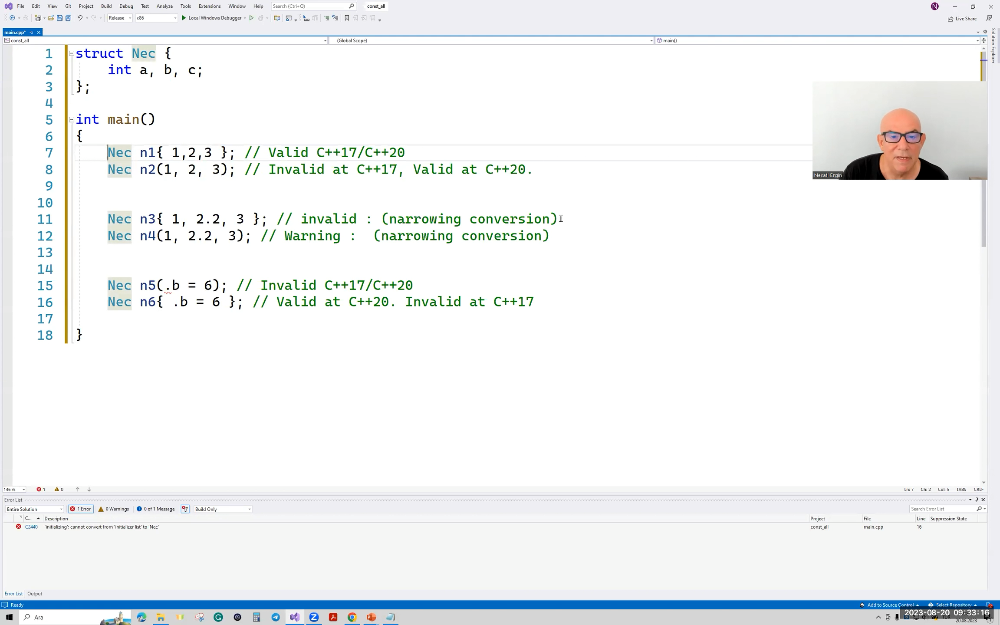
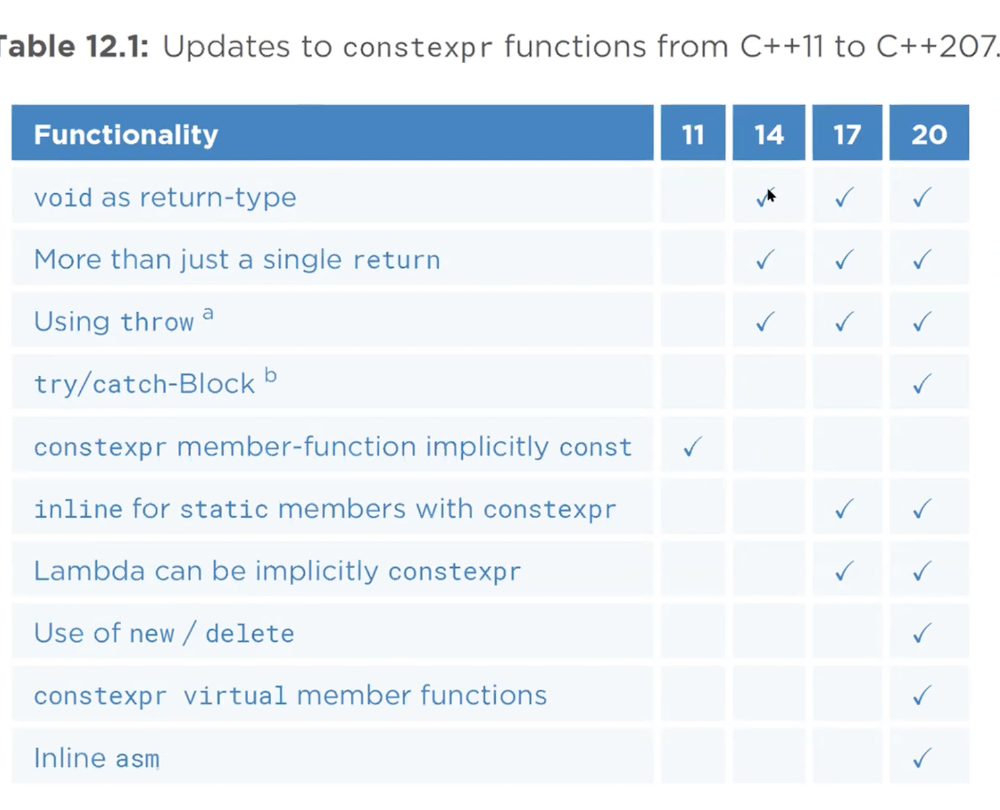
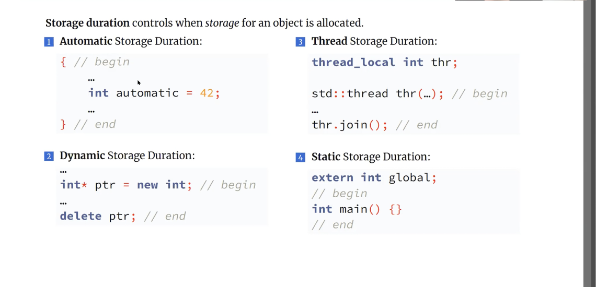
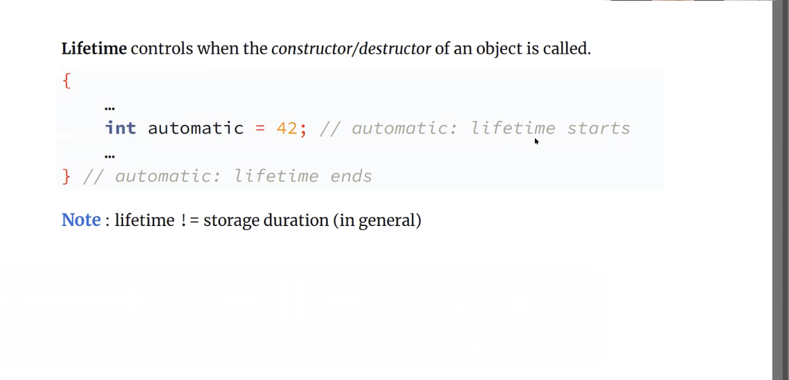
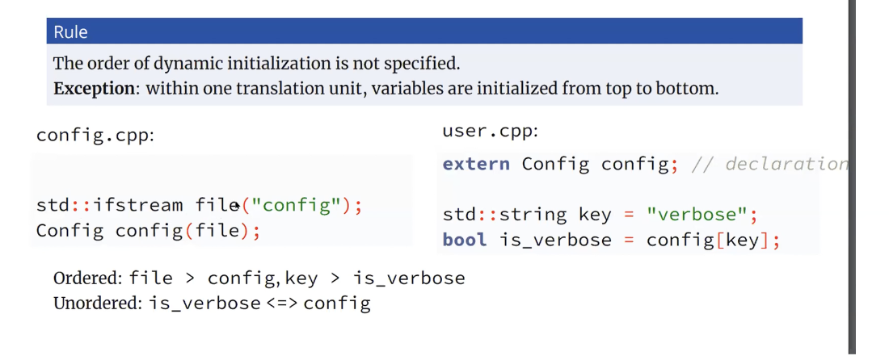

# 9.Hafta

- 15.Ders ve 16.Ders notları.

## İçindekiler

- [9.Hafta](#9hafta)
  - [İçindekiler](#i̇çindekiler)
  - [std::format Kütüphanesi](#stdformat-kütüphanesi)
    - [Custom Fomratting](#custom-fomratting)
    - [vFormat Fonksiyonu](#vformat-fonksiyonu)
  - [Aggregate Type](#aggregate-type)
    - [Semantik tarafı](#semantik-tarafı)
    - [Koşulları](#koşulları)
    - [Faydaları](#faydaları)
      - [Aggregate Initialization](#aggregate-initialization)
      - [Structure Binding](#structure-binding)
      - [C++20 İle Gelen Değişiklik](#c20-i̇le-gelen-değişiklik)
      - [Designated Initializer Sentaksı](#designated-initializer-sentaksı)
        - [Designated Initializer'ın Faydası Ne](#designated-initializerın-faydası-ne)
        - [Direkt Initilization'ını Desteklenmesi](#direkt-initilizationını-desteklenmesi)
    - [Aggregate Initializer ve Direct Initialization Farkları.](#aggregate-initializer-ve-direct-initialization-farkları)
    - [`template<auto>` sentaksı](#templateauto-sentaksı)
  - [Constexpr Keyword'ü](#constexpr-keywordü)
    - [Temel Kavramlar](#temel-kavramlar)
    - [C++20 ile Gelen Değişiklikler](#c20-ile-gelen-değişiklikler)
      - [consteval Fonksiyonlar](#consteval-fonksiyonlar)
      - [Constinit](#constinit)

---

> 19_08_2023

---

## std::format Kütüphanesi

`[[fill]align] [sign][#][0][width][.precision][type]`

### Custom Fomratting

- Parso fonksiyonun normalde `constexpr` fonksiyon olması bekleniyor, fakat bazı derleyiciler bu fonkksiyonun `constexpr` olması durumunda hata veriyor.
- - Parametresi `std::format_parse_context &` türünden olmalı, geri dönüş değeri de bu sınıfın `iterator` türünden olmalı.
- - `"{:12}"` elimizde olsun ve `begin()` fonksiyonu burada `12}`nin başını gösteriyor. `end()` fonksiyonu ise yazının sonunu gösteriyor. `ali{:<2.f}\n` olsaydı `end()` fonksiyonu '\n' karakterini gösterirdi.s
- - Birden fazla küme parantezi olsaydı bu işlem her bir küme parantezi için ayrı ayrı yapılacaktı. Parse fonksiyonu braclet'ın kapandığı konumu döndürmesi gerekiyor. Yanş begin fonksiyonunndan aldığımız konumdan başlayarak kapann küme parantezinin konumunu döndürmesi gerekiyor.
- Bir de format fonksiyonu yazmamaız gerekiyor, 1. parametre basttırılcak sınıf neseis, 2. parametre `format_context`.
- - Bu fonksiyon `format_to` fonksiyonunun geri dönüş değeri veriyor.

```cpp
#include <iostream>
#include <format> 
#include <string>

class Mint {
public:
    Mint() = default;
    Mint(int x) : mx(x) {}
    int get() const { return mx; }
private:
    int mx;
};

template<>
class std::formatter<Mint> {
public:
    constexpr auto parse(format_parse_context& ctx) {
        auto iter = ctx.begin();
        while (iter != ctx.end() && *iter != '}') {
            if (*iter < '0' || *iter > '9') {
                //exception throw edilebilir.
                //throw std::format_error{"invalid width character"};
                throw std::format_error{std::format("invalid width character: {}", *iter)};
            }
            m_width = m_width * 10 + (*iter - '0');
            ++iter;
        }            

        return iter;
    }

   auto format(const Mint& m, format_context& ctx) 
   {
        //return std::format_to(ctx.out, "Mint: {}", m.get());
        return std::format_to(ctx.out(),"{:{}}",m.get(),m_width);
   }
   int m_width{};
};

int main()
{
    using namespace std;
    Mint m(145);
    cout << format("{:15}", m) << endl; //begin fonksiyonu 1'in konumunu döndürecek 15'i bir tam sayı değeri olarak alacagız
}
```

- Tüm parametre özelliklerini tutmak istiyorsak format kütüphanesinin specializasyonları var. Int örneği için standart kütüphanenin bir specializasyonu var.

Bunu 2 farklı şekilde yapabiliriz. Sınıfımızda veri elemanı tutarak formatlamayı bu nesneye yaptırabiliriz ya da kalıtımdan yararlanarak yapabiliriz.

- derleyiciye bağlı olarak mutable keyword'ünü eklememiz gerekebilir.

```cpp
#include <iostream>
#include <format> 
#include <string>

class Mint {
public:
    Mint() = default;
    Mint(int x) : mx(x) {}
    int get() const { return mx; }
private:
    int mx;
};

template<>
class std::formatter<Mint> {
public:
    // mutable  std::formatter<int> mf;
    std::formatter<int> mf;
    //constexpr olması da sentaks hatası oluşturuyor olabilir.
    //constexpr auto parse(format_parse_context& ctx) 
    auto parse(format_parse_context& ctx) 
    {
        return mf.parse(ctx);
    }

   auto format(const Mint& m, format_context& ctx) 
   {
        return mf.format(m.get(), ctx);
   }

   int m_width{};
};

int main()
{
    using namespace std;
    Mint m(145);
    cout << format("{0:$>15} {0:_<15",m); 
}
```

- Kalıtım ile:

```cpp
#include <iostream>
#include <format> 
#include <string>

class Mint {
public:
    Mint() = default;
    Mint(int x) : mx(x) {}
    int get() const { return mx; }
private:
    int mx;
};

template<>
struct std::formatter<Mint> : std::formatter<int>
{
    auto format(const Mint& m, auto& ctx)
    {
        return std::formatter<int>::format(m.get(), ctx);
    }
};

int main()
{
    using namespace std;
    Mint m(145);
    cout << format("{0:$>15} {0:_<15",m); 
}
```

- Kalıtım ile custom type için:

```cpp
#include <format>
#include <iostream>


enum class Fruit
{
    Apple,
    Orange,
    Banana
};

template<>
struct std::formatter<Fruit> : public std::formatter<std::string>
{
    auto format(Fruit f, std::format_context& ctx)
    {
        std::string name;
        switch (f)
        {
        using enum Fruit;
        case Apple:
            name = "Apple";
            break;
        case Orange:
            name = "Orange";
            break;
        case Banana:
            name = "Banana";
            break;
        default:
            name = "Unknown";
            break;
        }
        return std::formatter<std::string>::format(name, ctx);
    }  
};

int main()
{
    Fruit f = Fruit::Apple;
    std::cout << std::format("Fruit: {:_<16}",f); 
}
```

Oluşturulabilir.

- Constexpr ve mutable olması ile ilgili olan durumlar derleyiciye bağlı olarak değişebilir. Bunun için koşulları aşağıdaki gibi sınayabiliriz.

```cpp
#include <iostream>
#include <format> 
#include <string>

class Mint {
public:
    Mint() = default;
    Mint(int x) : mx(x) {}
    int get() const { return mx; }
private:
    int mx;
};

template<>
struct std::formatter<Mint> : std::formatter<int>
{
#if __cpp_lib_format < 202106
    mutable //in case the standard formatters have a non-const format
#endif
    std::formatter<int>mf;
#if __cpp_lib_format >= 202106 //in case standard formatters don't support constexpr parse() yet
    constexpr
#endif
    auto parse(format_parse_context& ctx)
    {
        return mf.parse(ctx);
    }
  auto format(const Mint& m, format_context& ctx)
  {
    return mf.format(m.get(), ctx);
  }
};

int main()
{
    using namespace std;
    Mint m(145);

}
```

- Şimdiye kadar kullandığımız türler compile-time'da belirtilen string alıyordu.

### vFormat Fonksiyonu

Argümanları doğrudan geçmiyoruz ve make_format fonksiyonun geri dönüş değerini geçiyoruz.

```c++
int main()
{
    using namespace std;
    const char *p = "|{:<12}|";
    char str[20] = "";
    cout << "formatlama bilgisi : ";
    cin >> str;
    int x = 456;
    //auto str = format(str,x); Sentaks hatası
    auto name = std::vformat(str, std::make_format_args(x));
    cout << name << "\n";
}
```

## Aggregate Type

- Bilesşik türler. Sentaksı ayrı ve semantik yapısı ayrı.

### Semantik tarafı

Non static veri elemanlarını doğrudan kullanıma açan sınıflar, bu sınıfların veri elemanları için bir koruma yok.

- Neden? Sınıfları 2'ye ayırmak gerekiyor. Data hiding yapan sınıflar => sınıfın invariantlarının olması ve sınıfın bu invariantlarınıı kendi kontrol ediyor. Invariantlar tutmadığında exception throw edebiliriz.
- Aggregate olup olmamasını belirleyen dilin kurallarınca belirleniyor.
- Bir sınıf olabilir fakat.
- Dizi türleri kesinlikle aggregate type olarak kabul ediliyor. `string x[5]` türü de bir aggregate type.

### Koşulları

1. User-declared constructor'ları olmamalı (**NAN Aggregate**). C++20 öncesinde user-provided constructor'ları olmamalı idi.
2. Non-static veri elemanlarının tamamı public olmalı. C++17 öncesi bunu test etmek için bir meta-function yoktu. `is_aggregate` meta-function'ı eklendi.
3. Aggragate typelar, aggregate olmayan türden veri elemanları alabiliyor.
4. C++17 ile kalıtımla elde edilen sınıflar aggregate olabiliyor.
5. Virtual inheritance olursade aggregate ihlal edilmiş oluyor. **NAN Aggregate**
6. Multiple inharitance olması aggregate olmasına engel değil.
7. Inharited constructor olması durumunda da aggregate olma özelliğini bozuyor. **NAN Aggregate**
8. Referans veri elemanı olması aggregate olmasına engel değil.
9. Member functionları olabilir ve bu fonksiyonların private veya public olması aggregate olmasına engel değil.
10. Sanal fonksiyonlara sahip olamıyorlar. **NAN Aggregate** C++14 ile eklenen default member initializer özelliği eklendi
11. Lambda ifadelerinden elde edilen türler ifadeler aggregate değil. Fakat bu türlerden kalıtım ile edilmiş türler aggregate olabilir (K4). Variant sınıfının overloador idiom'u bundan yararlanıyor.
12. Dizi türleri aggregate.
13. Operator overloading fonksiyonlarınından da yararlanılabiliyor.
14. Statik veri elemanları olabilir.

Koşulların hepsi için örnekler:

```cpp
#include <type_traits>
struct A {  int x;    double d;     char c; };
struct B {  int x;    double d;     char c;
private: //protected olabilir.
    int a; };

struct A1 {    std::string x;    double d;     char c;};
class Myclass{};
struct MDer : Myclass { int a, b; }
struct MDer1 :protected Myclass { int a, b; }
struct SDer : std::string { int a, b;}
struct VDer : virtual Myclass { int a, b; };

class A_{};
class B_{};
class C_{};

struct MABC : A_, B_, C_ {int x,y };

struct RefAgg{int x,y; int &r1İ int &&r2};
class K9
{
public:
    int x,y;
    bar();
private:
    int foo();
protected:
    int baz();
};

struct K10{
    int x = 5;
    int y = 3;
};

struct K13
{
    int mx;
    K13 operator+(const K13&) const;
};

struct K14
{
    static int mx;
    inline stataic std::string str{"deneme"};
};

int main()
{
    static_assert(std::is_aggregate_v<A>, "not an aggregate"); 
    static_assert(std::is_aggregate_v<B>, "not an aggregate"); //not an aggregate
    static_assert(std::is_aggregate_v<std::string>, "not an aggregate"); //not an aggregate
    static_assert(std::is_aggregate_v<sA1>, "not an aggregate"); 
    static_assert(std::is_aggregate_v<Mder>, "not an aggregate"); 
    static_assert(std::is_aggregate_v<Mder1>, "not an aggregate"); //not an aggregate
    static_assert(std::is_aggregate_v<SDer>, "not an aggregate");  
    static_assert(std::is_aggregate_v<VDer>, "not an aggregate"); //not an aggregate
    static_assert(std::is_aggregate_v<MABC>, "not an aggregate");
    static_assert(std::is_aggregate_v<RefAgg>, "not an aggregate");
    static_assert(std::is_aggregate_v<K9>, "not an aggregate");
    static_assert(std::is_aggregate_v<K10>, "not an aggregate");
    static_assert(std::is_aggregate_v<decltype([]{}), "not an aggregate");
}
```

### Faydaları

#### Aggregate Initialization

Aggregate initialization sentaks ile bu türden neseneler oluşturulabiliyor.

- Narrowing conversion hala sentaks hatası. Küme parantezinin eşittirin sağında olması ile direkt kullanılmaması arasında bir fark yok.

```cpp
struct Point{
    int mx, my, mz;
};

struct Dene
{
    int x;
    double d;
    std::string str;
    int ar[4];
    Point
};

int main()
{
    Point p{1,2,3}; 
    Dene mydene {10, 2.3, "mustafa", 3,5,7,8, {1,1,1    }}; //nested küme parantezi kullanmamıza rağment bu ayrıştırma yapılmak zorunda.
}
```

- Aggregateların önemli bir özelliği member sayısından daha az bir sayıda veri elemanı değeri verilmemesi durumunda value initialize ediliyor.

```cpp
struct Myclass
{
    int x;
    int y;
    bool b;
    std::string str;
};
int main()
{
    int a[5] = {1,2,3}; //geriye kalan öğeler 0 olucak.
    std::string ar[4] = {"ali", "veli"}; //geriye kalan öğeler boş string olucak.
    std::cout << ar[2].size()<< "\n"; // 0

    Myclass mycl = {11,22}; // b öğesi false string öğesi boş string olucak.
    std::cout << boolalpha << "mycl.b = " << mycl.b <<  "mycl.str = " << mycl.str.size() << "\n"; //false, ""

}
```

- `Myclass mycl = 5;` şeklinde bir initialization yok. Küme parantezi içerisinde olması gerekiyor.

- Aşağıdaki örnekte `std::array` sınıfı aggregate type olduğu için aggregate initialization yapılabilir. Initailizer list ile alakalı değil.

```c++
int main()
{
    array<int,5> ar{2,4,6,9};
}
```

- Inderminate value oluşabilir. Bunu önlemek için ilk değer verilebilir.

```c++
struct Myclass
{
    int x;
    int y;
};

int main()
{
    using namespace std;
    Myclass mycl;
    cout <<  mycl.x << "\n"; //indeterminate value
}
```

#### Structure Binding

```c++
struct Point{
    int mx, my, mz;
};
int main()
{
    using namespace std;
    Point p{1,2,3};
    auto [x,y,z] = p;
}
```

#### C++20 İle Gelen Değişiklik

C++17'de:

```c++
struct Myclass
{
    int i = 45;
    Myclass() = delete;
}

int main()
{
    Myclass m{}; // bu kod geçerli olucaktı.
    //Myclass m1;  // bu kod geçersiz olucaktı.
}
```

- Aynı durum parametreli constructor delete edilseydi dahi aynı olucaktı. Bu tür durumları ortadan kaldırmak için `user declared` olmaması kararı alındı.

#### Designated Initializer Sentaksı

C'de C99 ile dile eklenen bir özellik. C++20 ile dile eklendi.

- Derleyiciler bunu daha önce extension olarak destekliyor olabilirdi.
- C'deki sentaksı olduğu gibi geçerli değil. C++'da kesiştiği ve kesimediği bir çok yer var.

```c
struct Data
{
    int a,b,c;
    char str{20};
    int ar[5];
};

int main()
{
    int a[10] = {[2] = 4,[7] = 9, 45}; // kalan öğeler 0 olucak. 2 numaralı indis 4, 7 numaralı indis 9 olucak.
    //dizinin boyutu verilmeseydi derleyici dizinin boyutunu en yüksek indeks + 1 olucaktı.
    struct Data mydata = {
        .ar = {2,[3] = 5},
        .str = "dneeme",
    };
}
```

- C++'ta diziler ile böyle bir kural yok.

1. Aggregate type olması gerekiyor.
2. `=` operatörü ile birlikte kullanılıp/kullanılmaması bu duruma etki etmiyor.
3. Designated initializer belirtimi bildirimdeki sıraya göre yapılmak zorunda. İlk değer verilmeyebilir.
4. Normal initializer list ile birlikte kullanılamıyor.
5. Statik veri elemanlarını initialze edemiyoruz

```c++
struct K1{  int x,y,z; };

struct K5{
    int x,y;
    static int z;
};

int main()
{
    K1 k1 = {.x = 10, .y = 20, .z = 30};
    K1 k2{.y = 20, .x = 10, .z = 30}; //geçerli   
    K1 k3{.x = 10, .z = 30}; //geçerli
    K1 k4{.x = 10};
    //K5 k5 {.z = 12} sentaks hatası 
}
```

```c++
struct Time
{
    int min;
    int hour;
};

struct Date
{
    int year;
    int month;
    int day;
    Time time;
    static int hmode;
};

int main()
{
    //Date d1 = {.hmode = 1}; static elemana ilk değer verilmesi hatalı
    //Date d2 = {.month = 3, .year = 2023}; sıranın karışık olması hatalı
    //Date d3 = {3, .year = 2023}; karışık olması hatalı
    //Date d4 = {.time.min = 25}; Nested member için designated initializer kullanılamıyor. 
    const Date d5 = {.time = {32,4}};
    Date mydate = {.time = {.min = 23}};
    Date mdate= { 
        .year{1984},
        .daty{12},
        .time{.hour{18}}
    };
}
```

- const olması durumunda bir hata yok.
- Default member initializer ile birlikte kullanılabilir.

##### Designated Initializer'ın Faydası Ne

Kodun okunmasını kolaylaştırıyor ve kodlama hatası riskini anlatıyor.

```c++
struct Student
{
    int id;
    std::string name;
    int grades[5];
};

struct Point
{
    int y,x,z; //bunu yazarken eğer x-y-z şeklinde yazmış olsaydık kullanımda bir hata yapabilirdik.
};

int main()
{
    using namespace std;
    Point p1 = {.y = 10, .x = 20, .z = 30}; // bu şekilde hem hata yapma riski azalıyor hem de kod okunabilirliği artıyor.
    Student s{
        .id = 1233113,
        .name = "Deneme",
        .grades = {100,90,80,70,60}
    };
}
```

Fonksiyonların geri dönüş türü eğer bir aggregate type ise bu sentaks ile geri dönüş değeri verilebilir ve mandatory copy-elision'dan faydalanabiliyoruz.

- Sabit ifadesi olması gerekmiyor.

```c++
struct Person
{
    int id;
    std::string name = "no-name";
    int age;
};

Person get_person()
{
    //codes
   //return Person{.id = 123, .name = "deneme", .age = 45};
   //return {.id = 123, .name = "deneme", .age = 45};
   return {234, "deneme", 45};
}

int main()
{
    auto p = get_person();
    auto [id, name, age] = get_person();
}
```

- Fonksiyonların parametre değişkenin sayısının çok fazla olması bir çok durumda bazı yöntemler kullanılabilir. Ardışık parametreler benzer türlerden veya doğrudan veya dolaylıı olarak aynı değeri alabilecek türdense burada birbirne karışabilir.

```c++
void func(???, double alpha, doble beta, double teta,????)  //??? kısımlarında başka parametreler olduğu düşünülerek,

func(???, a,b,t) // göndermek isterken yanlış bir değer göndermemiz risk yaratıyor olabilir.
```

- Designated kullanımı bunu paketleyip ve parametreyi designated type yapabiliyoruz.

```c++
void process_file(bool open, bool close, bool read, bool write){}    //codes

struct FileProp{
    bool open;
    bool close;
    bool read;
    bool write;
};
void process_file(const FileProp& prop){/*codes*/} 

int main()
{
    //process_file(false, true, false, true); //ne ye true ne ye false verdiğimiz çok belli değil. 
    //process_file(/*open*/ true, /*close*/ false, /*read*/ true, /*write*/ false); //bu şekilde daha okunabilir.
    process_file(FileProp{.open = true, .close = false, .read = true, .write = false});
}
```

- Bazı durumlarda function overload resoulitoon'ı sağlaması için de kullanabiliyoruz.

```c++
struct Point
{
    int x,y;
};

struct Point3D
{
    int dx,dy,dz;
};

void func(const Point& p){
    std::cout << "2D Point\n";
} //codes
void func(const Point3D& p){
    std::cout << "3D Point\n";
} //codes

int main()
{
    func({.x = 10}); //2D Point
    func({.dx = 10}); //3D Point
}
```

- Template type'lar da aggretate type olabilir.

```c++
template<typename T>
struct Myclass
{   
    T x;
    int ival;
};

int main()
{
    Myclass<double> m1{.x = 3.4, .ival = 45};
    Myclass<string> m2{.x = "deneme", .ival = 45}; 
}
```

- Eğer CTAD'dan faydalanmak istiyorsak 

```c++
template<typename T>
struct Myclass
{   
    T x;
    int ival;
};
//Myclass(T,int)->Myclass<T>; C++17'de bunu yazmamız gerekiyordu.

int main()
{
    Myclass m1{.x = 3.4, .ival = 45};
    Myclass m2{.x = "deneme", .ival = 45}; 
}
```

- Geçici nesne sentaksını kullandığımız her yerde designated initializer sentaksını kullanabiliyoruz.

```c++
struct Point
{
    int x,y,z;
};

struct Person
{
    int id;
    std::string name = "no-name";
    int age;
};

int main()
{
    //auto p = new Point{10,20,30}; //
    using namespace std;
    vector<Person> vp;
    vp.push_back({.id = 123, .name = "deneme", .age = 45});
    vp.push_back({.id = 123, .age = 45});
    vp.push_back({.id = 123 });
    vp.push_back({.age = 45});
    vp.push_back({.name = "deneme1"});    
    //
    //auto up = make_unique<Point>(10,20,30);
}
```

##### Direkt Initilization'ını Desteklenmesi

- Make_unique kısmının hata olmasının nedeni direct initialization olması. Emplace fonksiyonlarında, emplace_back fonksiyonlarında kullanılamıyor. C++20 ile gelen bir özellikte direct initialization kullanılabilmesine karar verildi.

```c++
template<typename T, typename... Args>
std::unique_ptr<T> MakeUnique(Args&&... args)
{
    return std::unique_ptr<T>(new T{std::forward<Args>(args)...});
}
struct Point
{
    int x,y,z;
};
int main()
{
    auto up = MakeUnique<std::string>(40,'A');
    cout << *up << "\n";
    //auto up1 = MakeUnique<Point>(10,20,30);
}
```

- C++17'de aşağıdaki kodlar sentaks hatası oluşturuyordu ve generic kodlar bazı yerlerde direkt initialization kullandığında sentaks hatası oluşuyor.

```c++
struct Point
{
    int x,y,z;
};
int main()
{
    //int a[3] (1,3,5); sentaks hatası çünkü bu şekilde değer verme sentaksı yok.
    //Point mp(1,3,5); //bu şekilde değer verme sentaksı yok.
}

```

---

> 20_08_2023 16.ders

---

- Diziler için kullanabiliyoruz.
- Direkt initialization için hemen köşeli parantezlerden sonra yazmamız gerekiyor.

```c++
struct Myclass
{
    int a[5];
};
int main()
{
    int a[] (4,7,9);
    for(int i = 0; i < 5; ++i)
        std::cout << a[i] << " ";
    //Myclass m{2,6,0}; geçerli değil
    Myclass m{{2,6,0}}; //geçerli 
    Myclass m1{{2,6,0}}; //geçerli
    std::array<int,5> ar{{2,6,0}}; //geçerli
}
```

- Parantez içinde virgüllerle oluşturulmuş bir liste de expression olarak değerlendiriliyor.

```c++
int main()
{
    int x = 5;
    int y = 3; 
    int z = 1;
    cout << x,y << '\n'; //ynin değeri
    cout << (x,y,z) << '\n'; //z'nin değeri 
    int a = x, y, z; //come separeted listin virgüşü. Burada y ve z geçerli değişkenler olduğu için sentaks hatası
    int a = (x, y, z); // a'nın değeri 1 olmamlı    
}
```

```c++
struct Myclass
{
    int x,y;
    double d;
};
int main()
{
    auto p = new Myclass{10,20,3.4}; //geçerli
    delete p;
}
```

- Artık emplace_back fonksiyonlarında da kullanabiliyoruz.

```c++
struct Myclass
{
    int x,y;
    double d;
};
int main()
{
    std::vector<Myclass> mvec;
    mvec.emplace_back(10,20,3.4);
}
```

### Aggregate Initializer ve Direct Initialization Farkları.

- Bazı noktalarda direkt initialization ile aggregate initializer arasında geçerli olmasına rağmen anlam farkı olan yerler olabilir ve bu bize life-extension konusunda bir problem çıkarabilir.

- Direkt iniialization life-extension'ı engelliyor.

```c++
struct Myclass
{
    int x,y;
    const int &ra;
    int &&rb;
};

int foo();
int bar();

int main()
{
    using namespace std;
    //int &r = foo(); // bu kod geçerli değil çünkü ilk değer veren ifade L-value expression 
    const int &r = foo(); // bu kod geçerli
    int &&r = foo(); // bu kod geçerli
    ///
    Myclass m = {10,20,foo(), bar()}; 
    //Burada life-extension hala geçerli
    Myclass m1(10,20,foo(), bar()); // burada life-extension geçerli değil. bu nesnelere erişildiğinde undefined behavior oluşabilir.
}
```

- Direkt initialization'da nested type'a aggregate initializer'da olduğu gibi küme parantezi kullanmadan izin verilmiyor.

```c++
struct Myclass
{
    int x,y;
    struct Nested{
        int x,y,z;
    }n;
};

int main()
{
    Myclass m = {10,20, {1,2,3}};
    Myclass m1 = {10,20, 1,2,3};
    Myclass m2 (1,2,{5,5,5});
    //Myclass m3 (1,2,(5,5,5)); 
    Myclass m3 = {10,20, (1,2,3)};
    //std::cout << m3.n.y << "\n"; // Ekrana 0 yazıyor ve burada virgül operatörü oluşturulan ifade bir expresion 
    //o yüzden x'e 3 değeri atamış ve diğer elemanlar 0 oluyor.
    Myclass m3 = {10,20, (5,5,5), (6,6,6), (7,7,7) };


}
```



- Referans elemanlar için life extension çalışmıyor.
- Designated initializer kullanamıyoruz.
- Eşittirin sağ tarafına parantez ile ilk değer veremeyiz
- Nested-type eleman için küme parantezi elemanlarını kullanmak zorundayız.

### `template<auto>` sentaksı

- C++17 ile dile eklendi.
- non-type parametre ve böyle bir sınıf için:

```c++
template <auto n>
class Myclass{};

int main()
{
    Myclass<5> m1;
    Myclass<9> m2;
}
```

- Burada da bir type-deduction yapılıyor. C++17 öncesi aynı etki sağlanmak için:

```c++
template <typename T, T n>
class Myclass{};

int main()
{
    Myclass<int,5> m1;
    Myclass<char,'A'> m2;
    Myclass<long,4L> m3;

}
```

- Sınıf şablonlarında: 

```c++
template <int n>
class Myclass{};

template <long n>
class Myclass{};
```

- Bu kod geçerli değil,  aynı isimden non-type parametreden sınıf oluşturamıyoruz. Bunun için bir yukardaki kodu kullanıyoruz. `auto` sentaksı ilk kod bloğunda verilen sentaks ile çok daha kolay bir sentaks olanağı sağlanıyor.

```c++
template <auto n>
class Myclass{};

int main()
{
    Myclass<5> m1;
    Myclass<5U> m2;
    //static_assert(std::is_same_v<decltype(m1), decltype(m2)>); bu türler birbirinden farklı olduğu için fail olur.
}
```

- fonksiyon şablonlarında da kullanabiliyoruz.

```c++
template <auto n>
void foo();

int main()
{
    foo<5>();
    foo<5U>();
}
```

- En fazla fayda sağladığı yer ise variable templateler. Öncesinde: 

```c++
template<typename T, T val >
constexpr T myval = val;

int main()
{
    constexpr auto x = myval<int,100>; // int türden 100 sabiti
    constexpr auto y = myval<char, 'A'>; // char türden 'A' sabiti
}
```

- C++17 ile:

```c++
template<auto val>
constexpr auto myval = val;

int main()
{
    constexpr auto x = myval<100>; // int türden 100 sabiti
    constexpr auto y = myval<'A'>; // char türden 'A' sabiti
}
```

şeklinde yazabiliyoruz.

C++20 ile gelen non-type parametreye argüman olarak literal tür'de verebiliyoruz.

```c++
template<decltype([](){})> // bu bir literal type ve template parametresi olabilir.
class Myclass{};

int main()
{
    Myclass<decltype([](){})> x ;
}
```

- auto yazarak template non-type parametre kullanıyoruz ve burada default template argümanı sağlamış oluyoruz.
- x ve y'nin türü farklı olucak çünkü her lambda ifadesi farklı bir tür oluşturuluyor ve instantiation aşamısında değerlendirildiği için bunların türünü farklı kabul ediyor.

```c++
template<auto = [](){}> //lambda ifadesi bir geçici nesne oluşturuyor.  
class Myclass{};

int main()
{
    Myclass<> x;
    Myclass<> y;
    //static_assert(std::is_same_v<decltype(x), decltype(y)>); //bu iki nesne aynı türden olucak.    
}
```

- Bunun kullanıldığı bir yer, static initialization order fiasco'u önlemek için kullanılabilir. Static nesnelerin dinamik initalization'ı bu fonksiyona girdiği zaman hayata başlıyor ve bu fonksiyon ilk kez çağırıldığında hayata getirlimiş oluyor ve 2-3.çağırıldığında aynı nesne elde ediliyor.
- C++20 ile static nesnelerin initialization'ı thread-safe hale getirildi.

```c++
#include <type_traits>

class Myclass{
public:
    Myclass(){ std::cout << "Myclass ctor this: " << this << "\n";}
    void foo()
    {
        std::cout << " Myclass::foo() this: " << this << "\n";
    }
};

Myclass & get_instance(){
    static Myclass m;
    return m;
}

int main()
{
    get_instance().foo(); //constructor ve this fonksiyonu aynı
    get_instance().foo(); //constructor çağırılmıyor.
    get_instance().foo(); //
}
```

- Bir global değişken başka bir modülde dinamik olarak initialize edilmeden kullanıldığında hayata geldiğine emin olmak için kullanıyoruz. Bu kodu generic bir hale getirmek istiyoruz yani lazy initialization edilen nesneyi generic yapmak istiyoruz.
- Bu sınıf türünden bir nesne oluşturduğumuzda, aynı nesnenin get fonksiyonu çağırılcak ve iki ayrı global nesne olarak kullanamıyoruz.

```c++
template<typename T>
class Lazy //struct'ta olaiblir.
{
public:
    constexpr Lazy() = default;
    T& get()
    {
        static T global;
        return global;
    }
    T& operator*()
    {
        return get();
    } 
    T* operator->()
    {
        return &get();
    } 
};

int main()
{
    Lazy<int> x;
    Lazy<int> y;
    x.get() = 10;
    x.get()++;
    x.get()++;
    x.get()++;
    x.get()++;
    x.get()++;
    x.get()++;
    cout << y.get() << "\n"; // x'in değerini yazdırıyor.
}
```

- Bunu farklı nesneler farklı global değişkenlere sahip olsun istiyorsak birden fazla yolu var, yollardan biri 2.bir template parametresi eklemek.

```c++
template<Typename Tag, typename T>
class Lazy //struct'ta olaiblir.
{
public:
    constexpr Lazy() = default;
    T& get()
    {
        static T global;
        return global;
    }
};

struct Den;//{}; // forward declaration da kullanabiliyoruz.
//incomplete typelar belirli bağlamlarda kullanılabiliyorlar.

int main()
{
    Den *p = nullptr; //incomplete type'tan pointer oluşturulabilir.
    struct Den1 *p = nullptr; //forward declarationı olmasa dahi bunu bir forward declaration olarak kabul ediyor.
    //C'de de böyle
    Lazy<struct X, int>x; //Buraya incomplete type olarak bunu kullanabiliyoruz.
    Lazy<struct Y, int>y;
    x.get() = 10;
    x.get()++;
    x.get()++;
    x.get()++;
    cout << y.get() << "\n";
    cout << x.get() << "\n"; // x'in değerini yazdırıyor.
}
```

```c++
template<Typename T, auto = [](){}>
class Lazy //struct'ta olaiblir.
{
public:
    constexpr Lazy() = default;
    T& get()
    {
        static T global;
        return global;
    }
};

int main()
{
    Lazy<int> x;
    Lazy<int> y;
    x.get() = 10;
    x.get()++;
    cout << y.get() << "\n"; 
    cout << x.get() << "\n"; // x'in değerini yazdırıyor.
}
```

- Bu şekilde bir Tag class kullanma zahmetinden kurtulmuş oluyoruz.

## Constexpr Keyword'ü



```c++
int x{};
int y{};
int main()
{
    constexpr int *p = &x;
    *p = 9; //bunun sentaks hatası olmasını istiyorsak
    constexpr int const * cp = &x;
    //*cp = 9; //bunun sentaks hatası oluyor.
}
```

### Temel Kavramlar

- Constexpr fonksiyonları yapmak için belli koşulların sağlanması gerekiyor.
- - Parametresi ve geri dönüş değeri literal type değilse constexpr olması sentaks hatası oluyor.
- - Statik yerel değişken kullanılıyor.
- Constexpr fonksiyonlara yapılan çağrı compile-time sırasında yapılmak zorunda değil. Runtime'da da yapılabilir.
- Belirli koşullarda compile-time'da çağırılma garantisi var.

```c++
constexpr int foo(int x)
{
    return x*5;
}

int main()
{
    foo(5); //eğer bu fonksiyon constant expresion gereken yerde çağırılırsa geri dönüş değerini compile-time'da hesaplamaya zorlamış oluyoruz.
}
```

- Bu derleyicinin yaptığı bir optimizasyon. Fakat bazı bağlamlarda constant expresion kullanılması zorunlu ve derleyici o fonksiyonu compile-time'da çağırmak **zorunda** kalıcak.
- C++20 standartı ile eklenen bazı araçlar ile fonksiyonun compile-time içerisinde çağırılıp/çağırılmadığı önemli hale geliyor.

```c++
//bu fonksiyonun run-time'da belli olan bir ifade ile çağrı yaparsak run-time'da çağırılır.
//Sabit ifadesi gereken yerde ayrı bir algoritma kullanmak istersek yani run-time ve compile-time da başka kodların çağırılmasını istiyorsak.
constexpr double mysqrt(double)
{
    if (std::is_constant_evaluated())
    {
        return x*x*x;
    }
    else
    {
        return x*x;
    }
}
int main()
{
    using namespace std;
    array<int,foo(5)> ar;// 125 elemanlı bir dizi oluşturuluyor.,

    if constexpr (foo(5) > 40) //compile time if
    {
        cout << "foo(5) > 40\n"; //bu kod çalıştırılıyor çünkü burda da derleyici sabit ifadesi kullanmaya zorluyoruz.
    }
    else
    {
        cout << "else foo(5)<40\n";
    }
    
    static_assert(foo(5)==125); // constexpr gereken context.

    if(foo(5) == 125)
    {
        cout << "foo(5) == 125\n";
    }
    else
    {
        cout << "else foo(5) != 125\n";
    }
}
```

- Dizi boyutu, switch-case, constexpr değişkene ilk değer verme sentaksı ise, enum türlere ilk değer verme sentaksı

```c++

int foo(int idx)
{
    int ar[] = {1,2,3,4,5,6,7,8,9,10};
    return ar[idx];
}
int cfoo(int idx)
{
    int ar[] = {1,2,3,4,5,6,7,8,9,10};
    return ar[idx];
}

int main()
{
    //int x = foo(20); Undefined behavior dizi taşması.
    //constexpr int x = foo(5);  Sentaks hatası çünkü constexpr değişkeni ilk değer veren ifade constexpr olması gerekiyor.
    // constexpr int x = foo1 (5); Derleyici burada tanımsız davranışı tespit edip bu şekilde değerlendiriyor.  
}
```

```c++
constexpr int factorial(int n)
{
    return n < 2 ? 1 : n * factorial(n-1);
}
// 4 Bytel'ık int türünde 13! 
// 8 Byte'lık long long türünde 20! taşıyor.
//İşaretli sayı türlerinde taşma tanımsız davranış.
constexpr int solakaydir(int x, int n)
{
    return x<< n;
}


int main()
{
    //constexpr int z = factorial(14); 
    //constexpr int val = solakaydir(20, 32);
    // İkisi de Undefined behavior olduğu için compile time'da sentaks hatası veriyor.
}
```

- constexpr fonksiyonunun içinde throw statement'ı olması constexpr ile tanımlanmasına engel değil. Fakat burada derleyici throw-statement ile karşılaşırsa sentaks hatası oluşuyor.

```c++
constexpr int factorial(int n)
{
    if (n < 0 )
        throw std::invalid_argument{"negative value"};
    int result = 1;
    for(int i = 1; i <= n; ++i)
        result *= i;
    return result;
}
int main()
{
    int ival;
    cout << "bir tam sayi girin: ";
    cin >> ival;
    try{
        auto x = factorial(ival); // İval'in değeri -5 olursa aeğer exception throw eder
    }catch(const std::exception &ex)
    {
        std::cout << "hata yakalandı: " << ex.what() << "\n";
    }
    // eğer burada compile-time contex'tinde çağırılırsa sentaks hatası oluşur.
}
```

### C++20 ile Gelen Değişiklikler

- Algoritmaların neredeyse tamamına yakını `constexpr`

```c++
constexpr int foo(int x)
{
    std::array<10> ar{1,2,3,4,5,6,7,8,9,10};
    std::sort(std::begin(ar), std::end(ar));
    return ar[x];
}

int main()
{
    constexpr int x = foo(5); // bu kod geçerli ve compile-time'da x = in değerini compile time'da elde ediyoruz.
}
```

- Artık compile time'da dinamik bellek yönetimi yapabiliyoruz. Delete etme işlemini de gene compile-time'da yapmamız gerekiyor.

```c++
constexpr int factorial(int n)
{
    return n < 2 ? 1 : n * factorial(n-1);
}

constexpr double get_e(int n)
{   
    double *p = new double[n];
    for(int i = 0; i < n; ++i)
        p[i] = 1.0/factorial(i);
    auto sum = acummulate(p,p+n,0.0); // 0'ın türünün double olması fonksiyonun geri dönüş değerini etkiliyor.
    delete[] p;
    return sum;
}   

int main()
{
    constexpr double e = get_e(10); // bu kod geçerli ve e'sayısını hesaplayabiliyoruz.
}
```

- Constexpr context'tinde undefined-behavior oluşması sentaks hatası oluşturuyor.

```c++
constexpr void foo(double *p)
{
    delete[] p;
}

constexpr int factorial(int n)
{
    return n < 2 ? 1 : n * factorial(n-1);
}

constexpr double get_e(int n)
{   
    double *p = new double[n];
    for(int i = 0; i < n; ++i)
        p[i] = 1.0/factorial(i);
    auto sum = acummulate(p,p+n,0.0); // 0'ın türünün double olması fonksiyonun geri dönüş değerini etkiliyor.
    foo(p);
    return sum;
}   
```

- Bir dinamik bellek bloğunu compile-time'da allocate edip onu run-time'a aktarmak gibi bir şey **yapamiyoruz**.

```c++

constexpr int get_median(std:vector<int> vec)
{
    std::sort(std::begin(vec), std::end(vec));
    return vec[vec.size()/2];
}
int main(){    constexpr auto median = get_median({23241,233,455, 1,2,3,4,5,6,7,8,9,10}); }
```

```c++
constexpr std::vector<std::string> split(std::string_view strv, std::string_view delims = " " )
{
    std::vector<std::string> output;
    size_t first = 0;
    while(first < strv.size())
    {
        const auto second = strv.find_firs_of(delims,first);
        if(first != second)
            output.emplace_back(strv.substr(first, second - first));
        if(second == std::string_view::npos)
            break;
        first = second + 1;
    }
    return output;
}

constexpr size_t numWords(std::string_view str)
{
    const auto words = split(str);
    return words.size();
}

int main()
{
    constexpr auto n = numWords("ali veli deli handan rukiye murat");
}
```

- constexpr 

```c++
struct Point
{
constexpr operator+=(const Point &other) noexcept
{
    x += other.x;
    y += other.y;
    return *this;
}; 
double x,y;
};
constexpr bool test(int n)
{
    std::vector<Point *> vec(n);
    for(auto &pt : vec)
        pt = new Point{1.0,2.0};
    Point sum{};
    for(auto pt : vec)
        sum += *pt;
    for(auto pt : vec)
        delete pt;
    return static_cast<int>(sum.my) == n;
}

int main()
{
    static_assert(test(10));
}
```

#### consteval Fonksiyonlar

consteval fonksiyonların constexpr fonksiyonlardan farkı, sadece ve sadece compile time içerisinde çağırılabilir.

```c++
consteval int square(int x)
{
    return x*x;
}
```

- Bu fonksiyonların çok küçük farklılıklar olsada koşulları aynı neredeyse.
- Tıpkı bu consexpr int ile değer verilen değişkenler gibi.

#### Constinit

Constinit anahtar sözcüğü ile tanımlanmış bir değişken statik olarak compile-time içerisinde initialize edilmiş bir değişken.

- Storage-duration ve life-span arasında fark.

```c++
int x = 10;
int y = foo();
Myclass m;
```

Program birden fazla kaynak dosyadan oluştuğunda global değişkenler ve static değişkenler başka bir kaynak dosyaya bağlı oluyor olabilir ve bazı durumlarda constructor içerisinde initialize edilmemiş değişkenler olabilir ve bu durum tanımsız davranışa yol açabilir.

- Aynı kaynak dosya içerisindeki  nesneler tanım sırasına göre initialize ediliyorlar.
- Fakat burada birden fazla kaynak dosya varsa ve burada 1'den fazla değişken var ise burada hangi değişkenin hangi sırayla init edildiğinin bir garantisi yok. Bu duruma static-initialization-order-fiasco deniyor.
- Bu problemle baş etmek için `constinit` anahtar sözcüğü kullanılıyor.

*Jonathan* *Müller*

**Storage Duration**:





- Static yerel değişkenler eğer fonksiyon çağırılmazsa hayata gelmemiş olucak

*When does the lifetime of variables with static storage duration begin?*

1. Static Initializaiton: memeory is set to zero.
2. Dynamic Initialization: initializating expression is executed.

- Global değişkenler söz konusu olduğunda 1.aşama ön aşama olarak gerçekleştiriliyor.
- Öyle varlıklar varki 2.madde hiç uygulanmıyor.

Eğer bir varlık bu kategoride ise o zaman onun run-time içerisinde değerini almadan kullanılma ihtimali yok.



- config ctor'u çağırıldığında file nesnesi hayatta olmalı.
- user.cpp: config nesnesine key değişkeni kullanılarak is_verbose değişkeni set ediliyor. is_verbose initialize edildiğinde config'in init edilme garantisi yok.

