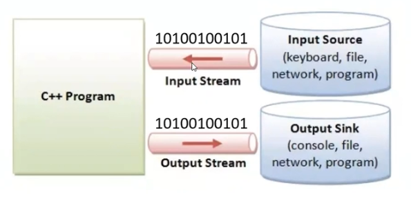
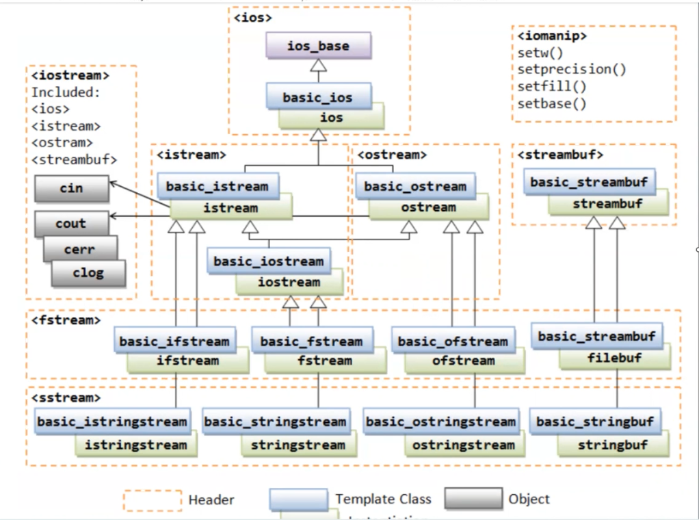

# 54.ders

## Formatlı Giriş Çıkış İşlemleri

Input/Output Operations: Programa veri giriş/çıkışı. Bizim programımıza dış dünyadan gelen/giden byte'lar.
*Stream*:  Bytelardan oluşan bir küme ama öyle bir kümeki bu bytelar bir akış içinde. Bu bytelar programa doğru (input stream ) ya da programdan dış dünyaya (output stream) akan veri

Eğer programımızın default olarak geldiği bir stream'den bahsediliyorsa, ona standart input stream diyoruz ( aksi yönde bir düzenleme yapılmadığı sürece konsola gittiği varsayılıyor. )

Program başladığında 3 tane standart stream'in default olarak varsayılıyor. Fakat bunlar yönlendirilebilir:

- Standart input
- Standart output
- Stadnart error stream

C++'ın giriş/çıkış işlemleri için çok büyük bir kütüphanesi var. Öğelerin hemen hepsi `template` parametresi.

Şimdiye kadar giriş/çıkış öğelerin template olup olmamasına değinmedik burada, doğrudan sınıfların bir *specialization*'na verilen eş ismi.

Burada hem generic programlama öğeleri hem de object oriented programming öğeleri var. Burada bize bir interfaceler birer nesne olarak tanımlanıyor.

```c++
#include<ostream>
//basic_ostream<char,char_traits<char>>;
//basic_ostream<char>;
//ostream;
```




En tepesindeki sınıf *ios_base* giriş çıkış sınıflarının taban sınıfı. Yapılan soyutlamalar, akımdaki karakter türünden bağımsız ve bu bir *template* değil. Stream'in input/output ile ilgili arayüzden de bağımsız.

Örneğin `cout.basefield` bu kütüphaneden kalıtım yoluyla gelen bir interface, aynı şekilde `cin.peek`.

Ios_base'den yapılan ilk kalıtım olan __basic_ios__ ise bir sınıf şablonu, bu ve bundan sonrası için hem karakter türüne hem de sınıf türüne bağlı. Burada da giriş ve çıkış olmasından bağımsız bir interface var.

*basic_ios*'tan iki farklı kalıtım yapılıyor: `basic_ostream` ve `basic_istream` burada bu iki sınıf ostream:çıkış interface'i sunuyor, `basic_istream`: ise giriş işlemlerini sağlıyor.

*basic_iostream* ise `basic_ostream` ve `basic_istream` sınıflarından multiple inharitance'tan kalıtım yoluylar elde edilmiş.

Burada bellekte yazma işlemleri için `basic_istringstream` sınıfı ve dosyaya yazma işlemlerinde kullanmak için `basic_istream`  sınıfı multi-level inharitance ile `basic_ifstream` sınıfından elde edilmiş.

Burada bellekten okuma işlemleri için `basic_ostringstream` sınıfı ve dosyadan okuma işlemlerinde kullanmak için `basic_ifstream`  sınıfı multi-level inharitance ile `basic_istream` sınıfından elde edilmiş.

Burada bellekten hem okuma hem de yazma işlemleri için `basic_stringstream` sınıfı ve dosyadan okuma işlemlerinde kullanmak için `basic_fstream`  sınıfı multi-level inharitance ile `basic_iostream` sınıfından elde edilmiş.

- Fakat buradaki bufferlama mekanizması `basic_stream_buffer` sınfı *ios_base* sınıfı ile ilişkilendirilmiş.



> Giriş çıkış işlemlerinin incomplete type kullanılması durumunda *iosfwd* include edebiliriz.

- Bazı sınıfların eş isim bildirimi var

```c++
#include<iostream>
    std::basic_ios<char>;
    std::ios;//ile aynı 
    auto n = ios_base::badbit; //n'in 
    auto n2 = basic_ios<char>::badbit;
    auto n3 = ios::badbit;
    auto n4 = ostream::badbit;
    auto n5 = cout.badbit;//bu sınıfın static veri elamanının sınıfın veri elemanı olarak aratarak kullanabiliyoruz.
```

Stream sınıflarının alma/gönderme tarafı ayrı bir soyutlama ve formatlama bilgileri ayrı bir soyutlama. Bu ikisi birbirinden bağımsız. Örneğin bir sınıf formatlama bilgisini tutuyor ve o format bilgisine göre giriş/çıkış işlemlerini gerçekleştiriyor. Stream nesnesinin state'innin bir bileşimi.

- Yani giriş/çıkış tarafı ayrı ve formatlama tarafı ayrı. Her stream nesnesi kendi format state'ini ayrı tutuyor.

> operator << operasyonlarına *inserter* da deniyor
> operator >> okun yeni set edilecek nesneye doğru. Buna da *extractor* deniyor. Stream'den karakterleri almak için kullanılıyor.

Bunların formatsız fonksiyonları da var.

```c++
#include <iostream>
int main()
{
    using namespace std;
    cout.put('A');
}
```

## Formatlı çıkış fonksiyonları

Aslında 2 kategoride

```c++
class ostream
{
public:
    //overload edilmiş operator left shitf var
    ostream& operator<<(int);
    ostream& operator<<(double);
    ostream& operator<<(long);
    
    //aşağıdaki fonksiyonlar kritik.
    ostream& operator<<(void *);
    ostream& operator<<(ostream&(*)(ostream &));
};

std::ostream & operator<<(std::ostream&, const char*); //cstring
```

- o iki fonksiyon için
  
```c++
#include<iostream>
int main()
{
    using namespace std;
    cout <<1;
    cout.operator<<(1);
    cout.operator<<("sofia");//void * parametreli fonksiyon çağırılıyor, sofia'nın tutulduğu bellek bloğunun adresi
    operator<<(cout, "sofia");
    char c = 'A';
    cout.operator<<(c);//int parametreli fonksiyon
    operator<<(cout, c);
}
```

- cout' nesnesi hayata geldiğinde default bir format state ile hayata geliyor. Bunu değiştirmek mümkün. Eğer bu format state'i tekrar değiştirilmezse her zaman için o hangi stateteyse onu basar.

```c++
int main()
{
    using namespace std;
    int ival = 54897;
    cout.setf(ios::hex, ios::basefield);
    //set format setf!
    cout << ival;
    cout.operator <<(x);
    cout << (10> 5);
}
```

```c++
int main()
{
    ostream os{ cout.rdbuf() };
    os << hex << showbase << uppercase;
    int x = 47804, y= 54807;
    cout << x << " "<< y << '\n';
    os << x << " "<< y << '\n';
}
```

Eğer ortada bir state varsa bunu set/get eden fonksiyonları var. Bir kısmı boolean bilgilerden oluşuyor. *ios_base* kütüphanesinde

- boolean değerler: ya *true/false* ya da *0 - 1*
- Uppercase mi lowercase mi yazsın.
- Sayı sistem tabanını göstersin mi göstermesin mi? (*showbase* - *noshowbase*)
- Pozitif işaretini yazıdsın mı yazdırmasın mı? (*showpos*)
- *showpoint*
- *skip whitespace*
- *buffering* yapsın mı yapmasın mı? *unit buffering*

boolean olmayanlara örnek:

- Gerçek sayıları nasıl yazdırılsın. *yazma alanı genişliği*
- Oryantasyon nasıl olsun.

Formatlama taban sınıftan gelen *fmt* olan bir türden ifade ediliyor. Bu formatlama statelere tutan tür bitsel işlemlere uygun olmalı.

Bu işlemler için bize bitmask var ve bunun için bize taban sınıf `constexpr static` olan maskeler var. Bu maskeler aşağıdaki gibi isimlendirilmiş.
  
- bu bitleri değiştirmenin en kolay yolu `setf()` fonksiyonunu çağırmak.

```c++
#include <iostream>
/*
class ostream{
    fmt_flags mf; türünden
};
*/
int main()
{
    using namespace std;
    cout<< typeid(ios::fmtflags).name();
    cout << ios::uppercase;
    cout << ios::boolalpha;
    cout << ios::showbase;
    cout << ios::showpoint;
    cout << ios::showpos;
}
```

- Biti sıfırlamak için maskenin değili ile işleme sokmak lazım. Bunu yapmanın kolay yolu ise `unsetf()` çağırmak, ya da `cout.flags(cout.flags() | !ios::boolalpha);` aynı anlamda.

```c++
void display_on_of_flags(std::ios_base& ib)
{
    if(ib.flags()& std::ios::boolalpha)
    {}
    //... yazıp on off flagler için yazılabilir.
}
```

### RadioButton format

Burada birbirini dışlayan özellikler var. Örneğin:

- Hangi sayı sisteminde bastırcak: hex, decimal, octal.  Bunlar için 3 bitlik alanda 3 farklı mask var hex(100), decimal(010), octal(001), basefield(111) gibi. Bunu yapan fonksiyon da gene `setf(ios::hex, ios::basefield)`.

### Yazma alanı genişliği

*output width*'in yazma alanı genişliği örneğin *420* sayısını yazdırmak istersek sağa(__iso::right__) dayalı olduğunda 20' olduğunu düşünüldüğünde ilk 17 karakteri dolduracak geri kalan yerde sayıyı yazacak. Sola (__iso::left__)dayalı içinse önce sayıyı sonra doldurma karakteri yazılacak. Default doldurma karakteri *white space*

- default'u sağa dayalı.
- yazma alanı genişliği ilk operasyon için geçerli, daha sonra sıfırlanıyor.

```c++
int main()
{
    using namespace std;
    cout.width(20);
    cout <<127 << "eray";
    cout.setf(ios::left, ios::adjustfield);
    cout.width(20);
    cout <<127 << "eray";
}

```

### Gerçek sayılar

fixed notation, scientific notation, fixed-scientific kendi karar veriyor. Alan bayrağı `ios::floatfield`.

- Default olarak kendisi karar veriyor. Eğer ikiside set edilimişse Hex float olarak yazıyor.

### Bunlar dışındakiler

```c++
cout.width()
cout.width(12)
cout.fill()
cout.fill('-')
cout.precision()
cout.precision(5)
```

> __NOT!!!: yazma alanı genişliği hiç bir zaman budamaya sebep olmaz.!!!!__
> yazma alanı genişliğinin 0 olması demek yazma alanının bir önemi yok demek.
